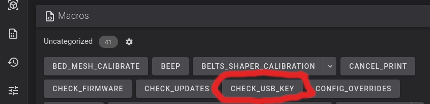

## Where can I get help?

Come on over to the pellcorp discord server, here is the invite, the `#simple-af-beacon` channel has been setup for anyone wanting support for beacon.

<https://discord.gg/2uGDzyJ3WX>

## Thanks

Thanks to <https://raven3dtech.com.au/> and <https://beacon3d.com> for donating Beacon probes to the Simple AF project to add support and continue to support the Beacon.

## Firmware requirements

### K1 Series

This guide assumes you have a K1, K1C, K1SE or K1 Max and you are running stock creality firmware 1.3.3.5 or **higher** (The firmware 1.3.3.5 is much older than 1.3.3.46 for example), **or alternately** you can use [my prerooted firmware](https://github.com/pellcorp/creality/wiki/Prerooted-K1-Firmware).

### Ender 5 Max

This guide assumes you are running stock Creality firmware 1.2.0.10 or **higher** on your Ender 5 Max.

The stock firmware comes pre-rooted, with the default root password being `Creality@2024_Wh_464`

Please note that you will need to change the screen orientation to horizontal, here is a model for that <https://www.printables.com/model/1246910-ender-5-max-screen-bracket>

### Ender 3 V3 KE

This guide assumes you have a stock Ender 3 V3 KE with Nebula Pad with Root enabled, when you get to installation below, you should specify the `--mount Default` to install
Simple AF on the KE for Beacon.

Please note that you will need to change the screen orientation to horizontal, here is a model for that <https://www.printables.com/model/727362-ender-3-v3-ke-screen-holder-landscape-for-guppyscr>,
but please do **not** follow the installation instructions on that page, just print the model and remount your screen only!

An alternative model which honestly seems a bit cleaner: <https://www.printables.com/model/706657-creality-ender-3-v3-e3v3-se-ke-and-cr-10-se-portra>

### Simple AF for RPi

See [Simple AF for RPi](rpi.md)

## Slicer Settings

!!! danger

    Creality Print won't be able to see your printer after you have installed Simple AF, the only tested slicer we all use is OrcaSlicer, likely if you want to
    use Creality Print you will need to print via usb.

    Cura Slicer won't work out of the box for configuring START_PRINT variables as below, you need to change the start print EXTRUDER_TEMP and BED_TEMP to pass
    in the correct values, but since I don't use Cura Slicer I can't advise on that!

There is an assumption that you are using a slicer like OrcaSlicer and Machine G-code like:


**Machine start G-code**
```
M140 S0
M104 S0 
START_PRINT EXTRUDER_TEMP=[nozzle_temperature_initial_layer] BED_TEMP=[bed_temperature_initial_layer_single]
```

**Machine end G-code**
```
END_PRINT
```

### Custom Bed Mesh Profile

If you want to select a specific predefined bed mesh profile (which disables adaptive mesh generation), you can pass in an additional `START_PRINT` parameter:

You can either hard code it to a particular model, like `BED_MESH_PROFILE=myprofile` or you can specify a profile based on orca slicer variables, such as `BED_MESH_PROFILE="[curr_bed_type] - [filament_type]"`, but you have to make sure you have all the possible profiles
defined for each of the bed type and filament type combinations.


## Probe Installation

It is **strongly** recommended to connect your probe to the front USB port initially and use it for a while that way to make sure its stable, before
directly wiring it to either the mainboard or making a cable for the lidar port (K1M users only).   If possible avoid destroying the original cable when
you are making your lidar or direct mainboard connection as you might need it in the future!

!!! danger

    If you are not using a side mount you **must** verify config changes for beacon.cfg before homing your printer, using **Screws Tilt Calculate** or doing a **bed mesh**!  

    Ignoring these instructions can lead to significant damage to your build plate and/or probe.

### Mount Options

| Mount           | Printer            | Beacon           | URL                                                                                                                  | Notes                                                           |
|-----------------|--------------------|------------------|----------------------------------------------------------------------------------------------------------------------|-----------------------------------------------------------------|
| **Default**     | K1, K1C, K1M, K1SE | RevH Standard    | <https://www.printables.com/model/1071641-beacon-probe-mounts-for-creality-k1-series>                                |                                                                 |
| **BootyGantry** | K1, K1C, K1M, K1SE | RevH Standard    | <https://github.com/tlace17/K1-Linear-Rail-Gantry/blob/main/STLs/Probe%20Mounts/Rail%20Carriage%20Carto%20Mount.stl> | This is **not** for low profile                                 |
| **SkeletorMK7** | K1, K1C, K1M, K1SE | RevH Low Profile | <https://www.printables.com/model/833769-the-skeletor-collection-a-creality-k1k1-maxk1c-coo>                         | This is only for the low profile beacon version of the mount!!! |
| **SimplyHexed** | Ender 5 Max        | RevH Standard    | <https://www.printables.com/model/1209230-ender-5-max-simply-hexed>                                                  | Ender 5 Max only!                                               |
| **Default**     | Ender 3 V3 KE      | RevH Standard    | <https://www.printables.com/model/732262-ender-3-v3-ke-beaconcartographer-mount>                                     | Might require shimming depending on the hotend / nozzle you use |

### Nozzle Offset

!!! warning

    It is vital that you verify the coil to nozzle tip distance is within the valid range of 2.6 to 3mm, you can use this simple tool to verify the range:
        <https://www.printables.com/model/1325363-cartographer-and-beacon-z-offset-goldilocks-tool>
    
    Just be sure to use digital calipers to verify the print printed with the correct size before relying on it, if you have trouble with 
    your z not being always entirely accurate consider printing the model on its side.

## Beacon Firmware

!!! warning

    You must have flashed your beacon with the latest beacon firmware (2.1.0 currently) **before** starting the installation

    For K1 Series Simple AF [there is a guide](beacon_flashing.md).
   
    For Simple AF for RPi, you can use the standard beacon guide <https://docs.beacon3d.com/contact/#51-firmware-update>

## Installation

!!! warning

     The installation section does not apply to Simple AF for RPi, See [Simple AF for RPi](rpi.md#installation)

The installation can only be performed on a printer which has been rooted and ssh granted

You need root access, if you are not already root, then follow [Helper Script Enable Root Access](https://guilouz.github.io/Creality-Helper-Script-Wiki/firmwares/install-and-update-rooted-firmware-k1/#enable-root-access)

### Factory Reset 

You must do a factory reset **only** if you have installed Helper Script or Fluidd/Mainsail directly from Creality, otherwise
you can safely proceed directly to installation.    If you have setup your printer with stock firmware only it can be quite
handy to skip a factory reset so that you can use [Switch to Stock](misc.md#switch-to-stock)

```
wget --no-check-certificate https://raw.githubusercontent.com/pellcorp/creality/main/k1/services/S58factoryreset -O /tmp/S58factoryreset
chmod +x /tmp/S58factoryreset
/tmp/S58factoryreset reset
```

!!! danger

    It is really important you do not close the ssh session until you get this message:

    

    It can take up to 5 minutes for a factory restart to finish, it is **vital** you do not power cycle your printer before the stock screen appears. There may be a 3002 error on the screen, this is completely normal.   If you are planning to install Simple AF you can ignore it, if you are trying to go back to stock, power cycle the printer again to clear the error.  

    Failing to follow this advice can lead to your printer getting bricked and requiring much more involved intervention to recover!
    
    

### Clone the Repo

```
git config --global http.sslVerify false
git clone https://github.com/pellcorp/creality.git /usr/data/pellcorp
sync
```

### Run the installer

!!! note

    If you have pellcorp-overrides in github but not stored locally, [you need to recreate the ~/pellcorp-overrides directory](config_overrides.md#create-local-repo) before running the installer.sh!

To run the script, you must use the following command:

```
/usr/data/pellcorp/installer.sh --install beacon --mount Mount
```

!!! warning

    For `Mount` you must specify the mount option for the mount you have used, if you do not do this the printer will be incorrectly configured for your mount, and bed meshes, x and y limits and related config will be wrong.   Please refer to [Mount Options](#mount-options) for supported mounts.   

    If you are using a non-supported mount you should specify a mount option as close to your mount as possible and properly adjust your configuration after installation before trying to perform a bed mesh or Screws Tilt Calculate!

## Post Installation

### MCU Firmware updates are pending

At the end of the installer process if you get this message:

```
WARNING: MCU Firmware updates are pending you need to power cycle your printer!
```

It means that new MCU firmware updates need to be applied and this can only be done by power cycling the printer.  After your printer is power cycled you can verify firmware was updated with the `CHECK_FIRMWARE` macro from Fluidd or Mainsail, if you see this message:

```
INFO: Your MCU Firmware is up to date!
```

Your printer MCU firmware was updated successfully.   If you still see the `MCU Firmware updates are pending you need to power cycle your printer!` message after a power cycle, check the `/tmp/mcu_update.log`, you may be asked to provide this file on Discord if you need additional assistance, sometimes an additional power cycle can solve the problem, there is a very short window of time (15 seconds) in which the MCU firmware can be updated, so  there is a chance it will work after an additional power cycle.

### Verify USB Key

It is important to make sure you have a way to [emergency factory reset](misc.md#emergency-factory-reset) the printer, if the worst happens.   There is a macro in Simple AF called `CHECK_USB_KEY` that will wait for you to plug a USB thumb drive (aka USB key) in and tell you if it was able to be successfully mounted.

You can find the CHECK_USB_KEY macro in Fluidd or Mainsail, because Fluidd and Mainsail are already installed, you can access Fluidd by opening your browser and connecting
using http://X.X.X.X, where X.X.X.X is your ip address that you used to login via ssh to your printer, you can also access Fluidd via http://X.X.X.X:4408 and Mainsail via http://X.X.X.X:4409!



After running the macro you should see output like the following:


- If you get the message: `INFO - USB Key was recognised and mounted correctly (/tmp/udisk/sda1)`, your USB thumb drive (aka USB key) is perfect to use for a factory reset.
- If you get no message at all before the script ends (after 60 seconds), your USB thumb drive (aka USB key) is defective.   You can check the `messages` file in the logs section of your UI to get more details about why the usb key could not be mounted!

!!! tip

    You should verify your USB thumb drive (aka USB key) often just to make sure you have something if you need to unbrick your printer, simply type `CHECK_USB_KEY` or hit the button in Fluidd / Mainsail
    The USB key should be FAT32 formatted and be no larger than 32GB!

!!! note

    If you have plugged your beacon into the front usb port, you are going to have to temporarily remove the beacon from the front usb slot and replace it with your USB thumb drive (aka USB key), after you have finished verifying the USB thumb drive (aka USB key) can be used in an emergency, you can replace the beacon into the front usb slot and restart klipper or power cycle your printer.

### Timer too close and microsteps

For beacon you cannot use more than `microsteps: 32`, the MCU cannot handle both more microsteps and beacon, it puts too much pressure on the system and it cause stuttering during bed meshes, it is also been known to cause klipper to crash
during repeated bed meshes.

## Calibration

!!! warning

    The following calibration steps are required to setup a new printer:

    - [Beacon Calibrate](#beacon-calibrate)
    - [PID Tuning and Input Shaping](#pid-tuning-and-input-shaping)

### Beacon Calibrate

!!! note

    The beacon team recommends heat soaking the printer a bit before doing calibration

1. Run `_SET_KIN_MAX_Z` and move toolhead so that the nozzle is only a few mm above the bed surface
2. Run `_CALIBRATE_HEAT_SOAK`, which will heat the bed to 60c, nozzle to 150c and **wait 8.5 minutes**!
3. Run the `STOP_CAMERA` macro to stop the camera
4. Run `BEACON_CALIBRATE` Follow the [Paper Test Method](https://www.klipper3d.org/Bed_Level.html#the-paper-test)
<br />Upon completion *`SAVE_CONFIG`*

!!! warning

    Do not use a metal feeler gauge for this step, it could damage your beacon!!!

**Source:** <https://docs.beacon3d.com/quickstart/#6-calibrate-beacon>

!!! note

    Is normal to show the Z position at almost at the max height of the printer even if the nozzle is somewhere in the middle or even close to the bed, this is not a bug, its intentional.   Until
    this calibration step is completed, the Z axes cannot be homed, so we make the printer pretend the bed is down the bottom of the printer so that you can freely move the bed
    up to meet the nozzle during the paper test without running into out of range issues.  You however won't be able to move the bed further away from the nozzle more than a few mm.
    
    

### Pid Tuning and Input Shaping

At least PID tuning (bed and extruder) and input shaping is required for acceptable printing.  If you try and print after running the installer.sh and a power cycle but before any calibration you will most likely have horrendous quality, the worst you have ever seen on the k1.   After PID tuning and input shaping you should see the same kind of quality as you get with stock k1 + input shaper fix.

!!! note

    You can use the QUICK_START Macro to complete Bed and Nozzle PID Tuning and Input Shaping Automatically.

#### Pid Tuning

**Source:** [Calibrate Pid Settings](https://www.klipper3d.org/Config_checks.html?h=pid#calibrate-pid-settings)

For example you might run these:

```
PID_CALIBRATE_BED BED_TEMP=65
PID_CALIBRATE_HOTEND HOTEND_TEMP=230
```

!!! note

    The `PID_CALIBRATE_BED` and `PID_CALIBRATE_HOTEND` macros are located in the `useful_macros.cfg` file and they have defaults values for BED_TEMP and HOTEND_TEMP so you can just run them by clicking on them if you want that same temperature.

#### Input Shaping

There is no default configuration for input shaping so it is essentially disabled out of the box.

You can use the `SHAPER_CALIBRATE` macro to run input shaping, just be sure to `SAVE CONFIG` at the end, to choose the automatically selected shaper config, be aware though that the shaper chosen might be sub-optimal due to a slight difference in vibrations between two options.  So you should probably review the output and potentially choose an alternative if it gives you higher recommended max acceleration for minimal increase in vibration.

[Input Shaper Auto Calibration](https://www.klipper3d.org/Measuring_Resonances.html#input-shaper-auto-calibration)

### Axis Twist Compensation

If you are using **a rear mount** it is highly recommended to perform axis twist compensation, this will affect the quality of your bed mesh, so best to do it before.

!!! tip

    There is no need to run axis twist compensation if you have mounted the eddy with a side mount that has a 0 y offset!

1. Home All (`G28`)
2. Run `AXIS_TWIST_COMPENSATION_CALIBRATE` The calibration wizard will prompt you to measure the probe Z offset at a few points along the bed
   <br />Upon completion *`SAVE_CONFIG`*

**Source:** <https://www.klipper3d.org/Axis_Twist_Compensation.html>

### First Print

You should optimise your model offset using baby stepping.

In fluidd the save button after you finish or cancel your print can be a bit hard to find, look for


### Other Calibrations

!!! info

    The default value for pressure advance is set to `0.04`

Refer to [Orcaslicer Calibration](https://github.com/SoftFever/OrcaSlicer/wiki/Calibration) for more calibrations

Refer to the [Ellis Print Tuning Guide](https://ellis3dp.com/Print-Tuning-Guide/) for more great tuning ideas.
