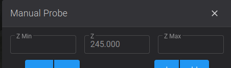

# BTT Eddy

!!! klipper-error "Build Plate Damage Alert"

    Your build plate must be spring steel with a magnetic sheet attached to your underlying printer bed.  Do not try and use this probe with embedded magnets or 
    some crappy magnetic flex plate that is not spring steel, your nozzle will dig a big hole in it.

This page covers installing SimpleAF using a BTT Eddy probe. New here? See [Getting Started](getting-started.md).

RPi / SBC users: install SimpleAF via [SimpleAF for RPi](rpi.md). The rest of this page &mdash; probe firmware, mount options, and calibration &mdash; applies to your setup too.

!!! info "What about CFS support?"

    The Creality CFS uses proprietary code blobs and likely will **never** be supported by Simple AF, there is a project underway to support Eddy with CFS that is **not affiliated** with Simple AF, but does use some stuff from Simple AF and some of our config and docs: <https://github.com/mikeinredding/K1Max-Klipper-Eddy>

## Firmware requirements

### Limits on X and Y microsteps

You cannot use more than `microsteps: 32` for `[stepper_x]` and `[stepper_y]`, the MCU cannot handle high microsteps, it puts too much pressure on the mainboard and it will cause stuttering and other reliability issues including random crashes.

!!! note

    This limit generally does not apply to RPi Series Simple AF

### K1 Series

This guide assumes you have a K1, K1C, K1SE or K1 Max and you are running stock creality firmware 1.3.3.5 or **higher** (The firmware 1.3.3.5 is much older than 1.3.3.46 for example), **or alternately** you can use [my prerooted firmware](https://github.com/pellcorp/creality/wiki/Prerooted-K1-Firmware).

### Ender 5 Max

This probe is currently not supported on Ender 5 Max

### Ender 3 V3 KE

This guide assumes you have a stock Ender 3 V3 KE with Nebula Pad with Root enabled, when you get to installation below, you should specify the `--mount Default` to install
Simple AF on the KE for BTT Eddy.

Please note that you will need to change the screen orientation to horizontal, here is a model for that <https://www.printables.com/model/727362-ender-3-v3-ke-screen-holder-landscape-for-guppyscr>,
but please do **not** follow the installation instructions on that page, just print the model and remount your screen only!
An alternative model which honestly seems a bit cleaner: <https://www.printables.com/model/706657-creality-ender-3-v3-e3v3-se-ke-and-cr-10-se-portra>

### RPi or SBC

See [Simple AF for RPi](rpi.md)

## BTT Eddy Firmware

!!! warning

    It is assumed that you have flashed your eddy with the firmware from <https://github.com/pellcorp/klipper/blob/master/fw/K1/btteddy.uf2> **before** starting the installation!!!
    
    For K1 Series Simple AF [there is a guide](btteddy_flashing.md)
    
    For Simple AF for RPi, you can follow this guide <https://github.com/bigtreetech/Eddy?tab=readme-ov-file#compiling-firmware>.   But make sure
    you are not trying to use any fork of klipper than pellcorp/klipper-rpi!  You can also skip this compilation step and just copy 
    the `~/klipper/fw/k1/btteddy.uf2` file to the Eddy after putting it into boot mode.

## Probe Installation

It is **strongly** recommended to initially connect your probe to the front USB Slot initially and use it for a while that way to make sure its stable, before
directly wiring it to either the mainboard or making a cable for the lidar port (K1M users only).   If possible avoid destroying the original cable when
you are making your lidar or direct mainboard connection as you might need it in the future.

!!! danger

    If you are not using a side mount you **must** verify config changes for btteddy.cfg before **homing your printer**, using **Screws Tilt Calculate** or doing a **bed mesh**!  

    Ignoring these instructions can lead to significant damage to your build plate and/or probe.

### Mount Options

| Mount         | Printer            | URL                                                                                                                                               | Notes                                                   |
|---------------|--------------------|---------------------------------------------------------------------------------------------------------------------------------------------------|---------------------------------------------------------|
| **Default**   | K1, K1C, K1M, K1SE | <https://www.printables.com/model/1012524-btteddy-creality-k1-k1c-k1-max-mount><br/><https://www.printables.com/model/1097856-btt-eddy-duo-mount> |                                                         |
| **Pellcorp**  | K1, K1C, K1M, K1SE | <https://www.printables.com/model/965667-wip-k1-btt-eddy-rear-mount-v4>                                                                           |                                                         |
| **Slam**      | K1, K1C, K1M, K1SE | <https://www.printables.com/model/1195575-btt-eddy-mount-for-k1c>                                                                                 |                                                         |
| **Default**   | Ender 3 KE         | <https://www.printables.com/model/1002777-cr-touch-to-btt-eddy-adapter-bracket>                                                                   |                                                         |


### Nozzle Offset

!!! warning

    If you use a different probe mount you must make sure the bottom of the btt eddy is between 2.6mm and 3mm from the tip of the nozzle, so if the nozzle is touching the bed (when both are cold), the bottom of the eddy should be at least 2.5mm above the bed and no more than 3mm.

    You can try this tool <https://www.printables.com/model/1277844-btt-eddy-and-eddy-ng-setup-helpers>

## Installation

!!! warning

     The installation section does not apply to Simple AF for RPi, See [Simple AF for RPi](rpi.md)

The installation can only be performed on a printer which has been rooted and ssh granted

You need root access, if you are not already root, then follow the excellent [Helper Script Enable Root Access](https://guilouz.github.io/Creality-Helper-Script-Wiki/firmwares/install-and-update-rooted-firmware-k1/#enable-root-access) instructions.

!!! tip

    ZeroDotCmd (aka Zero on discord) has provided an excellent BTT Eddy installation video, you can find it <https://www.youtube.com/watch?v=B17sS1klRxA>

    Please note however that the macros referenced in the video guide have been removed and you should instead follow the Calibration section of this wiki,
    I do not have the time to maintain the old guided macros, but you can still use the QUICK_START macro to do the pid and input shaper tuning.

### Factory Reset

If you've installed Guilouz's Helper Script, or installed Fluidd or Mainsail through any other means (such as from Creality directly), you need to [factory reset](factory_reset.md) before continuing.

### Clone the Repo

```
git config --global http.sslVerify false
git clone https://github.com/pellcorp/creality.git /usr/data/pellcorp
```

!!! note

    If you had already cloned the pellcorp creality repository before being asked to factory reset, the git repo is still there and you can skip the cloning step!

### Run the installer

!!! note

    If you have pellcorp-overrides in github but not stored locally, [you need to recreate the ~/pellcorp-overrides directory](config_overrides.md#create-local-repo) before running the installer.sh!

To run the script, you must specify the probe you want to use.

```
/usr/data/pellcorp/installer.sh --install btteddy --mount Mount
```

!!! warning

    Replace `Mount` with the specific mount option for the mount you have used, if you do not do this the printer will be incorrectly configured for your mount, and bed meshes, x and y limits and related config will be wrong.   Please refer to [Mount Options](#mount-options) for supported mounts.   

    If you are using a non-supported mount you should specify a mount option as close to your mount as possible and properly adjust your configuration after installation before trying to perform a bed mesh or Screws Tilt Calculate!

## Post Installation

### MCU Firmware updates are pending

At the end of the installer process if you get this message:

```
WARNING: MCU Firmware updates are pending you need to power cycle your printer!
```

It means that new MCU firmware updates need to be applied and this can only be done by power cycling the printer.  After your printer is power cycled you can verify firmware was updated with the `CHECK_FIRMWARE` macro from Fluidd or Mainsail, if you see this message:

```
INFO: Your MCU Firmware is up to date!
```

Your printer MCU firmware was updated successfully.   If you still see the `MCU Firmware updates are pending you need to power cycle your printer!` message after a power cycle, check the `/tmp/mcu_update.log`, you may be asked to provide this file on Discord if you need additional assistance, sometimes an additional power cycle can solve the problem, there is a very short window of time (15 seconds) in which the MCU firmware can be updated, so  there is a chance it will work after an additional power cycle.

## Slicer Settings

[Slicer Settings](slicer_settings.md)

## Calibration

!!! warning

    The following calibration steps are required to setup a new printer:

    - [Drive Current Calibration](#drive-current-calibration)
    - [Mapping Eddy Readings To Nozzle Heights](#mapping-eddy-readings-to-nozzle-heights)
    - [Temperature Compensation Calibration](#temperature-compensation-calibration)
    - [PID Tuning and Input Shaping](#pid-tuning-and-input-shaping)

!!! danger

    It is extremely important that you perform the following calibrations while the btt eddy is cool, if you calibrate the eddy hot, you will experience `Error during homing z: Eddy current sensor error` errors while homing and performing bed mesh if the btt is significantly cooler than it was while doing initial calibration.   

### Drive Current Calibration

--steps--

1. Home XY (`G28 X Y`)
2. Make sure nozzle is centred on bed
3. Run `_SET_KIN_MAX_Z` and then **use normal controls to move** the toolhead so that the bottom of the eddy is approximately 20mm from the bed, please try and be as accurate as possible with this distance, it's **better to be slightly closer** to the bed than further away.
4. Run `BTTEDDY_CALIBRATE_DRIVE_CURRENT`
   <br />Upon completion *`SAVE_CONFIG`*

--!steps--

**Source:** <https://github.com/bigtreetech/Eddy?tab=readme-ov-file#2-drive-current-calibration>

!!! note

    The auxiliary fan may turn on until the btt eddy temp is less than 40c before starting the actual calibration.  If you are in a hot climate you may need to adjust the `btteddy_macro.cfg` `variable_calibration_max_temp` value to something higher than 40c if you can't get the btt eddy under 40c with the aux fan easily.

### Mapping Eddy Readings To Nozzle Heights

--steps--

1. Home X and Y (`G28 X Y`)
2. Make sure nozzle is centred on bed
3. Run `BTTEDDY_CURRENT_CALIBRATE` Follow the [Paper Test Method](https://www.klipper3d.org/Bed_Level.html#the-paper-test)
4. After clicking **Accept**, the printer is going to move the bed up and down quite a few times as part of the calibration, do **not** interrupt it
   <br />Upon completion *`SAVE_CONFIG`*

--!steps--

**Source:** <https://github.com/bigtreetech/Eddy?tab=readme-ov-file#3-mapping-eddy-readings-to-nozzle-heights>

!!! warning

    Do not use a metal feeler gauge for this step, it could damage your eddy!!!

!!! note

    The auxiliary fan may turn on until the btt eddy temp is less than 40c before starting the actual calibration.  If you are in a hot climate you may need to adjust the `btteddy_macro.cfg` `variable_calibration_max_temp` value to something higher than 40c if you can't get the btt eddy under 40c with the aux fan easily.

    Is normal to show the Z position at almost at the max height of the printer even if the nozzle is somewhere in the middle or even close to the bed, this is not a bug, its intentional.   Until
    this calibration step is completed, the Z axes cannot be homed, so we make the printer pretend the bed is down the bottom of the printer so that you can freely move the bed
    up to meet the nozzle during the paper test without running into out of range issues.  You however won't be able to move the bed further away from the nozzle more than a few mm.
    
    

### Temperature Compensation Calibration

--steps--

1. Home All (`G28`)
2. Make sure nozzle is centred on bed
3. Run `BTTEDDY_TEMPERATURE_PROBE_CALIBRATE`
<br />Upon completion *`SAVE_CONFIG`*

--!steps--

**Source:** <https://github.com/bigtreetech/Eddy?tab=readme-ov-file#5-temperature-compensation-calibration-eddy-usb-only>

!!! warning

    Do not use a metal feeler gauge for this step, it could damage your eddy!!!

!!! tip

    If you are struggling to get over about 80c, you can end the calibration early with the `TEMPERATURE_PROBE_COMPLETE` macro, just know that if you end the calibration early and then you try to print really hot and the eddy gets hotter than the hottest temp you calibrated the eddy is going to read the bed wrong and cause issues for homing but especially bed meshes.

### Manual Bed Tramming

To avoid the risk of bed damage due to a badly trammed bed, please perform [Manual Bed Tramming](manual_bed_tramming.md) before going any further.

!!! danger

    If you choose to ignore this advice, you risk damage to your bed if the bed is significantly higher on one side compared to the centre of the bed where the printer is homed.

### Pid Tuning and Input Shaping

At least PID tuning (bed and extruder) and input shaping is required for acceptable printing.  If you try and print after running the installer.sh and a power cycle but before any calibration you will most likely have horrendous quality, the worst you have ever seen on the k1.   After PID tuning and input shaping you should see the same kind of quality as you get with stock k1 + input shaper fix.

!!! note

    You can use the QUICK_START Macro to complete Bed and Nozzle PID Tuning and Input Shaping Automatically.

#### Pid Tuning

**Source:** [Calibrate Pid Settings](https://www.klipper3d.org/Config_checks.html?h=pid#calibrate-pid-settings)

For example you might run these:

```
PID_CALIBRATE_BED BED_TEMP=65
PID_CALIBRATE_HOTEND HOTEND_TEMP=230
```

!!! note

    The `PID_CALIBRATE_BED` and `PID_CALIBRATE_HOTEND` macros are located in the `useful_macros.cfg` file and they have defaults values for BED_TEMP and HOTEND_TEMP so you can just run them by clicking on them if you want that same temperature.

#### Input Shaping

There is no default configuration for input shaping so it is essentially disabled out of the box.

You can use the `SHAPER_CALIBRATE` macro to run input shaping, just be sure to `SAVE CONFIG` at the end, to choose the automatically selected shaper config, be aware though that the shaper chosen might be sub-optimal due to a slight difference in vibrations between two options.  So you should probably review the output and potentially choose an alternative if it gives you higher recommended max acceleration for minimal increase in vibration.

[Input Shaper Auto Calibration](https://www.klipper3d.org/Measuring_Resonances.html#input-shaper-auto-calibration)

### Axis Twist Compensation

If you are using **a rear mount** it is highly recommended to perform axis twist compensation, this will affect the quality of your bed mesh, so best to do it before.

!!! tip

    There is no need to run axis twist compensation if you have mounted the eddy with a side mount that has a 0 y offset!

--steps--

1. Home All (`G28`)
2. Run `AXIS_TWIST_COMPENSATION_CALIBRATE` The calibration wizard will prompt you to measure the probe Z offset at a few points along the bed
   <br />Upon completion *`SAVE_CONFIG`*

--!steps--

**Source:** <https://www.klipper3d.org/Axis_Twist_Compensation.html>

!!! warning

    Do not use a metal feeler gauge for this step, it could damage your eddy!!!

### First Print

The save baby stepping button in fluidd / mainsail does nothing for btteddy, the z-offset is automatically saved to the variables.cfg,
we copied the feature from Helper Script: <https://guilouz.github.io/Creality-Helper-Script-Wiki/helper-script/save-z-offset-macros/>

### Other Calibrations

!!! info

    The default value for pressure advance is set to `0.04`

Refer to [Orcaslicer Calibration](https://github.com/SoftFever/OrcaSlicer/wiki/Calibration) for more calibrations

Refer to the [Ellis Print Tuning Guide](https://ellis3dp.com/Print-Tuning-Guide/) for more great tuning ideas.

## Where can I get help?

For support, join the [SimpleAF Discord](https://discord.gg/M5rmBQqRSG).
