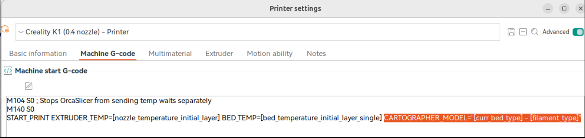

## Where can I get help?

Come on over to the pellcorp discord server, the `#simple-af-carto` channel has been setup for anyone wanting support for cartographer.

<https://discord.gg/2uGDzyJ3WX>

## Thanks

Thanks to Richard from <https://cartographer3d.com> and Zarboz from <https://wattskraken.xyz/> for donating Cartographers to the Simple AF project to add support and continue to support the cartographer.

## Firmware requirements

### K1 Series

This guide assumes you have a K1, K1C, K1SE, K1 Max or Ender 5 Max and you are running stock creality firmware 1.3.3.5 or **higher** (The firmware 1.3.3.5 is much older than 1.3.3.46 for example), or alternately you are using  [my prerooted firmware](https://github.com/pellcorp/creality/wiki/Prerooted-K1-Firmware).   Any other pre-rooted firmware is explicitly not supported and the installer.sh will validate this and refuse to proceed if you try to use it on different firmware.

### Ender 5 Max

You must be using pre-rooted firmware, which is not available from Creality at the moment, you can get it from <https://github.com/zevaryx/ender-5-max-firmware>

Please note that you will need to change the screen orientation to horizontal, here is a model for that <https://www.printables.com/model/1246910-ender-5-max-screen-bracket>

### Ender 3 V3 KE

This guide assumes you have a stock Ender 3 V3 KE with Nebula Pad with Root enabled, when you get to installation below, you should specify the `--mount Default` to install
Simple AF on the KE for Cartographer.

Please note that you will need to change the screen orientation to horizontal, here is a model for that <https://www.printables.com/model/727362-ender-3-v3-ke-screen-holder-landscape-for-guppyscr>,
but please do **not** follow the installation instructions on that page, just print the model and remount your screen only!
An alternative model which honestly seems a bit cleaner: <https://www.printables.com/model/706657-creality-ender-3-v3-e3v3-se-ke-and-cr-10-se-portra>

### Simple AF for RPi

See [Simple AF for RPi](rpi.md)

## Slicer Settings

!!! danger

    Creality Print won't be able to see your printer after you have installed Simple AF, the only tested slicer we all use is OrcaSlicer, likely if you want to
    use Creality Print you will need to print via usb.

    Cura Slicer won't work out of the box for configuring START_PRINT variables as below, you need to change the start print EXTRUDER_TEMP and BED_TEMP to pass
    in the correct values, but since I don't use Cura Slicer I can't advise on that!

    If you have used a cartographer with k1-klipper, please note that the `PRINT_START` macro specified in their docs **is not supported** by this project.   You **must** change your Slicer Start Print Machine G-Code (see next)

There is an assumption that you are using a slicer like OrcaSlicer and Machine G-code like:


**Machine start G-code**

```
M140 S0
M104 S0
START_PRINT EXTRUDER_TEMP=[nozzle_temperature_initial_layer] BED_TEMP=[bed_temperature_initial_layer_single]
```

**Machine end G-code**

```
END_PRINT
```

### Custom Bed Mesh Profile

If you want to select a specific predefined bed mesh profile (which disables adaptive mesh generation), you can pass in an additional `START_PRINT` parameter:

You can either hard code it to a particular model, like `BED_MESH_PROFILE=myprofile` or you can specify a profile based on orca slicer variables, such as `BED_MESH_PROFILE="[curr_bed_type] - [filament_type]"`, but you have to make sure you have all the possible profiles
defined for each of the bed type and filament type combinations.


## Probe Installation

!!! danger

    If you are not using a side mount you **must** verify config changes for cartotouch.cfg before **homing your printer**, using **Screws Tilt Calculate** or doing a **bed mesh**!  

    Ignoring these instructions can lead to significant damage to your build plate and/or probe.

### Mount Options

| Mount                  | Printer            | Carto                        | URL                                                                                                                                                                                     | Notes                                                                   |
|------------------------|--------------------|------------------------------|-----------------------------------------------------------------------------------------------------------------------------------------------------------------------------------------|-------------------------------------------------------------------------|
| **Default**            | K1, K1C, K1M, K1SE | Right Angle                  | <https://www.printables.com/model/1037606-cartographer-3d-right-angle-k1-series-mount>                                                                                                  |                                                                         |
| **D3vilStock**         | K1, K1C, K1M, K1SE | Flat Pack                    | <https://www.printables.com/model/684338-k1-k1max-eddy-current-mount-cartographer>                                                                                                      |                                                                         |
| **BootyGantry**        | K1, K1C, K1M, K1SE | Right Angle                  | <https://github.com/tlace17/K1-Linear-Rail-Gantry/blob/main/STLs/Probe%20Mounts/Rail%20Carriage%20Carto%20Mount.stl>                                                                    | May require shimming for correct nozzle offset                          |
| **SkeletorMK7**        | K1, K1C, K1M, K1SE | Low Profile                  | <https://www.printables.com/model/833769-the-skeletor-collection-a-creality-k1k1-maxk1c-coo><br /><br /><b>Get it printed:</b> <http://Mk7.printsbyrad.xyz>                             | This is only for the low profile cartographer version of the mount!!!   |
| **SkeletorRightAngle** | K1, K1C, K1M, K1SE | Right Angle<br />or Standard | <https://www.printables.com/model/1362668-skeletor-mk7-side-mounted-cartographer-integration>                                                                                           | This mount can support standard cartographer too                        |
| **PurcellV5**          | K1, K1C, K1M, K1SE | Right Angle                  | <https://www.printables.com/model/1071493-cartographer-probe-side-mount-options-for-creality><br /><https://www.printables.com/model/1239076-creality-k1-cartographer-right-angle-mount> | This also works with V3 and V4, probably also V8                        |
| **SimplyHexed**        | Ender 5 Max        | Right Angle                  | <https://www.printables.com/model/1209230-ender-5-max-simply-hexed>                                                                                                                     | Requires custom shroud                                                  |
| **Default**            | Ender 3 V3 SE      | Right Angle                  | <https://www.printables.com/model/732262-ender-3-v3-ke-beaconcartographer-mount>                                                                                                        | Will probably require shimming especially if you ugprade to a k1 hotend |
| **Default**            | Ender 3 V3 KE      | Right Angle                  | <https://www.printables.com/model/732262-ender-3-v3-ke-beaconcartographer-mount>                                                                                                        | Might require shimming depending on the hotend / nozzle you use         |

### Nozzle Offset

!!! warning

    It is vital that you verify the coil to nozzle tip distance is within the valid range of 2.6 to 3mm, you can use this simple tool to verify the range:
    <https://www.printables.com/model/1325363-cartographer-and-beacon-z-offset-goldilocks-tool>

    Just be sure to use digital calipers to verify the print printed with the correct size before relying on it, if you have trouble with 
    your z not being always entirely accurate consider printing the model on its side.

## Cartographer Firmware

!!! warning

    For K1 Series Simple AF you **must** flash your cartographer with `CARTOGRAPHER K1 5.1.0` or `CARTOGRAPHER K1 5.0.0` survey firmware **before** trying to use your printer:

    

    For K1 Series Simple AF [there is a guide](cartographer_flashing.md).
    
    For Simple AF for RPi, you can use the standard cartographer guide <https://docs.cartographer3d.com/cartographer-probe/firmware/firmware-updating/via-katapult/usb-flash#usb-katapult-updating>

    If you are using a Pi3 or less (so CB1, CB2, OPi 3, etc) to run klipper, I strongly recommend using the K1 variant of the cartographer firmware, you can do that 
    in the firmware script by enabling Advanced Mode and Enabling Creality K Series Firmware.

## Installation

!!! warn

     The installation section does not apply to Simple AF for RPi, See [Simple AF for RPi](rpi.md#installation)

The installation can only be performed on a printer which has been rooted and ssh granted

You need root access, if you are not already root, then follow the excellent [Helper Script Enable Root Access](https://guilouz.github.io/Creality-Helper-Script-Wiki/firmwares/install-and-update-rooted-firmware-k1/#enable-root-access) instructions.

!!! tip

    ZeroDotCmd (aka Zero on discord) has provided an excellent Cartographer installation video, you can find it <https://www.youtube.com/watch?v=GuxMITM9o4I>

    Please note however that the macros referenced in the video guide have been removed and you should instead follow the Calibration section of this wiki,
    I do not have the time to maintain the old guided macros, but you can still use the QUICK_START macro to do the pid and input shaper tuning.

### Factory Reset 

You must do a factory reset **only** if you have installed Helper Script or Fluidd/Mainsail directly from Creality, otherwise
you can safely proceed directly to installation.    If you have setup your printer with stock firmware only it can be quite
handy to skip a factory reset so that you can use [Switch to Stock](misc.md#switch-to-stock)

```
wget --no-check-certificate https://raw.githubusercontent.com/pellcorp/creality/main/k1/services/S58factoryreset -O /tmp/S58factoryreset
chmod +x /tmp/S58factoryreset
/tmp/S58factoryreset reset
```

!!! danger

    It is really important you do not close the ssh session until you get this message:

    

    It can take up to 5 minutes for a factory restart to finish, it is **vital** you do not power cycle your printer before the stock screen appears. There may be a 3002 error on the screen, this is completely normal.   If you are planning to install Simple AF you can ignore it, if you are trying to go back to stock, power cycle the printer again to clear the error.  

    Failing to follow this advice can lead to your printer getting bricked and requiring much more involved intervention to recover!
    
    

### Clone the Repo

```
git config --global http.sslVerify false
git clone https://github.com/pellcorp/creality.git /usr/data/pellcorp
sync
```

### Run the installer

!!! note

    If you have pellcorp-overrides in github but not stored locally, [you need to recreate the ~/pellcorp-overrides directory](config_overrides.md#create-local-repo) before running the installer.sh!

To run the script, you must use the following command:

```
/usr/data/pellcorp/installer.sh --install cartotouch --mount Mount
```

!!! warning

    For `Mount` you must specify the mount option for the mount you have used, if you do not do this the printer will be incorrectly configured for your mount, and bed meshes, x and y limits and related config will be wrong.   Please refer to [Mount Options](#mount-options) for supported mounts.   

    If you are using a non-supported mount you should specify a mount option as close to your mount as possible and properly adjust your configuration after installation before trying to perform a bed mesh or Screws Tilt Calculate!

## Post Installation

### MCU Firmware updates are pending

At the end of the installer process if you get this message:

```
WARNING: MCU Firmware updates are pending you need to power cycle your printer!
```

It means that new MCU firmware updates need to be applied and this can only be done by power cycling the printer.  After your printer is power cycled you can verify firmware was updated with the `CHECK_FIRMWARE` macro from Fluidd or Mainsail, if you see this message:

```
INFO: Your MCU Firmware is up to date!
```

Your printer MCU firmware was updated successfully.   If you still see the `MCU Firmware updates are pending you need to power cycle your printer!` message after a power cycle, check the `/tmp/mcu_update.log`, you may be asked to provide this file on Discord if you need additional assistance, sometimes an additional power cycle can solve the problem, there is a very short window of time (15 seconds) in which the MCU firmware can be updated, so  there is a chance it will work after an additional power cycle.

### Verify USB Key

It is important to make sure you have a way to [emergency factory reset](misc.md#emergency-factory-reset) the printer, if the worst happens.   There is a macro in Simple AF called `CHECK_USB_KEY` that will wait for you to plug a USB thumb drive (aka USB key) in and tell you if it was able to be successfully mounted.


- If you get the message: `INFO - USB Key was recognised and mounted correctly (/tmp/udisk/sda1)`, your USB thumb drive (aka USB key) is perfect to use for a factory reset.
- If you get no message at all before the script ends (after 60 seconds), your USB thumb drive (aka USB key) is defective.   You can check the `messages` file in the logs section of your UI to get more details about why the usb key could not be mounted!

!!! tip

    You should verify your USB thumb drive (aka USB key) often just to make sure you have something if you need to unbrick your printer, simply type `CHECK_USB_KEY` or hit the button in Fluidd / Mainsail
    The USB key should be FAT32 formatted and be no larger than 32GB!

!!! note

    If you have plugged your cartographer into the front usb port, you are going to have to temporarily remove the cartographer from the front usb slot and replace it with your USB thumb drive (aka USB key), after you have finished verifying the USB thumb drive (aka USB key) can be used in an emergency, you can replace the cartographer into the front usb slot and restart klipper or power cycle your printer.

### Timer too close and microsteps

For cartographer you cannot use more than `microsteps: 32`, the MCU cannot handle high microsteps and cartographer, it puts too much pressure on the system and it will cause stuttering during bed meshes.

## Calibration

!!! warning

    The following calibration steps are required to setup a new printer:

    - [Enable Touch Mode](#enable-touch-mode)
    - [Manual Cartographer Calibrate](#manual-cartographer-calibrate)
    - [Cartographer Threshold Scan](#cartographer-threshold-scan)
    - [Cartographer Touch Calibration](#cartographer-touch-calibration)
    - [PID Tuning and Input Shaping](#pid-tuning-and-input-shaping)

!!! note

    If you are running calibration for a printer that has previously been calibrated, the following SAVE_CONFIG sections **must** be removed from the bottom of the printer.cfg (if they exist) before
    redoing these calibrations:
      
    - `[scanner model default]`
    - `[scanner]`
    - `[axis_twist_compensation]`
    - `[bed_mesh]`


### Enable Touch Mode

To be able to set up the printer for cartographer with touch mode for printing you need to make sure the
mode is set to touch.

1. Run `PROBE_SWITCH MODE=touch`
<br />Upon completion *`SAVE_CONFIG`*

Source: <https://docs.cartographer3d.com/cartographer-probe/installation-and-setup/installation/calibration#initial-calibration>

### Manual Cartographer Calibrate

It is strongly recommended to disable the camera for these calibration steps, just use the `STOP_CAMERA`
macro to do this.

1. Run the `STOP_CAMERA` macro to stop the camera
2. Home X Y (`G28 X Y`)
3. Heat Nozzle to 150c (`M109 S150`) so that any filament can be removed from nozzle
4. Make sure nozzle is centred on bed
5. Run `CARTOGRAPHER_CALIBRATE METHOD=manual`
Follow the [Paper Test Method](https://www.klipper3d.org/Bed_Level.html#the-paper-test)
<br />Upon completion *`SAVE_CONFIG`*

!!! note

    Is normal to show the Z position at almost at the max height of the printer even if the nozzle is somewhere in the middle or even close to the bed, this is not a bug, its intentional.   Until
    this calibration step is completed, the Z axes cannot be homed, so we make the printer pretend the bed is down the bottom of the printer so that you can freely move the bed
    up to meet the nozzle during the paper test without running into out of range issues.  You however won't be able to move the bed further away from the nozzle more than a few mm.
    
    

!!! warn

    Do not use a metal feeler gauge for this step, it could damage your cartographer!!!

**Source:** <https://docs.cartographer3d.com/cartographer-probe/settings-and-commands#cartographer_calibrate>

After the save config you have to do the cartographer threshold scan (see next)

### Cartographer Threshold Scan

It is strongly recommended to disable the camera for these calibration steps, just use the `STOP_CAMERA`
macro to do this.

!!! danger

    For this next step, it is really important to be near your printer for this step, because if there is any issue with the printer configuration or your carto probe, its possible the nozzle will dig itself into the bed, so be hovering over that e-stop button!

1. Run the `STOP_CAMERA` macro to stop the camera
2. Home All (`G28`)
3. Make sure nozzle is centred on bed
4. Heat Nozzle to 150c (`M109 S150`) so that any filament can be removed from nozzle
5. Execute `CARTOGRAPHER_THRESHOLD_SCAN SPEED=2 MIN=1000 MAX=5000`
<br />Upon completion *`SAVE_CONFIG`*

After the save config you have to do the touch calibration.

**Source:** <https://docs.cartographer3d.com/cartographer-probe/settings-and-commands#cartographer_threshold_scan>

### Cartographer Touch Calibration

It is strongly recommended to disable the camera for these calibration steps, just use the `STOP_CAMERA`
macro to do this.

!!! danger

    For this next step, it is really important to be near your printer for this step, because if there is any issue with the printer configuration or your carto probe, its possible the nozzle will dig itself into the bed, so be hovering over that e-stop button!

1. Run the `STOP_CAMERA` macro to stop the camera
2. Home All (`G28`)
3. Heat Nozzle to 150c (`M109 S150`) so that any filament can be removed from nozzle
4. Execute `CARTOGRAPHER_CALIBRATE`
<br />Upon completion *`SAVE_CONFIG`*

!!! tip

    If this fails after 3 tries, you should check to make sure there is not filament stuck to the bottom of your nozzle!

**Source:** <https://docs.cartographer3d.com/cartographer-probe/survey-touch>

### Pid Tuning and Input Shaping

At least PID tuning (bed and extruder) and input shaping is required for acceptable printing.  If you try and print after running the installer.sh and a power cycle but before any calibration you will most likely have horrendous quality, the worst you have ever seen on the k1.   After PID tuning and input shaping you should see the same kind of quality as you get with stock k1 + input shaper fix.

!!! note

    You can use the QUICK_START Macro to complete Bed and Nozzle PID Tuning and Input Shaping Automatically.

#### Pid Tuning

**Source:** [Calibrate Pid Settings](https://www.klipper3d.org/Config_checks.html?h=pid#calibrate-pid-settings)

For example you might run these:

```
PID_CALIBRATE_BED BED_TEMP=65
PID_CALIBRATE_HOTEND HOTEND_TEMP=230
```

!!! note

    The `PID_CALIBRATE_BED` and `PID_CALIBRATE_HOTEND` macros are located in the `useful_macros.cfg` file and they have defaults values for BED_TEMP and HOTEND_TEMP so you can just run them by clicking on them if you want that same temperature.

#### Input Shaping

There is no default configuration for input shaping so it is essentially disabled out of the box.

You can use the `SHAPER_CALIBRATE` macro to run input shaping, just be sure to `SAVE CONFIG` at the end, to choose the automatically selected shaper config, be aware though that the shaper chosen might be sub-optimal due to a slight difference in vibrations between two options.  So you should probably review the output and potentially choose an alternative if it gives you higher recommended max acceleration for minimal increase in vibration.

[Input Shaper Auto Calibration](https://www.klipper3d.org/Measuring_Resonances.html#input-shaper-auto-calibration)

### Axis Twist Compensation

Next it is highly recommended to perform axis twist compensation calibration **if you are using a rear mount** before doing anything else, this will affect the quality of
your bed mesh, so best to do it before.

1. Home All (`G28`)
2. Run `AXIS_TWIST_COMPENSATION_CALIBRATE` The calibration wizard will prompt you to measure the probe Z offset at a few points along the bed
   <br />Upon completion *`SAVE_CONFIG`*

!!! warn

    Do not use a metal feeler gauge for this step, it could damage your cartographer!!!

**Source:** <https://www.klipper3d.org/Axis_Twist_Compensation.html>

### First Print

You should optimise your `scanner_touch_z_offset` using baby stepping, as documented here: <https://docs.cartographer3d.com/cartographer-probe/installation-and-setup/installation/first-print>

In fluidd the save button after you finish or cancel your print can be a bit hard to find, look for


### Other Calibrations

!!! info

    The default value for pressure advance is set to `0.04`

Refer to [Orcaslicer Calibration](https://github.com/SoftFever/OrcaSlicer/wiki/Calibration) for more calibrations

Refer to the [Ellis Print Tuning Guide](https://ellis3dp.com/Print-Tuning-Guide/) for more great tuning ideas.

## Scan Only Mode

Some cartographer users choose to use scan only instead of touch and that is easy enough to do, you can setup for scan immediately
after installation, no need to do the 3 step calibration as for touch!

!!! danger

    It is **vital** you are aware of the limitations of scan mode especially on the K1 series where temp calibration is not 
    an option.    If you print different bed and/or nozzle temp materials you must save a separate model per material and even
    with a single material the cartographer will return a different z-offset when hot than when cold, I strongly recommend
    **against** using scan mode on Simple AF, its actually likely to lead to bed damage unless you know exactly what you are doing!

You can run the following:

1. Run `PROBE_SWITCH MODE=scan`
   <br />Upon completion *`SAVE_CONFIG`*

It is strongly recommended to disable the camera for this calibration step, just use the `STOP_CAMERA`
macro to do this.

1. Run the `STOP_CAMERA` macro to stop the camera
2. Home X Y (`G28 X Y`)
3. Heat Nozzle to 150c (`M109 S150`) so that any filament can be removed from nozzle
4. Make sure nozzle is centred on bed
5. Run `CARTOGRAPHER_CALIBRATE METHOD=manual`
   Follow the [Paper Test Method](https://www.klipper3d.org/Bed_Level.html#the-paper-test)
   <br />Upon completion *`SAVE_CONFIG`*

!!! warn

    Do not use a metal feeler gauge for this step, it could damage your cartographer!!!

You can then use the CARTOGRAPHER_MODEL parameter to start print from your slicer to select different filament profiles, this is required if you print with different filaments and/or use different bed aurfaces.

### Cartographer Model

If you want to select a particular [cartographer model](<https://docs.cartographer3d.com/cartographer-probe/fine-tuning/cartographer-models>) other than the default you can pass in an additional `START_PRINT` parameter:



You can either hard code it to a particular model, like `CARTOGRAPHER_MODEL=mymodel` or you can specify a model based on orca slicer variables, such as `CARTOGRAPHER_MODEL="[curr_bed_type] - [filament_type]"`, but you have to make sure you have all the possible models
defined for each of the bed type and filament type combinations.
