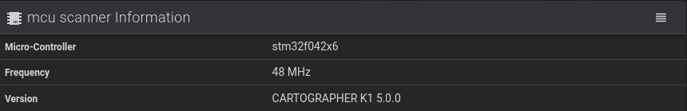
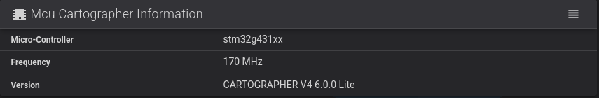
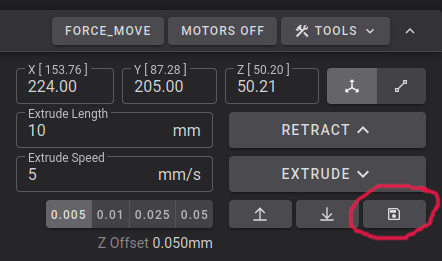

# Cartographer 

!!! klipper-error "Build Plate Damage Alert"

    Your build plate must be spring steel with a magnetic sheet attached to your underlying printer bed.  Do not try and use this probe with embedded magnets or 
    some crappy magnetic flex plate that is not spring steel, your nozzle will dig a big hole in it.

This page covers installing SimpleAF using a Cartographer probe. New here? See [Getting Started](getting-started.md).

RPi / SBC users: install SimpleAF via [SimpleAF for RPi](rpi.md). The rest of this page &mdash; probe firmware, mount options, and calibration &mdash; applies to your setup too.

!!! info

    Already running Cartotouch from a previous SimpleAF install? See [Cartotouch](cartotouch.md). Cartotouch is legacy &mdash; new installs should use Cartographer.

## Firmware requirements

### Limits on X and Y microsteps

You cannot use more than `microsteps: 32` for `[stepper_x]` and `[stepper_y]`, the MCU cannot handle high microsteps, it puts too much pressure on the mainboard and it will cause stuttering and other reliability issues including random crashes.

!!! note

    This limit generally does not apply to RPi Series Simple AF

### K1 Series

This guide assumes you have a K1, K1C, K1SE or K1 Max and you are running stock creality firmware 1.3.3.5 or **higher** (The firmware 1.3.3.5 is much older than 1.3.3.46 for example), **or alternately** you can use [my prerooted firmware](https://github.com/pellcorp/creality/wiki/Prerooted-K1-Firmware).

#### Ender 5 Max

This guide assumes you are running stock Creality firmware 1.2.0.10 or **higher** on your Ender 5 Max.

The stock firmware comes pre-rooted, with the default root password being `Creality@2024_Wh_464`

Please note that you will need to change the screen orientation to horizontal, here is a model for that <https://www.printables.com/model/1246910-ender-5-max-screen-bracket>

#### Ender 3 V3 KE

This guide assumes you have a stock Ender 3 V3 KE with Nebula Pad with Root enabled, when you get to installation below, you should specify the `--mount Default` to install
Simple AF on the KE for Cartographer.

Please note that you will need to change the screen orientation to horizontal, here is a model for that <https://www.printables.com/model/727362-ender-3-v3-ke-screen-holder-landscape-for-guppyscr>,
but please do **not** follow the installation instructions on that page, just print the model and remount your screen only!
An alternative model which honestly seems a bit cleaner: <https://www.printables.com/model/706657-creality-ender-3-v3-e3v3-se-ke-and-cr-10-se-portra>

### RPi or SBC

See [Simple AF for RPi](rpi.md)

## Cartographer Firmware

!!! warning

    For K1 Series (which includes K1, K1C, K1SE, K1 Max, Ender 3 V3 KE and Ender 5 Max) Simple AF you **must** flash your **V3 Probe** with `CARTOGRAPHER K1 5.0.0`:

    

    For a **V4 Probe** `CARTOGRAPHER V4 6.0.0 Lite`:
   
    

    For K1 Series (which includes K1, K1C, K1SE, K1 Max, Ender 3 V3 KE and Ender 5 Max) Simple AF there is the [cartographer flashing guide](cartographer_flashing.md).
    
    For Simple AF for RPi, you can use the standard cartographer guide <https://docs.cartographer3d.com/cartographer-probe/firmware/firmware-updating/via-katapult/usb-flash#usb-katapult-updating>

    If you are using a Pi3 or less (so CB1, CB2, OPi 3, etc) to run klipper, I strongly recommend using the K1/Lite variants of the cartographer firmware, you can do that 
    in the firmware script by enabling Advanced Mode and Enabling Creality K Series Firmware.

## Probe Installation

It is **strongly** recommended to connect your probe to the front USB port initially and use it for a while that way to make sure its stable, before
directly wiring it to either the mainboard or making a cable for the lidar port (K1M users only).   If possible avoid destroying the original cable when
you are making your lidar or direct mainboard connection as you might need it in the future!

!!! danger

    If you are not using a side mount you **must** verify config changes for cartographer.cfg before **homing your printer**, using **Screws Tilt Calculate** or doing a **bed mesh**!  

    Ignoring these instructions can lead to significant damage to your build plate and/or probe.

### Mount Options

| Mount                    | Printer              | Carto                                                  | URL                                                                                                                                                                                      | Notes                                                                                                                     |
|--------------------------|----------------------|--------------------------------------------------------|------------------------------------------------------------------------------------------------------------------------------------------------------------------------------------------|---------------------------------------------------------------------------------------------------------------------------|
| **Default**              | K1, K1C, K1M, K1SE   | V3&nbsp;Right&nbsp;Angle                               | <https://www.printables.com/model/1037606-cartographer-3d-right-angle-k1-series-mount>                                                                                                   |                                                                                                                           |
| **Default**              | K1, K1C, K1M, K1SE   | V4&nbsp;Standard                                       | <https://www.printables.com/model/1629782-creality-k1-cartographer-v4-mount>                                                                                                             |                                                                                                                           |
| **D3vilStock**           | K1, K1C, K1M, K1SE   | V3&nbsp;Flat&nbsp;Pack                                 | <https://www.printables.com/model/684338-k1-k1max-eddy-current-mount-cartographer>                                                                                                       |                                                                                                                           |
| **Pellcorp**             | K1, K1C, K1M, K1SE   |  V4 Right angle variant                                | <https://www.printables.com/model/1680350-cartographer-v4-rear-mounted-k1>                                                                                                               | May require shimming for correct nozzle offset                                                                            |
| **BootyGantry**          | K1, K1C, K1M, K1SE   | V3&nbsp;Right&nbsp;Angle                               | <https://github.com/tlace17/K1-Linear-Rail-Gantry/blob/main/STLs/Probe%20Mounts/Rail%20Carriage%20Carto%20Mount.stl>                                                                     | May require shimming for correct nozzle offset                                                                            |
| **SkeletorMK7**          | K1, K1C, K1M, K1SE   | V3&nbsp;Low&nbsp;Profile<br />V4&nbsp;Low&nbsp;Profile | <https://www.printables.com/model/833769-the-skeletor-collection-a-creality-k1k1-maxk1c-coo><br /><br /><b>Get it printed:</b> <https://mk7.tbkm.xyz/>                                   |                                                                                                                           |
| **SkeletorRightAngle**   | K1, K1C, K1M, K1SE   | All V3 and V4 variants                                 | <https://www.printables.com/model/1362668-skeletor-mk7-side-mounted-cartographer-integration>                                                                                            |                                                                                                                           |
| **PurcellV5**            | K1, K1C, K1M, K1SE   | V3&nbsp;Right&nbsp;Angle                               | <https://www.printables.com/model/1071493-cartographer-probe-side-mount-options-for-creality><br /><https://www.printables.com/model/1239076-creality-k1-cartographer-right-angle-mount> | This also works with V3 and V4, probably also V8                                                                          |
| **SimplyHexed**          | Ender 5 Max          | V3&nbsp;Right&nbsp;Angle                               | <https://www.printables.com/model/1209230-ender-5-max-simply-hexed>                                                                                                                      | Requires custom shroud, also a risk it will hit the frame                                                                 |
| **Default**              | Ender 3 V3 SE        | V3&nbsp;Right&nbsp;Angle                               | <https://github.com/pellcorp/Creality-Ender-3-V3-SE-KE/blob/main/KE%20Beacon-Cartographer%20Mount/STL%20Files/Ender3V3KE%20BeaconCartographer%20mount.stl>                               | Strongly recommend the Pellcorp mount which has 0 x offset |
| **Default**              | Ender 3 V3 KE        | V3&nbsp;Right&nbsp;Angle                               | <https://github.com/pellcorp/Creality-Ender-3-V3-SE-KE/blob/main/KE%20Beacon-Cartographer%20Mount/STL%20Files/Ender3V3KE%20BeaconCartographer%20mount.stl>                               | Might require shimming depending on the hotend / nozzle you use<br />Original author removed from printables.com!                                                           |
| **Pellcorp**             | Ender 3 V3 SE        | All V3 and V4 variants                                 | <https://www.printables.com/model/1621139-ender-3-v3-se-cartographer-and-beacon-mounts>                                                                                                  | Only works with K1 hotend, might require scaling in Z                                                                     |


!!! note

    Multiple mounts use the `Default` designation, if a mount has the same x and y offsets as Default but is for a different cartographer variant, it will be listed separately.

### Nozzle Offset

!!! warning

    It is vital that you verify that the coil to nozzle tip distance is within the Cartographer's required range of 2.6 to 3mm.  You can use this simple tool to measure the range:
    <https://www.printables.com/model/1325363-cartographer-and-beacon-z-offset-goldilocks-tool>

    Be sure to use digital calipers to confirm its dimensions before relying on it.  If you have trouble with
    your Z not being accurate, consider printing the model on its side.

    Also, note that K1 series hotends and nozzles may vary in length.  If the probe's distance from the nozzle is <2.6mm, you may need to try a different mount, or adjust
    the dimensions of an existing mount in CAD.

## Installation

!!! warning

     The installation section does not apply to Simple AF for RPi, See [Simple AF for RPi](rpi.md)

The installation can only be performed on a printer which has been rooted and ssh granted

You need root access, if you are not already root, then follow the excellent [Helper Script Enable Root Access](https://guilouz.github.io/Creality-Helper-Script-Wiki/firmwares/install-and-update-rooted-firmware-k1/#enable-root-access) instructions.

### Factory Reset

If you've installed Guilouz's Helper Script, or installed Fluidd or Mainsail through any other means (such as from Creality directly), you need to [factory reset](factory_reset.md) before continuing.

### Clone the Repo

```
git config --global http.sslVerify false
git clone https://github.com/pellcorp/creality.git /usr/data/pellcorp
```

!!! note

    If you had already cloned the pellcorp creality repository before being asked to factory reset, the git repo is still there and you can skip the cloning step!

### Run the installer

!!! note

    If you have pellcorp-overrides in github but not stored locally, [you need to recreate the ~/pellcorp-overrides directory](config_overrides.md#create-local-repo) before running the installer.sh!

To run the script, you must use the following command:

```
/usr/data/pellcorp/installer.sh --install cartographer --mount Mount
```

!!! warning

    Replace `Mount` with the specific mount option for the mount you have used, if you do not do this the printer will be incorrectly configured for your mount, and bed meshes, x and y limits and related config will be wrong.   Please refer to [Mount Options](#mount-options) for supported mounts.   

    If you are using a non-supported mount you should specify a mount option as close to your mount as possible and properly adjust your configuration after installation before trying to perform a bed mesh or Screws Tilt Calculate!

## Post Installation

### MCU Firmware updates are pending

At the end of the installer process if you get this message:

```
WARNING: MCU Firmware updates are pending you need to power cycle your printer!
```

It means that new MCU firmware updates need to be applied and this can only be done by power cycling the printer.  After your printer is power cycled you can verify firmware was updated with the `CHECK_FIRMWARE` macro from Fluidd or Mainsail, if you see this message:

```
INFO: Your MCU Firmware is up to date!
```

Your printer MCU firmware was updated successfully.   If you still see the `MCU Firmware updates are pending you need to power cycle your printer!` message after a power cycle, check the `/tmp/mcu_update.log`, you may be asked to provide this file on Discord if you need additional assistance, sometimes an additional power cycle can solve the problem, there is a very short window of time (15 seconds) in which the MCU firmware can be updated, so  there is a chance it will work after an additional power cycle.

## Slicer Settings

[Slicer Settings](slicer_settings.md)

## Calibration

If you are switching from cartotouch remove these:

- `[scanner model default]`
- `[scanner]`

Make sure you remove these:

- `[cartographer scan_model default]`
- `[cartographer touch_model default]`

Plus because axis twist and bed mesh were generated with a previous model you **must** remove these as well:

- `[axis_twist_compensation]`
- `[bed_mesh]`

!!! warning

    The following calibration steps are required to setup a new printer:

    - [Scan calibration](#scan-calibration)
    - [Touch Calibration](#touch-calibration)

### Scan calibration

--steps--

1. Run the `STOP_CAMERA` macro to stop the camera
2. Home X Y (`G28 X Y`)
3. Heat Nozzle to 148c (`M109 S148`) so that any filament can be removed from nozzle
4. Run `CARTOGRAPHER_SCAN_CALIBRATE`
   Follow the [Paper Test Method](https://www.klipper3d.org/Bed_Level.html#the-paper-test)
   <br />Upon completion *`SAVE_CONFIG`*

--!steps--

!!! note

    Is normal to show the Z position at almost at the max height of the printer even if the nozzle is somewhere in the middle or even close to the bed, this is not a bug, its intentional.   Until
    this calibration step is completed, the Z axes cannot be homed, so we make the printer pretend the bed is down the bottom of the printer so that you can freely move the bed
    up to meet the nozzle during the paper test without running into out of range issues.  You however won't be able to move the bed further away from the nozzle more than a few mm.
    
    

**Source:** <https://docs.cartographer3d.com/cartographer-probe/installation-and-setup/software-configuration/scan-calibration>

!!! warning

    Do not use a metal feeler gauge for this step, it could damage your cartographer!!!

After the save config you have to do the touch calibration.

### Touch Calibration

!!! danger

    For this next step, it is really important to be near your printer for this step, because if there is any issue with the printer configuration or your carto probe, its possible the nozzle will dig itself into the bed, so be hovering over that e-stop button!

--steps--

1. Home All (`G28`)
2. Run the `STOP_CAMERA` macro to stop the camera
3. Heat Nozzle to 148c (`M109 S148`) so that any filament can be removed from nozzle
4. Run `CARTOGRAPHER_TOUCH_CALIBRATE`
   <br />Upon completion *`SAVE_CONFIG`*

--!steps--

!!! note

    Some people have reported more reliable touch calibration with the nozzle heater off, so you could try running `TURN_OFF_HEATERS` after 
    step 3, or else skip step 3 entirely, just make sure your nozzle is clean af! 


!!! warning

    Observe your nozzle to make sure it touches on the bed.
    If it never touches the bed, refer to <https://docs.cartographer3d.com/cartographer-probe/installation-and-setup/software-configuration/touch-calibration#nozzle-never-touches-the-bed   >

**Source:** <https://docs.cartographer3d.com/cartographer-probe/installation-and-setup/software-configuration/touch-calibration>

### Manual Bed Tramming

To avoid the risk of bed damage due to a badly trammed bed, please perform [Manual Bed Tramming](manual_bed_tramming.md) before going any further.

!!! danger

    You risk damage to your bed surface if the bed is significantly higher on one side compared to the centre of the bed where the printer is homed.

### Pid Tuning and Input Shaping

At least PID tuning (bed and extruder) and input shaping is required for acceptable printing.  If you try and print after running the installer.sh and a power cycle but before any calibration you will most likely have horrendous quality, the worst you have ever seen on the k1.   After PID tuning and input shaping you should see the same kind of quality as you get with stock k1 + input shaper fix.

!!! note

    You can use the QUICK_START Macro to complete Bed and Nozzle PID Tuning and Input Shaping Automatically.

#### Pid Tuning

**Source:** [Calibrate Pid Settings](https://www.klipper3d.org/Config_checks.html?h=pid#calibrate-pid-settings)

For example you might run these:

```
PID_CALIBRATE_BED BED_TEMP=65
PID_CALIBRATE_HOTEND HOTEND_TEMP=230
```

!!! note

    The `PID_CALIBRATE_BED` and `PID_CALIBRATE_HOTEND` macros are located in the `useful_macros.cfg` file and they have defaults values for BED_TEMP and HOTEND_TEMP so you can just run them by clicking on them if you want that same temperature.

#### Input Shaping

There is no default configuration for input shaping so it is essentially disabled out of the box.

You can use the `SHAPER_CALIBRATE` macro to run input shaping, just be sure to `SAVE CONFIG` at the end, to choose the automatically selected shaper config, be aware though that the shaper chosen might be sub-optimal due to a slight difference in vibrations between two options.  So you should probably review the output and potentially choose an alternative if it gives you higher recommended max acceleration for minimal increase in vibration.

[Input Shaper Auto Calibration](https://www.klipper3d.org/Measuring_Resonances.html#input-shaper-auto-calibration)

### Axis Twist Compensation

!!! note

    This is a fancy new feature of the new Cartographer software it does not require any paper!

Next it is highly recommended to perform axis twist compensation calibration **if you are using a rear mount** before doing anything else, this will affect the quality of
your bed mesh, so best to do it before.

--steps--

1. Home All (`G28`)
2. Heat Nozzle to 148c (`M109 S148`) so that any filament can be removed from nozzle
3. Run `CARTOGRAPHER_AXIS_TWIST_COMPENSATION`
   <br />Upon completion *`SAVE_CONFIG`*

--!steps--

**Source:** <https://docs.cartographer3d.com/cartographer-probe/features/axis-twist-compensation>

### First Print

You should optimise your `cartographer touch_model default` `z_offset` using baby stepping, as documented here: <https://docs.cartographer3d.com/cartographer-probe/installation-and-setup/software-configuration/z-offset#babystep-adjusting-z-offset>

In fluidd the save button after you finish or cancel your print can be a bit hard to find, look for



### Other Calibrations

!!! info

    The default value for pressure advance is set to `0.04`

Refer to [Orcaslicer Calibration](https://github.com/SoftFever/OrcaSlicer/wiki/Calibration) for more calibrations

Refer to the [Ellis Print Tuning Guide](https://ellis3dp.com/Print-Tuning-Guide/) for more great tuning ideas.

## Where can I get help?

For support, join the [SimpleAF Discord](https://discord.gg/M5rmBQqRSG).

Please refer to [How can I make sure my bed is level / trammed?](faq.md#how-can-i-make-sure-my-bed-is-level-trammed)

## Thanks

Thanks to Richard from <https://cartographer3d.com> and Zarboz from <https://wattskraken.xyz/> for donating Cartographers to the Simple AF project to add support and continue to support the cartographer.
