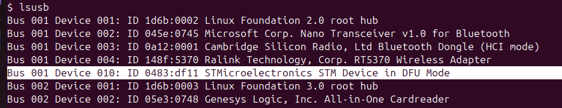

!!! danger

    THIS IS A RISKY OPERATION YOU CAN BRICK YOUR CARTO

    Do not follow these instructions unless you have a USB V3 Carto!!!!!!

!!! warn

    You might corrupt the katapult boot loader trying to use a Linux VM to flash the carto, I strongly recommend a live USB over a VM.

## Verify your Cable

You must make sure that the cable you are using is pinned correctly.  For both flat pack and right angle carto's the default cable that comes with your carto might not be pinned correctly.


!!! warn
    
    The right angle and flat pack pin out is different to using a low profile carto, so the image above **does not apply** to low profile cartographers!

!!! warn

    You **must** not use the firmware.cartographer3d.com, it will not flash the proper version of `CARTOGRAPHER K1 5.1.0` firmware for the K1.

    The reason this cannot be done on K1, seems to be some incompatibility with pyserial and MIPS, and issue for this has been opened 
    <https://github.com/Arksine/katapult/issues/137> 

## Flashing the Cartographer

You will need some kind of linux environment, this can be a Raspberry Pi, desktop Linux or even a Linux Server if you can plug something in via USB.   If you do not have anything like that, you will need to create a Live USB key running Ubuntu 24.04 Desktop edition.

### Creating a Live USB Key

You should create a live USB with Ubuntu 24.04 Desktop, make sure the USB is at least 8GB in size!

<https://ubuntu.com/tutorials/try-ubuntu-before-you-install#1-getting-started>

## Installation dependencies

On your raspberry pi, linux desktop, linux server or live Ubuntu USB environment you need to run the following commands to install essential packages.

```
sudo apt-get update
sudo apt-get install virtualenv python3-dev python3-pip libffi-dev build-essential git dfu-util
```

## Clone Klipper and Cartographer-Klipper

```
git clone "https://github.com/Klipper3d/klipper" $HOME/klipper
git clone "https://github.com/Cartographer3D/cartographer-klipper.git" $HOME/cartographer-klipper
```

### Update Cartographer Klipper repo 

If you already have cartographer-klipper cloned locally, and especially if you had switched to the beta to flash 5.1.0 firmware, you need to pull down the latest master and switch to it, which you can do like this:

```
cd $HOME/cartographer-klipper
git fetch
git switch master
git reset --hard origin/master
```

## Setup Klipper Virtual Env

```
virtualenv --system-site-packages $HOME/klippy-env
$HOME/klippy-env/bin/pip3 install -r $HOME/klipper/scripts/klippy-requirements.txt
```

## Flashing K1 Carto Touch V5.1.0 Firmware

This firmware is provided by Richard from Cartographer3d.com specifically for the K1, K1M and K1C.   It is critical that you flash your cartographer with this version of the Survey firmware over the official Survey Firmware on K1, K1M and K1C to avoid stuttering during bed meshes.

### Connect Cartographer via USB

Plug the cartographer into your computer and make sure it shows up if you type `lsusb` you should find an entry something like this:

```
Bus 001 Device 067: ID 1d50:614e OpenMoko, Inc.
```

### Enable Bootloader

```
CARTO_DEV=$(ls /dev/serial/by-id/usb-Cartographer*)
cd $HOME/klipper/scripts
sudo $HOME/klippy-env/bin/python -c "import flash_usb as u; u.enter_bootloader('$CARTO_DEV')"
```

**IMPORTANT:** If you get a message like `ls: cannot access '/dev/serial/by-id/usb-Cartographer': No such file or directory`, it means you forgot the `*` in the command above or else your carto cable is incorrectly pinned

You should see a message like:

```
Entering bootloader on /dev/serial/by-id/usb-Cartographer_614e_16000C000F43304253373820-if00
```
**Note:** If the carto does not enter bootloader mode, it is possible you forgot to use sudo!

**Note:** If your carto does show up in /dev/serial but won't enter bootloader mode, you will need to fix this with [DFU mode](#flashing-k1-firmware-via-dfu-mode)

### Flashing

```
CATAPULT_DEV=$(ls /dev/serial/by-id/usb-katapult*)
sudo $HOME/klippy-env/bin/python $HOME/klipper/lib/canboot/flash_can.py -f $HOME/cartographer-klipper/firmware/v2-v3/survey/5.1.0/Survey_Cartographer_K1_USB_8kib_offset.bin -d $CATAPULT_DEV
```

You should see output this this:

```
Attempting to connect to bootloader
CanBoot Connected
Protocol Version: 1.0.0
Block Size: 64 bytes
Application Start: 0x8002000
MCU type: stm32f042x6
Flashing '/home/ubuntu/cartographer-klipper/firmware/v2-v3/survey/5.1.0/Survey_Cartographer_K1_USB_8kib_offset.bin'...

[##################################################]

Write complete: 22 pages
Verifying (block count = 338)...

[##################################################]

Verification Complete: SHA = BB45B9575AC57FFF03CA5FE09186DB479E09BF53
CAN Flash Success
```

**Note:** If the carto does not flash, it is possible you forgot to use sudo!

When you reconnect your carto to your printer it should show a version `CARTOGRAPHER K1 5.1.0`:


## Flashing K1 Firmware via DFU Mode

You will need to temporarily switch to the beta branch to get the 5.1.0 combined dfu firmware:

```
cd $HOME/cartographer-klipper
git fetch
git switch beta
git reset --hard origin/beta
```

You need to bridge the boot pins before you plug your carto in via USB to your Linux session, make sure `lsusb` reports it being in DFU mode, it should show



Then cd to the combined firmware directory 

```
cd $HOME/cartographer-klipper/firmware/v2-v3/combined-firmware/5.1.0
```

And run dfu-util to write the firmware:

```
sudo dfu-util -R -a 0 -s 0x08000000:leave -D Full_Survey_Cartographer_CrealityK1_USB_5_1_0.bin
```


**Source:** <https://docs.cartographer3d.com/cartographer-probe/firmware/manual-methods/cartographer-with-input-shaper/update-via-dfu-mode>
