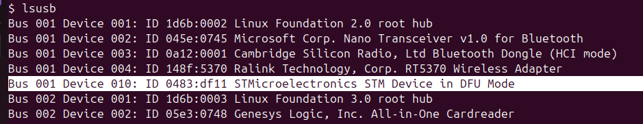

# Cartographer Flashing

This page covers flashing firmware for Cartographer USB probes for Simple AF for K1 Series printers (K1, K1C, K1SE, K1 Max, Ender 3 V3 KE and Ender 5 Max)

If you want the fully manual process instead, see the manual guides for [V3](cartographer_V3_flashing.md) and [V4](cartographer_V4_flashing.md).

For Simple AF for RPi, you should use the standard cartographer guide <https://docs.cartographer3d.com/cartographer-probe/firmware/firmware-updating/via-katapult/usb-flash#usb-katapult-updating>

!!! warn

    This process has been tested on Ubuntu 24.04 and 26.04.  Other debian based distributions might work, but they are untested!

## Creating a Live USB Key

!!! warning

    You might corrupt the katapult boot loader trying to use a Linux VM or WSL to flash the carto, I strongly recommend a live USB over a VM or WSL.

You should create a live USB with **Ubuntu 26.04** Desktop, make sure the USB is at least 8GB in size!

<https://ubuntu.com/tutorials/try-ubuntu-before-you-install#1-getting-started>

## Firmware targets

- V3 probes will be flashed with `CARTOGRAPHER K1 5.0.0`
- V4 probes will be flashed with `CARTOGRAPHER V4 6.0.0 Lite`

!!! warn 

    These cartographer firmware versions have been extensively tested with Simple AF K1 Series, newer versions may not work as reliably.

## Downloading

```bash
wget https://pellcorp.github.io/creality-wiki/scripts/cartographer_flash.sh -O ~/cartographer_flash.sh
```

## Flashing

!!! note

    Maybe it should be obvious, but make sure your cartographer is plugged in to your computer before running this step!

```bash
bash ~/cartographer_flash.sh
```

The script auto-detects V4 when the serial id exposes `stm32g431`. Otherwise it defaults to V3. You can still force the model with `--model`.

## Flashing via DFU Mode

You need to bridge the boot pins before you plug your carto in via USB to your Linux session, make sure `lsusb` reports it being in DFU mode, it should show



**Source:** <https://docs.cartographer3d.com/cartographer-probe/firmware/updating-firmware#cartographer-v3-1>

```bash
bash ~/cartographer_flash.sh --dfu --model v3
```

!!! note

    The `--model` is required in DFU mode because the normal Cartographer serial id is not available, specify `--model v3` if you 
    have an older probe, `--model v4` if you have a new probe.

## Notes

- The script uses `sudo` for `apt`, `add-apt-repository`, bootloader entry, `dfu-util` and flashing.
- If `python3.12` is already installed, the script reuses it and skips adding the deadsnakes PPA.
- If `apt` is blocked by `unattended-upgrades`, the script retries automatically.
- If `~/klipper` or `~/cartographer_firmware` already exists with the wrong `origin` remote or local uncommitted changes, the script aborts instead of updating it.
