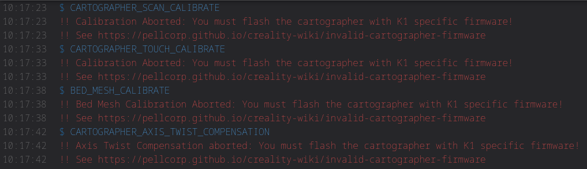

# Troubleshooting

<https://docs.cartographer3d.com/cartographer-probe/troubleshooting>

## You must flash the cartographer with K1 specific firmware!



This means when you received your cartographer you failed to flash it with the K1 (known as Lite for V4 cartographer) specific firmware required for Simple AF and Cartographer to
function without causing lots of performance and stability issues.   Validations were recently added to various macros in Simple AF for the new
Cartographer software to abort if the non K1 / Lite specific firmware is not flashed.

[cartographer firmware](cartographer.md#cartographer-firmware)

## [cartographer] MCU not connected


If you get the following warning, it means what it says, that the cartographer is not connected to the printer, either a configuration
issue with the `serial:`, or a cabling issue or something.

Refer to [Manual Cartographer Serial Device configuration](#manual-cartographer-serial-device-configuration) below.


### Manual Cartographer Serial Device configuration

You can run the following command to fix your serial if you forgot to plug your cartographer in during the installation or update:

```
~/pellcorp/installer.sh --fix-serial
```

!!! note

    If you run the above and receive an error like:

        ```
        root@K1Max-AF34 /root [#] ~/pellcorp/installer.sh --fix-serial
        -sh: /root/pellcorp/installer.sh: not found
        ```

    It means you are on an older version of Simple AF and you should instead use the old style commands:

        ```
        /usr/data/pellcorp/k1/installer.sh --fix-serial
        ```

