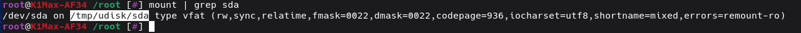

# Downgrade from CFS Firmware

Creality added logic to prevent downgrading to older version of firmware, but its super easy to work around this, we just need to
download an older `local_ota_update.sh file`, I have saved the 1.3.3.46 version of the script to my downloads repo to make it
easier to get.

So first of all go and grab the version of the older K1 firmware you want from <https://www.creality.com/pages/download-k1-flagship>,
save it to a USB key, and stick it into the front of your printer!

Now login via ssh to your printer

From the ssh command line on your printer download the older `local_ota_update.sh` script like so:

```
wget https://raw.githubusercontent.com/Guilouz/Creality-K1-Extracted-Firmwares/refs/heads/main/Firmware/etc/ota_bin/local_ota_update.sh -O - > /usr/data/local_ota_update.sh
chmod 777 /usr/data/local_ota_update.sh
```

Now you can flash new firmware with this script without the version downgrade logic getting in the way:

```
/usr/data/local_ota_update.sh /tmp/udisk/sda1/CR4CU220812S11_ota_img_V1.3.3.46.img
```

You should wait until you see lines like the following especially `ota update ok`:

```
rootfs.squashfs read ok, now quit
ota: data processed: 99% 127696896 132233080
rootfs update done
start update rtos
zero.bin read ok, now quit
ota: data processed: 100% 452408 132233080
rtos update done
ota update ok
256+0 records in
256+0 records out
ota: stoped success
```

Then you can logout of your ssh session and power cycle your printer.   It is a good idea to factory reset your printer just to be sure all remnants of the CFS abomination has been excised!

!!! note 

    If you get the error `-sh: /usr/data/local_ota_update.sh: Permission denied`, you forgot to do
    `chmod 777 /usr/data/local_ota_update.sh`

    If you get the error `/tmp/udisk/sda1/CR4CU220812S11_ota_img_V1.3.3.46.img Not a file` it means
    either you did not download the latest img or else for some reason the usb key was mounted to somewhere
    different than `/tmp/udisk/sda1/`

    You can check which directory the usb was mounted with the following command:

    ```
    mount | grep 'sda'
    ```

    For example for my USB key its not mounted to `/tmp/udisk/sda1`, instead its mounted to `/tmp/udisk/sda`:

    

    So I would need to specify instead: 

    ```
    /usr/data/local_ota_update.sh /tmp/udisk/sda/CR4CU220812S11_ota_img_V1.3.3.46.img
    ```
