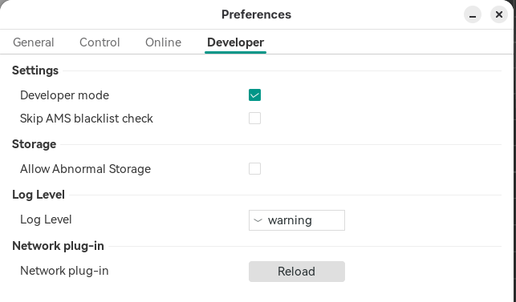
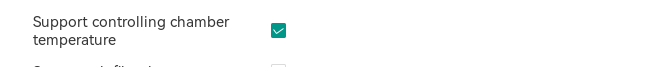
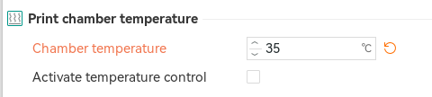
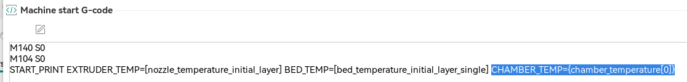
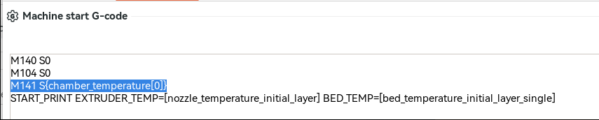
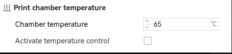

# Chamber Temperature

## Wait for Chamber Temp

Orca Slicer has the ability to define a chamber target temp per filament and if you want Simple AF to wait on that chamber temp before actually trying to
print we can with a bit of work in both Orca Slicer and Simple AF via Custom hooks.

!!! note "OrcaSlicer 2.3.2 Changes"

    Starting from OrcaSlicer 2.3.2 for some strange reason, you have to enable developer mode to access these settings:

    

    And then you have to enable the setting in the Printer Settings (Basic information) settings:

    

Step 1 - Define per filament any requirement for a chamber temp, look **Print chamber temperature** for:



Set a value in celcius, but do **NOT** check the **Activate temperature control** checkbox.

Step 2 - Add `CHAMBER_TEMP={chamber_temperature[0]}` to Machine Gcode Start Print:



Step 3 - Define a `_SAF_START_PRINT_BEFORE_LINE_PURGE` [custom hook](custom_hooks.md), something like this would work:

```
[gcode_macro _SAF_START_PRINT_BEFORE_LINE_PURGE]
gcode:
    
    
        RESPOND TYPE=command MSG="Waiting chamber to reach {CHAMBER_TEMP}c ..."
        TEMPERATURE_WAIT SENSOR="temperature_sensor chamber_temp" MINIMUM={CHAMBER_TEMP}
        RESPOND TYPE=command MSG="Chamber target temperature reached: {CHAMBER_TEMP}°C"
    
```

## Chamber Fan Target Temp

There is no way to pass in a parameter to start print for this, but there is a really easy workaround and you can even set the target per filament.   The target being the temp at which the fan gets activated.

So per filament in Orca Slicer find the **Print chamber temperature** and set a value in celcius, but do **NOT** check the **Activate temperature control** checkbox.


Then in your Machine start Gcode above START_PRINT add this line (before the START_PRINT line):

```
M141 S{chamber_temperature[0]}
```

The M141 macro provided by Simple AF (derived from Helper Script) sets the target of the chamber fan via this macro.



