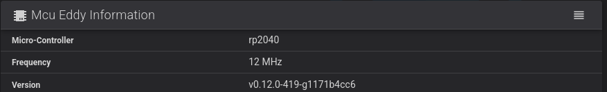
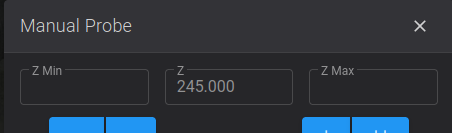
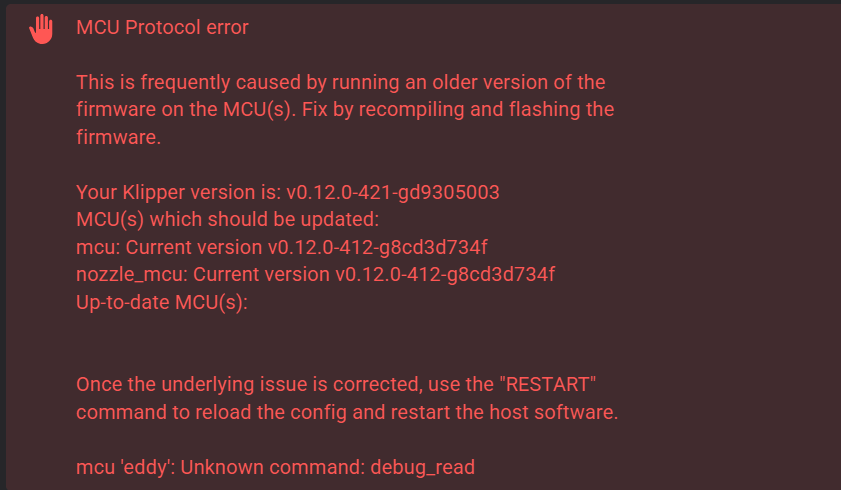
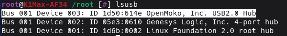

## Experimental Status

!!! danger

    This feature has just been released and it is under active development from vvuk over at <https://github.com/vvuk/eddy-ng/>, so there 
    are likely to be gotchas and issues, please bare that in mind.   Its likely you will be required to reflash your eddy a few times
    before things settle down to just python klipper updates.

## Where can I get help?

Come on over to the pellcorp discord server, the `#simple-af-btteddy` channel has been setup for anyone wanting support for btt eddy.

<https://discord.gg/2uGDzyJ3WX>

### eddy-ng discord 

You can also get help from the eddy-ng discord channels on the sovol discord, with the <https://discord.gg/djhnkDR2JN> link

## Firmware requirements

This guide assumes you have a K1, K1C, K1SE or K1 Max and you are running stock creality firmware 1.3.3.5 or higher, or alternately you are using  [my prerooted firmware](https://github.com/pellcorp/creality/wiki/Prerooted-K1-Firmware).   Any other pre-rooted firmware is explicitly not supported and the installer.sh will validate this and refuse to proceed if you try to use it on different firmware.

## Slicer Settings

There is an assumption that you are using a slicer like OrcaSlicer and Machine G-code like:


**Machine start G-code**
```
M140 S0
M104 S0
START_PRINT EXTRUDER_TEMP=[nozzle_temperature_initial_layer] BED_TEMP=[bed_temperature_initial_layer_single]
```

**Machine end G-code**
```
END_PRINT
```

### Custom Bed Mesh Profile

If you want to select a specific predefined bed mesh profile (which disables adaptive mesh generation), you can pass in an additional `START_PRINT` parameter:

You can either hard code it to a particular model, like `BED_MESH_PROFILE=myprofile` or you can specify a profile based on orca slicer variables, such as `BED_MESH_PROFILE="[curr_bed_type] - [filament_type]"`, but you have to make sure you have all the possible profiles
defined for each of the bed type and filament type combinations.


## Wiring

Confirm the USB wiring based on this diagram(s)
On a K1M you can use the lidar cable either directly by repinning it, or via the pass through lidar port on the toolhead.  However you cannot use the lidar port on the toolhead for K1, K1C or K1SE.   The reason this does not work is because for Lidar on the K1M creality actually routes a completely separate USB cable from the mainboard.

 

## Probe Installation

!!! danger

    Please note if you are not using ZeroDotCmd side mount you might have to make post install config changes to eddyng.cfg before **homing your printer**, using **screw tilt adjust** or doing a **bed mesh**!    Ignoring these instructions can lead to significant damage to your build plate and/or probe.

    Ignoring these instructions can lead to significant damage to your build plate and/or probe.

### Mount Options

| Mount        | Printer            | URL                                                                                                                                                                     | Notes                                                         |
|--------------|--------------------|-------------------------------------------------------------------------------------------------------------------------------------------------------------------------|---------------------------------------------------------------|
| **Default**  | K1, K1C, K1M, K1SE | <https://www.printables.com/model/1012524-btteddy-creality-k1-k1c-k1-max-mount><br/><https://www.printables.com/model/1212731-btt-eddy_ng-mount-for-creality-k1-series> ||
| **Pellcorp** | K1, K1C, K1M, K1SE | <https://www.printables.com/model/965667-wip-k1-btt-eddy-rear-mount-v4>                                                                                                 ||
| **Slam**     | K1, K1C, K1M, K1SE | <https://www.printables.com/model/1195575-btt-eddy-mount-for-k1c>                                                                                                       ||
| **Default**  | Ender 3 V3 SE      | <https://www.printables.com/model/1202031-ender-3-v3-se-k1-hotend-btt-eddy-mount>                                                                                        ||

### Nozzle Offset

!!! warn

    If you use a different probe mount you must make sure the bottom of the btt eddy **coil** is at least 3mm away from the nozzle tip, its better to be further away than closer.
    This is not the difference of the bottom of the case to the nozzle, the case is about 1.2mm thick, so this means you want the bottom of the case to be at least 2mm offset, 
    its probably a good idea to look into mounts which do not use a case or a modified case with no bottom.

## BTT Eddy Firmware

!!! warning

    It is assumed that you have flashed your eddy with the firmware from <https://github.com/pellcorp/klipper/blob/master/fw/K1/btteddy.uf2> **before** starting the installation!!!
    
    I have put together a guide for flashing the btt eddy [here](btteddy_flashing.md)

## Installation

The installation can only be performed on a printer which has been rooted and ssh granted

You need root access, if you are not already root, then follow the excellent [Helper Script Enable Root Access](https://guilouz.github.io/Creality-Helper-Script-Wiki/firmwares/install-and-update-rooted-firmware-k1/#enable-root-access) instructions.

### Factory Reset 

You must do a factory reset **only** if you have installed Helper Script or Fluidd/Mainsail directly from Creality, otherwise
you can safely proceed directly to installation.    If you have setup your printer with stock firmware only it can be quite
handy to skip a factory reset so that you can use [Switch to Stock](misc.md#switch-to-stock)

```
wget --no-check-certificate https://raw.githubusercontent.com/pellcorp/creality/main/k1/services/S58factoryreset -O /tmp/S58factoryreset
chmod +x /tmp/S58factoryreset
/tmp/S58factoryreset reset
```

!!! danger

    It is really important you do not close the ssh session until you get this message:

    

    It can take up to 5 minutes for a factory restart to finish, it is **vital** you do not power cycle your printer before the stock screen appears. There may be a 3002 error on the screen, this is completely normal.   If you are planning to install Simple AF you can ignore it, if you are trying to go back to stock, power cycle the printer again to clear the error.  

    Failing to follow this advice can lead to your printer getting bricked and requiring much more involved intervention to recover!
    
    

### Clone the Repo

```
git config --global http.sslVerify false
git clone https://github.com/pellcorp/creality.git /usr/data/pellcorp
sync
```

??? note "RPC Timeouts, try SSH Git Clone"
    ```
    mkdir -p /root/.ssh
    wget --no-check-certificate "https://raw.githubusercontent.com/pellcorp/creality/main/k1/ssh/git-ssh.sh" -O /root/git-ssh.sh
    chmod 777 /root/git-ssh.sh
    wget --no-check-certificate "https://raw.githubusercontent.com/pellcorp/creality/main/k1/ssh/pellcorp-identity" -O /root/.ssh/pellcorp-identity
    export GIT_SSH_IDENTITY=pellcorp
    export GIT_SSH=/root/git-ssh.sh
    git clone git@github.com:pellcorp/creality.git /usr/data/pellcorp
    cd /usr/data/pellcorp && git remote set-url origin https://github.com/pellcorp/creality.git && cd
    ```

### Config Overrides

If you have pellcorp-overrides in github but not stored locally, [you need to recreate the /usr/data/pellcorp-overrides directory](config_overrides.md#create-local-repo) before running the installer.sh!

### Run the installer

To run the script, you must specify the probe you want to use.

```
/usr/data/pellcorp/installer.sh --install eddyng --mount Mount
```

!!! warning

    For `Mount` you must specify the mount option for the mount you have used, if you do not do this the printer will be incorrectly configured for your mount, and bed meshes, x and y limits and related config will be wrong.   Please refer to [Mount Options](#mount-options) for supported mounts.   

    If you are using a non-supported mount you should specify a mount option as close to your mount as possible and properly adjust your configuration after installation before trying to perform a bed mesh or Screws Tilt Calculate!

??? note "RPC failed; curl 18 transfer closed"

    You might get this error:

    ```
    error: RPC failed; curl 18 transfer closed with outstanding read data remaining
    fatal: the remote end hung up unexpectedly
    fatal: early EOF
    fatal: index-pack failed
    ```
    
    Just rerun the installer.sh script (with the same probe argument), it will start from the stage that failed (most of the time this
    will be the Installing Klipper stage!)
    
    You can also prefix the installer command with `AF_GIT_CLONE=ssh` to force git to clone via ssh, this will take a **lot** longer, but it will never time out, so its good in a pinch if you are getting repeated klipper repo clone failures.

## Post Installation

### EddyNG Develop Branch

If you would like to switch to the development version of EddyNG, Simple AF maintains a branch of our klipper fork with the latest code from eddyng project develop branch, you can easily switch to this branch with this command:

```
/usr/data/pellcorp/installer.sh --klipper-branch eddy_ng_develop
```

!!! danger

    You must make sure you flash your eddy with the `fw/K1/btteddy.uf2` from this `eddy_ng_develop` when its updated!!!

    Please note the version of Eddy MCU should look like this when on develop branch 
    
    You can download the current btteddy.uf2 for the eddy_ng_develop from here:
    <https://raw.githubusercontent.com/pellcorp/klipper/eddy_ng_develop/fw/K1/btteddy.uf2>

### MCU Firmware updates are pending

At the end of the installer process if you get this message:

```
WARNING: MCU Firmware updates are pending you need to power cycle your printer!
```

It means that new MCU firmware updates need to be applied and this can only be done by power cycling the printer.  After your printer is power cycled you can verify firmware was updated with the `CHECK_FIRMWARE` macro from Fluidd or Mainsail, if you see this message:

```
INFO: Your MCU Firmware is up to date!
```

Your printer MCU firmware was updated successfully.   If you still see the `MCU Firmware updates are pending you need to power cycle your printer!` message after a power cycle, check the `/tmp/mcu_update.log`, you may be asked to provide this file on Discord if you need additional assistance, sometimes an additional power cycle can solve the problem, there is a very short window of time (15 seconds) in which the MCU firmware can be updated, so  there is a chance it will work after an additional power cycle.

### Verify USB Key

It is important to make sure you have a way to [emergency factory reset](misc.md#emergency-factory-reset) the printer, if the worst happens.   There is a macro in Simple AF called `CHECK_USB_KEY` that will wait for you to plug a USB thumb drive (aka USB key) in and tell you if it was able to be successfully mounted.


- If you get the message: `INFO - USB Key was recognised and mounted correctly (/tmp/udisk/sda1)`, your USB thumb drive (aka USB key) is perfect to use for a factory reset.
- If you get no message at all before the script ends (after 60 seconds), your USB thumb drive (aka USB key) is defective.   You can check the `messages` file in the logs section of your UI to get more details about why the usb key could not be mounted!

!!! tip

    You should verify your USB thumb drive (aka USB key) often just to make sure you have something if you need to unbrick your printer, simply type `CHECK_USB_KEY` or hit the button in Fluidd / Mainsail
    The USB key should be FAT32 formatted and be no larger than 32GB!

!!! note

    If you have plugged your btt eddy into the front usb port, you are going to have to temporarily remove the btt eddy from the front usb slot and replace it with your USB thumb drive, after you have finished verifying the USB thumb drive can be used in an emergency, you can replace the btt eddy into the front usb slot and restart klipper or power cycle your printer.

### Calibration

Calibrating the eddy should be as easy as running the `PROBE_EDDY_NG_SETUP`, first step is to home X and Y:

1. Home XY (`G28 X Y`)
2. Make sure nozzle is centred on bed
3. Heat Nozzle to 150c (`M109 S150`) so that any filament can be removed from nozzle
4. Run `PROBE_EDDY_NG_SETUP`
<br />Upon completion *`SAVE_CONFIG`*

!!! note

    Is normal to show the Z position at almost at the max height of the printer even if the nozzle is somewhere in the middle or even close to the bed, this is not a bug, its intentional.   Until
    this calibration step is completed, the Z axes cannot be homed, so we make the printer pretend the bed is down the bottom of the printer so that you can freely move the bed
    up to meet the nozzle during the paper test without running into out of range issues.  You however won't be able to move the bed further away from the nozzle more than a few mm.
    
    

Source: <https://github.com/vvuk/eddy-ng/wiki#calibration>

#### Manual Calibration

Sometimes the drive current for homing will work but for tap it breaks, you can calibrate another drive current and manually configure it for tap,
I recommend incrementing one from homing value, so for instance of tap and homing setup have 16 as drive current, calibrate 17 as well and you can 
manually modify the configuration afterwards:

```
PROBE_EDDY_NG_CALIBRATE DRIVE_CURRENT=17
```

You can then modify the `#*# tap_drive_current = 16` to be `#*# tap_drive_current = 17` and save and restart again

I am hopeful further work on this from the eddyng project might make this manual adjustment unnecessary!

### First Print

For this first print you can go and do the tuning first (PID Tuning, etc) or you can go ahead and optimise your probe z offset using baby stepping.

In fluidd the save button after you finish or cancel your print can be a bit hard to find, look for


### Tuning

At least PID tuning (bed and extruder) and input shaping is required for acceptable printing.  If you try and print after running the installer.sh and a power cycle but before any calibration you will most likely have horrendous quality, the worst you have ever seen on the k1.   After PID tuning and input shaping you should see the same kind of quality as you get with stock k1 + input shaper fix.

#### Quick Start

You can use the QUICK_START Macro to do Bed and Nozzle PID Tuning and Input Shaping.

#### Pid Tuning

**Source:** [Calibrate Pid Settings](https://www.klipper3d.org/Config_checks.html?h=pid#calibrate-pid-settings)

For example you might run these:

```
PID_CALIBRATE_BED BED_TEMP=65
PID_CALIBRATE_HOTEND HOTEND_TEMP=230
```

!!! note

    The `PID_CALIBRATE_BED` and `PID_CALIBRATE_HOTEND` macros are located in the `useful_macros.cfg` file and they have defaults values for BED_TEMP and HOTEND_TEMP so you can just run them by clicking on them if you want that same temperature.

#### Input Shaping

There is no default configuration for input shaping so it is essentially disabled out of the box.

You can use the `SHAPER_CALIBRATE` macro to run input shaping, just be sure to `SAVE CONFIG` at the end, to choose the automatically selected shaper config, be aware though that the shaper chosen might be sub-optimal due to a slight difference in vibrations between two options.  So you should probably review the output and potentially choose an alternative if it gives you higher recommended max acceleration for minimal increase in vibration.

[Input Shaper Auto Calibration](https://www.klipper3d.org/Measuring_Resonances.html#input-shaper-auto-calibration)

### Other Calibrations

!!! info

    The default value for pressure advance is set to `0.04`

Refer to [Orcaslicer Calibration](https://github.com/SoftFever/OrcaSlicer/wiki/Calibration) for more calibrations

Refer to the [Ellis Print Tuning Guide](https://ellis3dp.com/Print-Tuning-Guide/) for more great tuning ideas.

## Troubleshooting

### MCU Protocol Error - mcu 'eddy' Unknown command: debug_read

If you get the following error, it means that the eddy is not connected to the printer.   This is either because its physically not connected, the wiring is wrong, the usb subsystem has disconnected the eddy during a restart or the serial id is wrong



So from ssh run a `lsusb` and make sure you can see:



If you cannot see it in `lsusb`, then it very likely means either the eddy is wired incorrectly, or if was working, it just means that an attempt to restart the eddy failed because the K1 refused to recognise it, there is no recourse except to restart the host via Fluidd / Mainsail (or power cycle the printer)

If you can see the eddy in lsusb, then you should try to update the serial (see next)

### Manual BTT Eddy Serial Device configuration

You can run the following command to fix your serial if you forgot to plug your btt eddy in during the installation or update:

```
/usr/data/pellcorp/installer.sh --fix-serial
```
