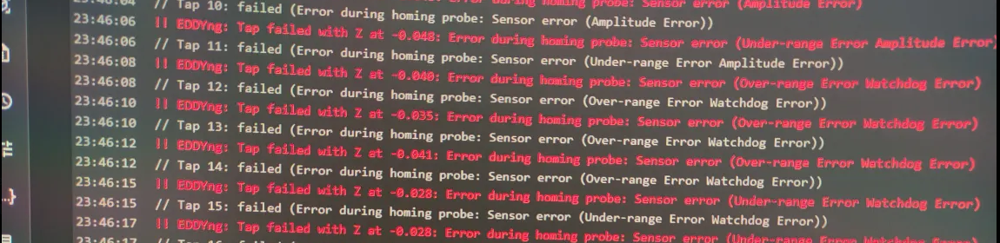
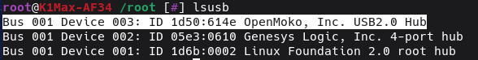

# Troubleshooting

### Tap failed with Z: Error during homing probe



The very first thing you should check is the height of the eddy, see [Nozzle Offset](eddyng.md#nozzle-offset)

Sometimes the drive current for homing will work but for tap it breaks, you can calibrate another drive current and manually configure it for tap,
I recommend incrementing one from homing value, so for instance of tap and homing setup have 16 as drive current, calibrate 17 as well and you can
manually modify the configuration afterwards:

```
PROBE_EDDY_NG_CALIBRATE DRIVE_CURRENT=17
```

You can then modify the `#*# tap_drive_current = 16` to be `#*# tap_drive_current = 17` in the `printer.cfg` file and save and restart again!

I am hopeful further work on this from the eddyng project might make this manual adjustment unnecessary!

## Eddy is not connected, aborting homing Z

If you see this error when trying to home your printer, it is a clear indication that the eddy was either not connected
when klipper started, or was disconnected sometime later.

You should look for a `mcu 'eddy' disconnected` error in your klippy.log or gcode console, if the eddy was momentarily
disconnected (so if you run `lsusb` on the printer the eddy shows up), you can simply restart klipper from the services
menu in Fluidd or Mainsail, if the eddy completely disappeared you will need to power cycle the printer!

So from ssh run a `lsusb` and make sure you can see:



If you cannot see it in `lsusb`, then it very likely means either the eddy is wired incorrectly, or if was working, it just means that an attempt to restart the eddy failed because the K1 refused to recognise it, there is no recourse except to restart the host via Fluidd / Mainsail (or power cycle the printer)

If you can see the eddy in lsusb, then you should try to update the serial (see next)

## Manual BTT Eddy Serial Device configuration

You can run the following command to fix your serial if you forgot to plug your btt eddy in during the installation or update:

```
~/pellcorp/k1/installer.sh --fix-serial
```

!!! note

    If you run the above and receive an error like:

        ```
        root@K1Max-AF34 /root [#] ~/pellcorp/installer.sh --fix-serial
        -sh: /root/pellcorp/installer.sh: not found
        ```

    It means you are on an older version of Simple AF and you should instead use the old style commands:

        ```
        /usr/data/pellcorp/k1/installer.sh --fix-serial
        ```
