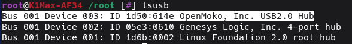

# Troubleshooting

### Tap failed with Z: Error during homing probe


Sometimes the drive current for homing will work but for tap it breaks, you can calibrate another drive current and manually configure it for tap,
I recommend incrementing one from homing value, so for instance of tap and homing setup have 16 as drive current, calibrate 17 as well and you can
manually modify the configuration afterwards:

```
PROBE_EDDY_NG_CALIBRATE DRIVE_CURRENT=17
```

You can then modify the `#*# tap_drive_current = 16` to be `#*# tap_drive_current = 17` and save and restart again

I am hopeful further work on this from the eddyng project might make this manual adjustment unnecessary!

## MCU Protocol Error - mcu 'eddy' Unknown command: debug_read

If you get the following error, it means that the eddy is not connected to the printer.   This is either because its physically not connected, the wiring is wrong, the usb subsystem has disconnected the eddy during a restart or the serial id is wrong


So from ssh run a `lsusb` and make sure you can see:



If you cannot see it in `lsusb`, then it very likely means either the eddy is wired incorrectly, or if was working, it just means that an attempt to restart the eddy failed because the K1 refused to recognise it, there is no recourse except to restart the host via Fluidd / Mainsail (or power cycle the printer)

If you can see the eddy in lsusb, then you should try to update the serial (see next)

## Manual EddyNG Serial Device configuration

You can run the following command to fix your serial if you forgot to plug your btt eddy in during the installation or update:

```
/usr/data/pellcorp/installer.sh --fix-serial
```

!!! note

    If you run the above and receive an error like:

        ```
        root@K1Max-AF34 /root [#] ~/pellcorp/installer.sh --fix-serial
        -sh: /root/pellcorp/installer.sh: not found
        ```

    It means you are on an older version of Simple AF and you should instead use the old style commands:

        ```
        /usr/data/pellcorp/k1/installer.sh --fix-serial
        ```

