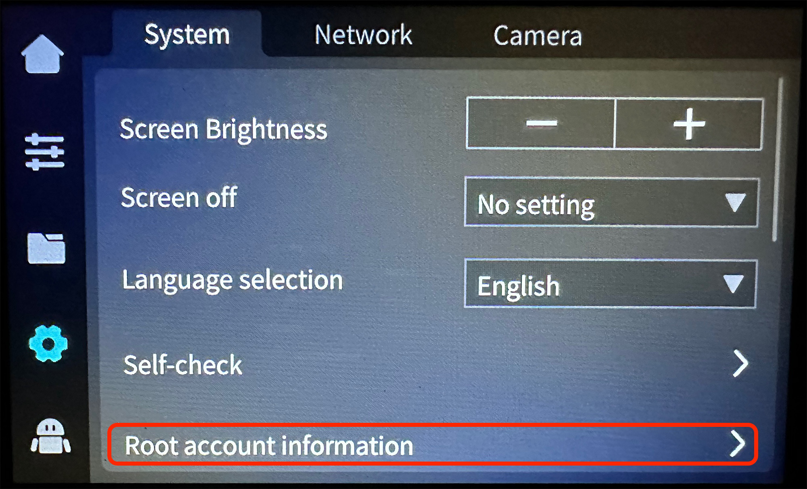
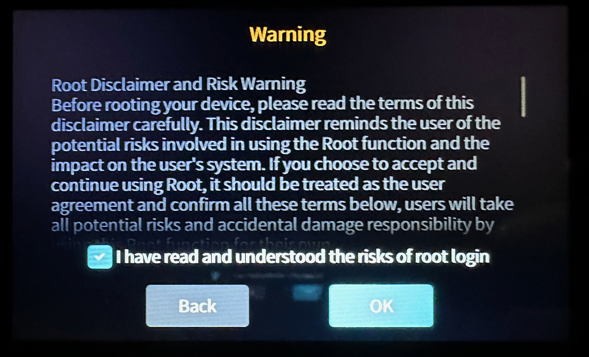
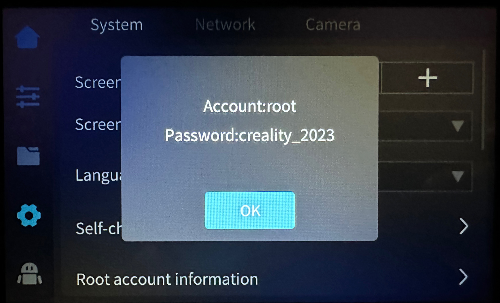

# Enable Root Access

!!! note
    Root access must be re-enabled if you restore the printer to factory settings.

- On the screen UI, go to `Settings` → `Root account information`:

    

- Carefully review the disclaimer, check the agreement box, wait 30 seconds and click on `OK` button:

    

- Root access is now enabled, you can click on `OK` button:

    

- You can now connect via SSH with:

    * User: `root`
    * Password: `creality_2023`

---

*This page is adapted from [Guilouz/Creality-Helper-Script-Wiki](https://github.com/Guilouz/Creality-Helper-Script-Wiki) ([original page](https://guilouz.github.io/Creality-Helper-Script-Wiki/firmwares/install-and-update-rooted-firmware-k1/#enable-root-access)).*
