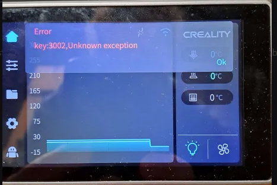

# Factory Reset

A factory reset is **required** if you have installed Guilouz's Helper Script or if you have installed Fluidd or Mainsail
through any other means, such as from Creality directly.  Otherwise, you can safely proceed directly to installation.

!!! note

    Because the Ender 5 Max **and** Ender 3 V3 KE both use the same basic software as the K1 series, this step applies to these printers as well.

```
wget --no-check-certificate https://raw.githubusercontent.com/pellcorp/creality/main/k1/services/S58factoryreset -O /tmp/S58factoryreset
chmod +x /tmp/S58factoryreset
/tmp/S58factoryreset reset
```

!!! danger

    It is really important you do not close the ssh session until you get this message:

    

    It can take up to 5 minutes for a factory restart to finish, it is **vital** you do not power cycle your printer before the stock screen appears. 

    Failing to follow this advice can lead to your printer getting bricked and requiring much more involved intervention to recover!

!!! note

    If you are factory resetting after installing Simple AF, there may be a 3002 error on the screen, this is completely normal.   
    If you are planning to install Simple AF again you can ignore it, if you are trying to go back to stock, power cycle the printer 
    again to clear the error.  

    

## First Start Setup

After performing a factory reset you might expect to be greeted with first time setup, but the Simple AF S58factoryreset suppresses this by modifying the
`/usr/data/creality/userdata/config/system_config.json` to skip self_test step!

You can force this manually by going to the **Settings**, then **Self-Check** and selecting both Input Shaping and Auto Leveling.

It is recommended to do this step **before** installing Simple AF if the printer you are about to install Simple AF to is the only printer you have access to that can print probe mounts, you want to be able to quickly [Switch to Stock](misc.md#switch-to-stock) to print
a mount if you get into trouble!
