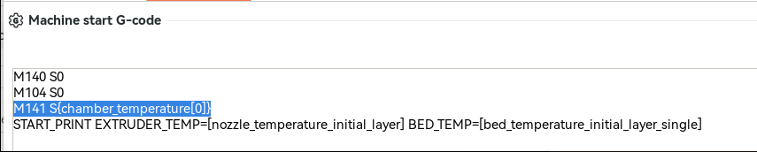
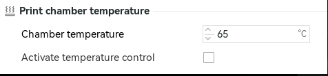
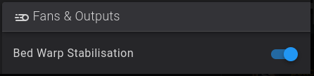
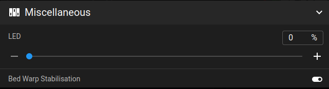

# Frequently Asked Questions

??? "How do I integrate Purcell Nozzle Wipe?"

    You can find the advanced_nozzle_cleaner.cfg file at <https://www.printables.com/model/1023575-advanced-nozzle-wiper-for-creality-k1-series>,
    and upload it to your config directory
    
    Make sure its included **after** `[include start_end.cfg]` in `printer.cfg`
        
    Then make these changes to `advanced_nozzle_cleaner.cfg`:
    
    Disable this:
    
    ```
    #[gcode_macro CX_NOZZLE_CLEAR]
    #rename_existing: _CX_NOZZLE_CLEAR
    #gcode:
    #  WIPE_NOZZLE
    ```
    
    Add this:
    
    ```
    [gcode_macro _SAF_START_PRINT_BEFORE_BED_MESH]
    gcode:
    WIPE_NOZZLE
    ```
    
    **I provide no guarantees this works because I have only tested it allows klipper to start, but this is how you integrate the nozzle cleaner, its up to you to verify your mount does not collide with it.**

??? "How do I integrate Calin Nozzle Wipe?"

    For Calin solution its all on the website:
    <https://makerworld.com/en/models/1547901-creality-k1-max-silicone-nozzle-wiper>


??? "How do I switch from btteddy to eddyng?"

    If you have calibrated the btt eddy, you can switch to the eddyng, but you will have to manually remove any btt eddy specific configuration from the SAVE CONFIG section of your printer.cfg file.
    
    To make sure Simple AF repo is up to date and on the right branch, run this:
    
    ```
    ~/pellcorp/installer.sh --branch main
    ```
    
    Then to switch to eddyng from eddy while retaining most of your customisations:
    
    ```
    ~/pellcorp/installer.sh --update eddyng
    ```
    
    Klipper may fail to start because of the btt eddy configuration at the bottom of the file, you can just manually clean those up, save and restart.


??? "How do I switch from btteddy to cartotouch?"

    If you have calibrated the btt eddy, you can switch to the cartotouch, but you will have to manually remove any btt eddy specific configuration from the SAVE CONFIG section of your printer.cfg file.
    
    To make sure Simple AF repo is up to date and on the right branch, run this:
    
    ```
    ~/pellcorp/installer.sh --branch main
    ```
    
    Then to switch to cartotouch from btteddy while retaining most of your customisations:
    
    ```
    ~/pellcorp/installer.sh --update cartotouch
    ```
    
    Klipper may fail to start because of the btt eddy configuration at the bottom of the file, you can just manually clean those up, save and restart.

??? "How do I add my own macros to Simple AF?"

    So you cannot modify or add new macros to Simple AF cfg files, they will be erased the next time you update, what you should do instead is add your own .cfg files with your macros.

    So create a new file in the config directory, if you create the file in the config directory, Simple AF will back it up for you to the pellcorp-overrides directory where it can be automatically added to your github and will survive a factory reset.
    
    So first step is create a new file in the config directory via fluidd or mainsail, I am going to call my file `example.cfg`
    
    Then just add `[include example.cfg]` to printer.cfg, just put it at the end of all the includes in the existing file, save and restart and your macro should appear in the list of macro buttons.

    Its worth noting cfg in sub-directories will not be automatically backed up so best to keep them all in the main config directory.

??? "Why can't I use force move?"
    
    We disable FORCE_MOVE by default because it works on the stepper level so for multi-z users it would create havoc, and also force move does not work so well for moving x and y either, so its really not that useful.
    SET_KINEMATIC_POSITION is a much better choice as once you activate this you can use the normal movement buttons in fluidd and mainsail.
    
    So if you need to move your nozzle up from being on the bed you should run:

    ```    
    SET_KINEMATIC_POSITION Z=0
    ```

    This tells the printer to pretend that the nozzle is at zero, so this allows you to move the bed down the the max height of z
    
    If you want move to your bed up to the nozzle you should instead do something like:

    ```    
    SET_KINEMATIC_POSITION Z=200
    ```
    
    The reason why you cannot choose Z=0 for this scenario is you are telling the printer its at 0 z and the min position for z is -5, so this would only allow you to move the bed down 5mm, so you need to fake the printer into setting the bed to sufficient height to allow you to move it down sufficiently.
    
    If you were to set `SET_KINEMATIC_POSITION Z=100`, but your bed is already at the bottom of the printer there is no way to bring the bed up to meet the nozzle because it will exceed minimum position after moving 105mm.

    If you wish to restore access to force move set the variable_disable_force_move: True to False in sensorless.cfg and save and restart.

??? "How do I replace Simple AF the Kamp Line_Purge with a custom line purge?"

    So currently there is no official support to do a simple line purge like stock creality, but it is possible with a trick to replace the Simple AF `Line_Purge.cfg` macro with your own.
    
    First step is to disable `[include Line_Purge.cfg]` in `printer.cfg`
    
    Second step is to create a new macros file, call it something like `CustomMacros.cfg` (it matters not what its called, just as long as its not the name of an existing file), and create your own LINE_PURGE macro.
    
    Third step is to add a new include to printer.cfg for your new custom config file, and your LINE_PURGE macro will be called now instead of the KAMP one.
    
    The reason this is recommended over just commenting out LINE_PURGE in start_end.cfg and adding your own macro call, is everything I have described above will survive an Update and even a factory reset because config overrides supports removing the Line_Purge.cfg include, adding a new include to printer.cfg and backing up your custom files. 

??? "How do I integrate Knomi?"

    [Knomi Support](custom_hooks.md#knomi-support) 

??? "How can I change MCU fan from always on?"

    By default Simple AF configures the main MCU fan to always be on to avoid overheating the MCU, you can instead restore it to only come on when the steppers or heaters are activated by a few tweaks to fan_control.cfg.
    
    So disable this:

    ```    
    [static_digital_output mcu_fan_always_on]
    pins:PB2
    ```
    
    Enable this:

    ```    
    [controller_fan mcu]
    pin: PB2
    tachometer_pin: ^PC6
    heater: extruder, heater_bed
    stepper: stepper_x, stepper_y, stepper_z
    idle_timeout: 90
    ```

    You also have the option of making the MCU fan purely temp based, however there is a risk if the temp sensor on the MCU is a bit dodgy the fan might not startup early enough to avoid damage or weird behaviour from the MCU and other components, I strongly recommend leaving the MCU fan to always be on
    
    But if you want to, something like this might work:
    
    So disable this:
    
    ```
    [static_digital_output mcu_fan_always_on]
    pins:PB2
    ```
    
    And add this config:

    ```    
    # thanks to Habitural from discord
    [temperature_fan _mcu_fan]
    pin: PB2
    kick_start_time: 0.8
    off_below: 0.1
    #max_power 1.0
    sensor_type: temperature_mcu
    control: pid
    min_temp: 0
    max_temp: 80
    pid_kp: 1.0
    pid_ki: 0.5
    pid_kd: 2.0
    min_speed: 0.1
    max_speed: 0.8
    target_temp: 38
    ```
    
    Note config overrides should retain these config changes as long as you do them in the fan_control.cfg file (special handling for that file allows adding and removing whole sections)

??? "How do I get the printer to lower the bed at the end of a print?"

    This is just a configuration change to the `start_end.cfg` `_CLIENT_VARIABLE` `variable_custom_park_dz` value, you change the value from 25.0 to 50.0 or whatever you want.   If you print a really tall print the bed will be lowered as much room as there is left without exceeding the stepper_z max_position.

??? "How do I switch default UI from fluidd to mainsail and back?"

    To switch to mainsail:
    
    ```
    ~/pellcorp/switch-default-ui.sh mainsail
    ```
    
    To switch back to fluidd:
    ```    
    ~/pellcorp/switch-default-ui.sh fluidd
    ```
    
    This change will survive updating Simple AF, but will not be retained for a reinstall or factory reset. 

??? "How do I change the hostname?"

    You can update the /etc/hostname with the new hostname from ssh like this:
    
    ```    
    echo "myhostname" > /etc/hostname
    sync
    ```
    
    Next time you power cycle your printer, the hostname should be updated

??? "How to install Happy Hare on Simple AF?"
    
    **This does not apply to Simple AF for RPi**

    The default installer needs to be executed with some different arguments

    So first of all clone the repo:
    
    git clone https://github.com/moggieuk/Happy-Hare.git /usr/data/Happy-Hare
    
    Then run the installer:
    
    cd /usr/data/Happy-Hare
    ./install.sh -k /usr/data/klipper -c /usr/data/printer_data/config -z -m /usr/data/moonraker
    systemctl restart moonraker
    systemctl restart klipper

??? "How do I enable moonraker timelapses?"

    [Enable Moonraker Timelapse](misc.md#moonraker-timelapse)

??? "Where can I find stock configuration files?"

    So Guilouz who created Helper Script hosts the latest version of the K1 / K1M / K1C firmware on his website, you can find the stock config files in his repo:
    <https://github.com/Guilouz/Creality-K1-Extracted-Firmwares/tree/main/Firmware/usr/share/klipper/config>

    I am also starting to collect some squashfs (decrypted) for various firmware as well at <https://github.com/pellcorp/downloads/tree/main/creality/firmware>

??? "How can I test a new Simple AF feature?"

    So pellcorp or someone else has ask you to test a feature and you forgot how.   So each proposed feature is going to be in its own branch.   To switch branches or to get new updates for that branch:

    ```    
    ~/pellcorp/installer.sh --branch jp_some_feature
    ```
    
    Then you need to run an update:
    
    ```    
    ~/pellcorp/installer.sh --update
    ```

    Pellcorp will tell you the branch name, so replace jp_some_feature, with the branch he gave you!


??? "How do I control octoeverywhere?"
    
    [Installing Octoeverywhere Companion](misc.md#octoeverywhere-companion) 

    Octoeverywhere Companion is controlled by systemd, and each printer is a separate service, so you can see them here:
    
    ```
    $ systemctl list-units octo* --all
    UNIT                               LOAD   ACTIVE SUB     DESCRIPTION                 
    octoeverywhere-companion-2.service loaded active running OctoEverywhere For Moonraker
    octoeverywhere-companion.service   loaded active running OctoEverywhere For Moonraker
    ```
    
    To check status:
    
    ```
    systemctl status octoeverywhere-companion.service
    ```
    
    To start it:

    ```    
    sudo systemctl start octoeverywhere-companion.service
    ```
    
    To make it start on boot:
    
    ```    
    sudo systemctl enable octoeverywhere-companion.service
    ```

    The configuration for each instance of the service is in a separate directory in your home directory, so in my case I have two of them:

    ```
    ~/.octoeverywhere-companion/
    ~/.octoeverywhere-companion-2/
    ```

    And you can find a octoeverywhere.conf in each directory and you can change the IP address in that config file and restart the service:
    
    ```
    sudo systemctl restart octoeverywhere-companion
    ```

??? "How to read belt shaper graphs?"

    Take a look at this video recommended by @EAZY
    <https://www.youtube.com/watch?v=zfnWsBOt3_8>

??? "How can I make sure my bed is level / trammed?"

    ZeroDotCmd created a great video on the subject of teeth skipping with a few options for how to do it
    <https://youtu.be/S2d_9Ysz-Q8>

    Note this is not about bed mesh, this video is just about getting your bed level enough for bed mesh to be effective.

??? "How to enable Github backups for my configuration?"

    [Backup Config Overrides](config_overrides.md#git-backups-for-configuration-overrides)

??? "How can I set a chamber fan target temp from my slicer?"

    So currently there is no way to pass in a parameter to start print for this, but there is a really easy workaround and you can even set the target per filament.   The target being the temp at which the fan gets activated.
    
    So per filament in Orca Slicer find the Print chamber  temperature and set a value in celcius, but do NOT check the Activate temperature control checkbox.
    
    Then in your Machine start Gcode above START_PRINT add this line (before the START_PRINT line):
    
    ```
    M141 S{chamber_temperature[0]}
    ```

    The M141 macro provided by Simple AF (derived from Helper Script) sets the target of the chamber fan via this macro.

    
    

??? "How do I cleanup all those backup printer config files?"

    **This does not apply to Simple AF for RPi**

    Simple AF runs a cleanup every time the printer starts it does the following:
    
        - Deletes all log files older than 7 days (excluding moonraker.log, klippy.log and guppyscreen.log), if all log files are older than 7 days, it will leave the the newest old file intact
        - Deletes all backup tar.gz files older than 7 days, if all backup .tar.gz files are older than 7 days, it will leave the newest intact
        - If there is less than 1GB of space left on /usr/data it will remove all gcode files older than 7 days
    
    You can also run this script manually via the hidden macro _CLEANUP_FILES

??? "What is bed warp stabilisation and why is it good?"

    An excellent video from need it make if for why heat soaking is absolutely vital for optimal bed mesh
    <https://youtu.be/8PEsPLDxt-c>

    In Simple AF out of the box when you start a print a period of bed warp stabilisation is performed.   The default macro will wait 8 seconds for every degree of target bed temp.
    
    This is also often referred to as heat soak and it allows the heated bed to settle into its final state before performing the bed mesh.
    
    You can disable it before a print by toggling the bed warp stabilisation toggle, which you can find in the fans and outputs section of your UI.
    
    
    In Mainsail its available at 

    You can disable it permanently by changing the start_end.cfg [output_pin Bed_Warp_Stabilisation] value to 0.
    
    You can also modify the following configuration in _START_END_PARAMS:
    
    - `variable_bed_warp_wait_multiplier`  - So this value is how many seconds per degree of final bed target temp.
    - `variable_bed_warp_fraction_wait` - If the bed temp is at least 75% of target we will do partial heat soak, if it's less than 75% will heat soak then entire target amount.
    - `variable_bed_warp_wait_interval` - This is how long the macro will sleep between notifications

    **IMPORTANT:** Please note at the end of a print the heater of the bed will remain heated until the printer times out in a hour.
    
    If you want to use bed warp stabilisation but not keep the heater on at end, you can change the `start_end.cfg` `_START_END_PARAMS` `variable_end_print_keep_bed_heated` to `False`!

