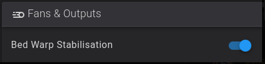
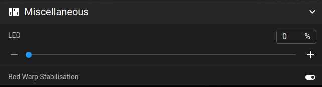
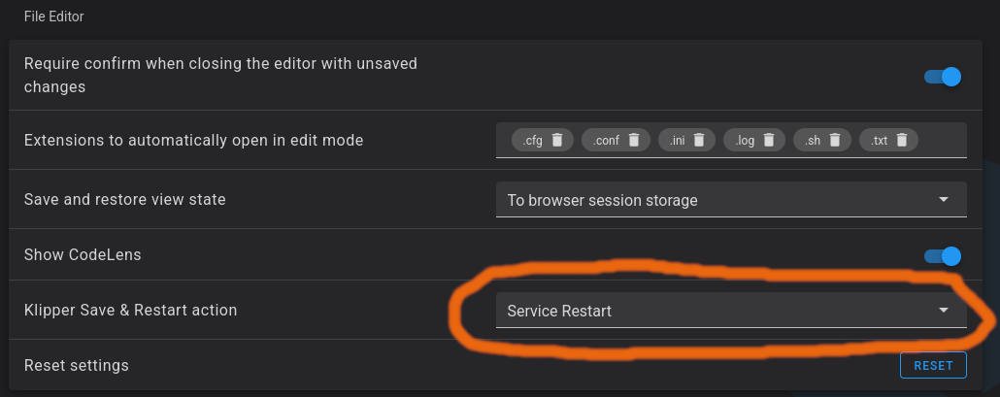

# Frequently Asked Questions

## Probes and Calibration

### Can I use Simple AF with Load Cells? { data-toc-label="Load Cells" }


There is now highly [experimental support for using existing load cells](loadcells.md) for K1, K1C, K1SE, K1 Max and Ender 3 V3 CoreXZ.

#### Load Cells for auto z-offset

We have just introduced [experimental support for using existing load cells for auto z-offset](loadcells_zoffset.md) for K1, K1C, K1SE, K1 Max, Ender 3 V3 CoreXZ, Ender 3 V3 KE and Ender 3 V3 SE users.  This is the ability to use a load cell to do auto z-offset with any of
the probes we support.  For K1, K1C, K1SE, K1 Max this would also work as an alternative to using Cartographer Touch, Beacon Contact or EddyNG Tap you can continue to use your eddy
probe of choice for bed mesh and proximity homing, but use the load cell for z-offset during prints.

The loadcell support has **zero** creality code and is fully configurable via config and gcode.  There are no python macros (complicated or otherwise) you need to navigate to customise your printer to use the load cells.  

In the near future, we will port the existing nozzle wipe macros from Creality, but [you are free to use your own or an existing third party solution](nozzle_wipe.md)

### How do I switch from btteddy to eddyng? { data-toc-label="BTT Eddy to EddyNG" }


[Switching Probes](switching_probes.md)

### How do I switch from btteddy to cartographer? { data-toc-label="BTT Eddy to Cartographer" }


[Switching Probes](switching_probes.md)

### How do I use my cartographer for input shaping? { data-toc-label="Cartographer Input Shaping" }


[Cartographer Input Shaper](cartographer_faq.md#how-do-i-use-my-cartographer-for-input-shaping)

### What is Axis Twist? { data-toc-label="Axis Twist" }


So ZeroDotCmd has done some great videos on this topic <https://www.youtube.com/watch?v=O_U8t5Ap0Ik> and <https://www.youtube.com/watch?v=1KVTRDim1lk>

More details here: <https://www.klipper3d.org/Axis_Twist_Compensation.html>

### How can I make sure my bed is level / trammed? { data-toc-label="Bed Level / Tramming" }


ZeroDotCmd created a great video on the subject of teeth skipping with a few options for how to do it
<https://youtu.be/S2d_9Ysz-Q8>

Note this is not about bed mesh, this video is just about getting your bed level enough for bed mesh to be effective.

### How to read belt shaper graphs? { data-toc-label="Belt Shaper Graphs" }


Take a look at this video recommended by @EAZY
<https://www.youtube.com/watch?v=zfnWsBOt3_8>

## Printing

### How do I replace Line_Purge with a custom line purge? { data-toc-label="Custom Line Purge" }


Create a new macros file, call it something like `CustomMacros.cfg` (it matters not what its called, just as long as it is not the name of an existing file), and create your own `_SAF_LINE_PURGE` macro.

Third step is to add a new include to `printer.cfg` for your new custom config file, and your `_SAF_LINE_PURGE` macro will be called now instead of the KAMP one.

The reason this is recommended over just commenting out `LINE_PURGE` in `start_end.cfg` and adding your own macro call, is everything I have described above will survive an Update and even a factory reset.

For more information [Custom Hooks](custom_hooks.md)

### What is bed warp stabilisation and why is it good? { data-toc-label="Bed Warp Stabilisation" }


An excellent video from need it make if for why heat soaking is absolutely vital for optimal bed mesh
<https://youtu.be/8PEsPLDxt-c>

In Simple AF out of the box when you start a print a period of bed warp stabilisation is performed.   The default macro will wait 8 seconds for every degree of target bed temp.

This is also often referred to as heat soak and it allows the heated bed to settle into its final state before performing the bed mesh.

You can disable it before a print by toggling the bed warp stabilisation toggle, which you can find in the fans and outputs section of your UI.

In Fluidd its here:



In Mainsail its here: 



You can disable it permanently by changing the `start_end.cfg` `[output_pin Bed_Warp_Stabilisation]` value to **0**.

You can also modify the following configuration in `_START_END_PARAMS`:

- `variable_bed_warp_wait_multiplier`  - So this value is how many seconds per degree of final bed target temp.
- `variable_bed_warp_fraction_wait` - If the bed temp is at least 75% of target we will do partial heat soak, if it's less than 75% will heat soak then entire target amount.
- `variable_bed_warp_wait_interval` - This is how long the macro will sleep between notifications

!!! warning

    Please note at the end of a print the heater of the bed will remain heated until the printer times out in a hour.

If you want to use bed warp stabilisation but not keep the heater on at end, you can change the `start_end.cfg` `_START_END_PARAMS` `variable_end_print_keep_bed_heated` to `False`!

For some probes like the eddy (so for `btteddy` or `eddyng`) sitting just above the heated bed for an extended period of time can cause it
to be excessively heated, there is a `start_end.cfg` property `variable_start_print_bed_heating_move_bed_distance` which can be set to something like `100`
to position the toolhead much further away from the bed while the bed heats, the default value of 20mm might not be sufficient for your use case.

### How do I get the bed to cooldown after a print finishes? { data-toc-label="Bed Cooldown After Print" }


So by default with Bed Warp stabilisation enabled, the bed will stay warm after a print for up to 1 hour (this can be changed too btw), if you do not want
the bed to stay warm after a print you can either toggle the [bed warp stabililation](#what-is-bed-warp-stabilisation-and-why-is-it-good) toggle in fluidd or mainsail before END_PRINT runs or you can modify the 
`start_end.cfg` `variable_end_print_cool_down` and change it to `False`, so it should then look like:

```
variable_end_print_cool_down: False
```

### How do I get the printer to lower the bed at the end of a print? { data-toc-label="Lower Bed After Print" }


This is just a configuration change to the `start_end.cfg` `_CLIENT_VARIABLE` `variable_custom_park_dz` value, you change the value from 25.0 to 50.0 or whatever you want.   If you print a really tall print the bed will be lowered as much room as there is left without exceeding the `[stepper_z]` `position max`!

### How can I wait for chamber temp? { data-toc-label="Wait for Chamber Temp" }

See [Wait for Chamber Temp](chamber_temp.md#wait-for-chamber-temp).

### How can I set a chamber fan target temp from my slicer? { data-toc-label="Chamber Fan Target Temp" }

See [Chamber Fan Target Temp](chamber_temp.md#chamber-fan-target-temp).

### How can I prevent a print starting or resuming if there is no filament present? { data-toc-label="No Filament Check" }


See [How can I prevent a print starting or resuming if there is no filament present?](filament_runout.md#how-can-i-prevent-a-print-starting-or-resuming-if-there-is-no-filament-present)

### How can I switch to a toolhead filament runout sensor? { data-toc-label="Toolhead Runout Sensor" }


See [How can I switch to a toolhead filament runout sensor?](filament_runout.md#how-can-i-switch-to-a-toolhead-filament-runout-sensor)

### How do I integrate a Nozzle Wipe? { data-toc-label="Nozzle Wipe" }


Information has been moved to [Nozzle Wipe Custom Hook](nozzle_wipe.md)

## Customising

### How do I add my own macros to Simple AF? { data-toc-label="Your Own Macros" }


So you cannot modify or add new macros to Simple AF cfg files, they will be erased the next time you update, what you should do instead is add your own .cfg files with your macros.

So create a new file in the config directory, if you create the file in the config directory, Simple AF will back it up for you to the pellcorp-overrides directory where it can be automatically added to your github and will survive a factory reset.

So first step is create a new file in the config directory via fluidd or mainsail, I am going to call my file `example.cfg`

Then just add `[include example.cfg]` to `printer.cfg`, just put it at the end of all the existing includes, save and restart and your macro should appear in the list of macro buttons.

!!! note

    Its worth noting cfg in sub-directories will not be automatically backed up so best to keep them all in the main config directory.

### How can I get a SimpleAF style theme for Fluidd and Mainsail { data-toc-label="Fluidd and Mainsail Themes" }

See [Simple AF Fluidd and Mainsail Themes](ui_theme.md).

### How do I switch default UI from fluidd to mainsail and back? { data-toc-label="Switch Default UI" }

    
To switch to mainsail:

```
~/pellcorp/tools/switch-default-ui.sh mainsail
```

To switch back to fluidd:

```
~/pellcorp/tools/switch-default-ui.sh fluidd
```

This change will survive updating Simple AF, but will not be retained for a reinstall or a factory reset. 

!!! note

    If you run the above and receive an error like:

        ```
        root@K1Max-AF34 /root [#] ~/pellcorp/tools/switch-default-ui.sh mainsail
        -sh: /root/pellcorp/tools/switch-default-ui.sh: not found
        ```

    It means you are on an older version of Simple AF and you should instead use the old style commands:

        ```
        /usr/data/pellcorp/k1/installer.sh --branch main
        ~/pellcorp/tools/switch-default-ui.sh mainsail
        ```

### Get Fluidd to restart Klipper for Save and Restart { data-toc-label="Fluidd Save and Restart" }


Fluidd actually has a feature to switch from asking Klipper to restart itself to getting Moonraker to restart the Klipper service itself, this can
be a useful change to make because in my experience restarting klipper results in less disconnections of eddy probes like Cartographer, Beacon or Eddy
and takes about the same amount of time.



### How do I integrate Knomi? { data-toc-label="Knomi" }


[Knomi Support](custom_hooks.md#knomi-support)

## Add-ons

### How to install AFC on Simple AF? { data-toc-label="AFC" }


!!! note

    This does not apply to Simple AF for RPi

First of all clone the repo, you must clone it to /usr/data, do NOT clone it to /root:

```
pip install crudini
git clone https://github.com/AFCProject/AFC-Klipper-Add-On.git  /usr/data/AFC-Klipper-Add-On
ln -s /usr/data/AFC-Klipper-Add-On /root
cd /root/AFC-Klipper-Add-On
./install-afc.sh -k /usr/data/klipper -m /usr/data/printer_data/config/moonraker.conf -y /usr/share/klippy-env/bin -p /usr/data/printer_data/config
```

!!! warning

    The above approach will hopefully be greatly simplified soon as a few fixes have been made to the Creality OS support
    on the AFC repository but not released.

### How to install Happy Hare on Simple AF? { data-toc-label="Happy Hare" }


!!! note    

    This does not apply to Simple AF for RPi

The default installer needs to be executed with some different arguments

So first of all clone the repo:

```
git clone https://github.com/moggieuk/Happy-Hare.git /usr/data/Happy-Hare
```

Then run the installer:

```
cd /usr/data/Happy-Hare
./install.sh -k /usr/data/klipper -c /usr/data/printer_data/config -z -m /usr/data/moonraker -e
systemctl restart moonraker
systemctl restart klipper
```

### How do I install Klipper TMC Autotune { data-toc-label="TMC Autotune" }


!!! note

    This only applies to K1 Series, for RPI and PiK1 you should just follow the normal installation procedure

You must ensure that you are on latest Simple AF, we enhanced the systemctl shim and added an ln shim so that the upstream
installer works like this:

```
wget --no-check-certificate -O - https://raw.githubusercontent.com/andrewmcgr/klipper_tmc_autotune/refs/heads/main/install.sh | EUID=1 KLIPPY_PATH=/usr/share/klipper AUTOTUNETMC_PATH=/usr/data/klipper_tmc_autotune sh
```

!!! tip

    If you get an error like: `[ERROR] Klipper service not found, please install Klipper first!`, it is likely your version of Simple AF is too old
    we had to enhance our systemctl shim and a soft link and hack the busybox ln command to allow the installer to run as though it were on a proper os
    like rasbian.

### How do I enable moonraker timelapses? { data-toc-label="Timelapses" }


[Enable Moonraker Timelapse](moonraker_timelapse.md)

### How do I setup remote access and AI failure detection? { data-toc-label="Remote Access" }


[Octoeverywhere Companion](octoeverywhere_companion.md)

### Can I have more than one camera on Simple AF { data-toc-label="More Than One Camera" }


For Simple AF for RPi yes thats fine and you can do that via crowsnest, but for K1 Series (which includes K1, K1M, K1SE, K1C, Ender 5 Max and Ender 3 V3 KE), that
is not possible, for more information see [Additional Camera](additional_camera.md)

## System

### How do I change the hostname? { data-toc-label="Hostname" }


You can update the /etc/hostname with the new hostname from ssh like this:

```    
echo "myhostname" > /etc/hostname
```

Next time you power cycle your printer, the hostname should be updated

### How can I configure the timezone { data-toc-label="Timezone" }


The `/etc/init.d/S58factoryreset` has recently been updated not to delete the `/etc/localtime`, so you can configure it once and it should survive any number of factory resets, following the excellent guide here:

<https://guilouz.github.io/Creality-Helper-Script-Wiki/firmwares/change-date-and-time/>

### How to enable Github backups for my configuration? { data-toc-label="GitHub Backups" }


[Backup Config Overrides](config_overrides.md#git-backups-for-configuration-overrides)

### How do I cleanup all those backup printer config files? { data-toc-label="Cleanup Backup Files" }


!!! note

    This does not apply to Simple AF for RPi

Simple AF runs a cleanup every time the printer starts it does the following:

- Deletes all log files older than 7 days (excluding moonraker.log, klippy.log and guppyscreen.log), if all log files are older than 7 days, it will leave the the newest old file intact
- Deletes all backup tar.gz files older than 7 days, if all backup .tar.gz files are older than 7 days, it will leave the newest intact
- If there is less than 1GB of space left on /usr/data it will remove all gcode files older than 7 days

You can also run this script manually via the hidden macro _CLEANUP_FILES

### Why can't I use force move? { data-toc-label="Force Move" }

    
We disable FORCE_MOVE by default because it works on the stepper level so for multi-z users it would create havoc, and also force move does not work so well for moving x and y either, so its really not that useful.
SET_KINEMATIC_POSITION is a much better choice as once you activate this you can use the normal movement buttons in fluidd and mainsail.

So if you need to move your nozzle up from being on the bed you should run:

```
SET_KINEMATIC_POSITION Z=0
```

This tells the printer to pretend that the nozzle is at zero, so this allows you to move the bed down the the max height of z

If you want move to your bed up to the nozzle you should instead do something like:

```    
SET_KINEMATIC_POSITION Z=200
```

The reason why you cannot choose Z=0 for this scenario is you are telling the printer its at 0 z and the min position for z is -5, so this would only allow you to move the bed down 5mm, so you need to fake the printer into setting the bed to sufficient height to allow you to move it down sufficiently.

If you were to set `SET_KINEMATIC_POSITION Z=100`, but your bed is already at the bottom of the printer there is no way to bring the bed up to meet the nozzle because it will exceed minimum position after moving 105mm.

If you wish to restore access to force move set the `variable_disable_force_move: True` to False in `homing.cfg` and save and restart.

!!! note

    You can use the hidden `_SET_KIN_MAX_Z` macro to set kinematic distance to allow the full range of z height, this macro is normally used for calibration to allow
    users to move their Cartographer, Beacon or Eddy close to the bed before calibration, but its useful for many situations.

### How can I change MCU fan from always on? { data-toc-label="MCU Fan" }

See [MCU Fan](mcu_fan.md) for how to change the MCU fan from always on.

### Where can I find stock configuration files? { data-toc-label="Stock Config Files" }


You can find the stock config files for all printers we support here:

<https://github.com/pellcorp/creality-firmware/tree/main/configs/usr/share/klipper/config>

We are also starting to collect some rootfs.squashfs (decrypted) for various firmware as well at <https://github.com/pellcorp/downloads/tree/main/creality/rootfs>

### How can I downgrade from CFS Firmware? { data-toc-label="Downgrade CFS Firmware" }

See [Downgrade from CFS Firmware](cfs_downgrade.md).
