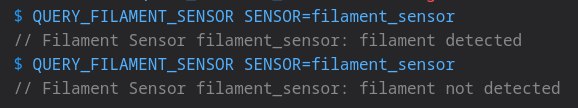
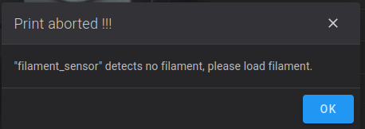

# Filament Runout

Simple AF comes with filament runout detection out of the box for all printers which are fitted with a filament runout sensor

!!! note

    A filament runout event will **not** be generated during a print if you start off the print without filament, its the state
    change from filament present, to filament not present that triggers the runout event, see [below](#how-can-i-prevent-a-print-starting-or-resuming-if-there-is-no-filament-present)
    for a way to stop a print even starting if there is no filament present.

## Configuration

It is vital you define a `filament_switch_sensor filament_sensor` with the following configuration:

```
[filament_switch_sensor filament_sensor]
switch_pin: <<CHANGE ME>>
pause_on_runout: false
runout_gcode: _ON_FILAMENT_RUNOUT
```

The `switch_pin` will differ depending on your printer, on a K series printer such as a K1, by default it will be `!PC15`, if you switch to a
nozzle based filament runout sensor it will be `!nozzle_mcu:PA10`, for RPI based printers it will vary.

!!! danger

    Do **not** set `pause_on_runout` to `True`, Simple AF relies on `pause_on_runout` being false to prevent ghost triggering of resume and pause
    during filament change, the printer will be paused as part of calling `_ON_FILAMENT_RUNOUT`!

## Testing filament runout works

You can very easily verify that the filament runout sensor is working correctly by using the gcode `QUERY_FILAMENT_SENSOR SENSOR=filament_sensor`,
where no filament is inserted it should report:

```
// Filament Sensor filament_sensor: filament not detected
```

Where filament is detected it should report:

```
// Filament Sensor filament_sensor: filament detected
```



## How can I switch to a toolhead filament runout sensor?

So if you are using the DXC extruder, Creality CFS Extruder, or even the Henlor Mod for the stock Extruder, you want to switch
from using the runout sensor bolted to the printer case and use the extruder runout sensor on the toolhead, its really easy, its
literally just a single config change in your printer.cfg.

So find the `[filament_switch_sensor filament_sensor]` and change:

From: `switch_pin: !PC15`

To: `switch_pin: !nozzle_mcu:PA10`

It should look something like this (there may be `event_delay` and `pause_delay` which should be left alone):

```
[filament_switch_sensor filament_sensor]
pause_on_runout: false
switch_pin: !nozzle_mcu:PA10
runout_gcode: _ON_FILAMENT_RUNOUT
```

Save and Restart and enjoy!

!!! danger

    Do not define two filament_switch_sensor that both _ON_FILAMENT_RUNOUT for `runout_gcode`, the installer will 
    remove the `[filament_switch_sensor filament_sensor_2]`, do not restore this config!

    Please also note that on more recent versions of Simple AF the `pause_on_runout` value is set to false, because
    we trigger `PAUSE` from the _ON_FILAMENT_RUNOUT macro now to avoid phantom triggers of pause when changing filament!


## How can I prevent a print starting or resuming if there is no filament present?

Open the `start_end.cfg`, find the `variable_runout_sensor` in the `_CLIENT_VARIABLE` section and set it to match
your filament runout sensor, like so:

```
variable_runout_sensor: "filament_switch_sensor filament_sensor"
```

!!! warn

    The runout sensor you specify in the `variable_runout_sensor` configuration must match exactly your configuration,
    so for instance if you switch to a toolhead sensor you might have configured it as `[filament_switch_sensor toolhead_sensor]`
    in which case you must change the configuration to `variable_runout_sensor: "filament_switch_sensor toolhead_sensor"` 

Save and Restart

Then when you try to start a print without filament you will get a message like:


