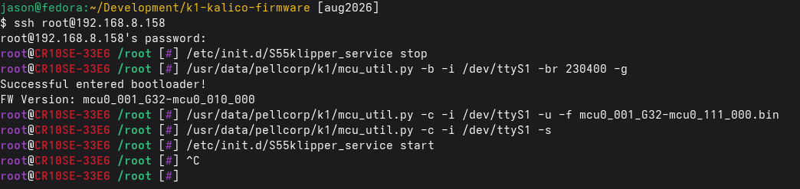

# Flashing Creality firmware via mcu_util.py

Once Simple AF has been installed and the machine restarted at least once, the firmware now has a bootloader
which allows you to flash new firmware without a restart.

The basic steps are:

- Stop klipper
- Enter bootloader of an MCU
- Flash firmware to MCU
- Start firmware on MCU
- Start Klipper

The steps to flash the MCU on most Creality printers that have one looks like:

```
/etc/init.d/S55klipper_service stop
/usr/data/pellcorp/k1/mcu_util.py -b -i /dev/ttyS1 -br 230400 -g
/usr/data/pellcorp/k1/mcu_util.py -c -i /dev/ttyS1 -u -f mcu0_001_G32-mcu0_111_000.bin
/usr/data/pellcorp/k1/mcu_util.py -c -i /dev/ttyS1 -s
/etc/init.d/S55klipper_service start
```

!!! tip "SimpleAF for RPI or PIK1"

    If you flash Simple AF firmware onto your MCUs via the /etc/init.d/S13mcu_update before you 
    switch over to RPI or PIK1, you can then use the mcu_util.py to flash them in future from your pi.



## The Serial Devices

You will need to check your printer.cfg for the specific /dev/ttyS? of your target MCU, for a K1 series printer they are:

- nozzle_mcu -> /dev/ttyS1
- mcu -> /dev/ttyS7
- leveling_mcu -> /dev/ttyS9

For an Ender 3 V3 KE the mcu is:

- mcu -> /dev/ttyS1

For an CR10SE:

- mcu -> /dev/ttyS1
- nozzle_mcu -> /dev/ttyS7

