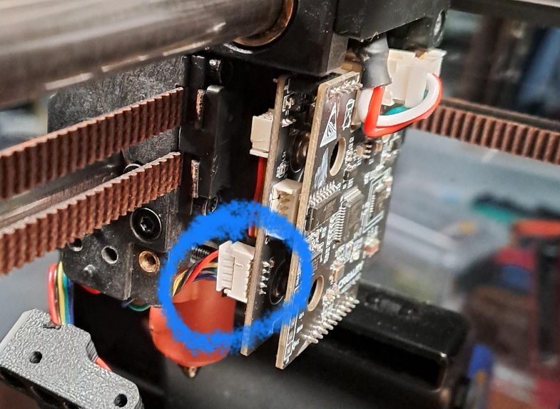

## Where can I get help?

!!! danger

    Getting the klicky setup correctly takes time and patience to ensure you do not damage your printer or the klicky, also when doing operations
    like homing and bed meshes and the like you should never leave your printer unattended in case docking or attaching fails for some reason.

!!! warning

    The default klicky dock is for the **stock gantry**, its highly unlikely to work with any other gantry, the dock would need to be remixed for that!

Come on over to the pellcorp discord server, here is the invite, the `#simple-af-klicky` channel has been setup for anyone wanting support for klicky.

<https://discord.gg/2uGDzyJ3WX>

### K1 Series

This guide assumes you have a K1, K1C, K1SE or K1 Max and you are running stock creality firmware 1.3.3.5 or **higher** (The firmware 1.3.3.5 is much older than 1.3.3.46 for example), or alternately you are using [my prerooted firmware](https://github.com/pellcorp/creality/wiki/Prerooted-K1-Firmware).   Any other pre-rooted firmware is explicitly not supported and the installer.sh will validate this and refuse to proceed if you try to use it on different firmware.

### Ender 5 Max

This probe is currently not supported on Ender 5 Max

### Ender 3 V3 KE

This probe is currently not supported on Ender 3 V3 KE

### Simple AF for RPi

See [Simple AF for RPi](rpi.md)

## Slicer Settings

There is an assumption that you are using a slicer like OrcaSlicer and Machine G-code like:


**Machine start G-code**
```
M140 S0
M104 S0
START_PRINT EXTRUDER_TEMP=[nozzle_temperature_initial_layer] BED_TEMP=[bed_temperature_initial_layer_single]
```

**Machine end G-code**
```
END_PRINT
```

### Custom Bed Mesh Profile

If you want to select a specific predefined bed mesh profile (which disables adaptive mesh generation), you can pass in an additional `START_PRINT` parameter:

You can either hard code it to a particular model, like `BED_MESH_PROFILE=myprofile` or you can specify a profile based on orca slicer variables, such as `BED_MESH_PROFILE="[curr_bed_type] - [filament_type]"`, but you have to make sure you have all the possible profiles
defined for each of the bed type and filament type combinations.


## Probe Installation

All probe mount options assume you have purchased a PCB Klicky:

- <https://www.aliexpress.com/item/1005005023158174.html>

### Mount Options

#### Default

The models can be downloaded from <https://www.printables.com/model/1170906-klicky-pcb-probe-for-creality-k1>, but the instructions for wiring and the macros
are not relevant and the wiring shown is a bit misleading, so just the models from printables nothing else.   Don't forget the 1mm spacer on the toolhead
otherwise the klicky does not properly line up when attached.

This mount should work for K1/K1C/K1SE and K1M, but only K1 and K1M variants have actually been tested.

### Wiring

!!! note

    This wiring section applies to K1/K1C/K1SE/K1M printers only

You will need to make a cable from the nozzle touch port to the 3 pin port on the klicky.

The TOUCH port on the Nozzle MCU board mates with a male 5-pin Molex Picoblade connector.
Some sellers may call the connector "Micro JST SH 1.25" but that is [incorrect](https://www.reddit.com/r/AskElectronics/comments/m6mibq/comment/gr6w1m0). 

You could repin a CR-Touch cable (used for connecting bltouch / microprobe) with the 3 pin connector provided with the PCB Klicky, or make your own cable.

The Creality cable for their CR Touch probe is a good option although you will need to remove 2 of the wires for a neat connection

- <https://www.aliexpress.us/item/1005004960067376.html>
- <https://www.amazon.com/dp/B0BKPFY24M/>

You want to use the 3 top wires on the nozzle mcu TOUCH port.   Connect to TOUCH port on the nozzle MCU, it is accessible from the side left (LIDAR) side of the printhead and only the external cover of the printhead has to be removed.




The wiring looks like this:


## Installation

!!! warn

    The installation section does not apply to Simple AF for RPi, See [Simple AF for RPi](rpi.md#installation)

The installation can only be performed on a printer which has been rooted and ssh granted

You need root access, if you are not already root, then follow the excellent [Helper Script Enable Root Access](https://guilouz.github.io/Creality-Helper-Script-Wiki/firmwares/install-and-update-rooted-firmware-k1/#enable-root-access) instructions.

### Factory Reset 

You must do a factory reset **only** if you have installed Helper Script or Fluidd/Mainsail directly from Creality, otherwise
you can safely proceed directly to installation.    If you have setup your printer with stock firmware only it can be quite
handy to skip a factory reset so that you can use [Switch to Stock](misc.md#switch-to-stock)

```
wget --no-check-certificate https://raw.githubusercontent.com/pellcorp/creality/main/k1/services/S58factoryreset -O /tmp/S58factoryreset
chmod +x /tmp/S58factoryreset
/tmp/S58factoryreset reset
```

!!! danger

    It is really important you do not close the ssh session until you get this message:

    

    It can take up to 5 minutes for a factory restart to finish, it is **vital** you do not power cycle your printer before the stock screen appears. There may be a 3002 error on the screen, this is completely normal.   If you are planning to install Simple AF you can ignore it, if you are trying to go back to stock, power cycle the printer again to clear the error.  

    Failing to follow this advice can lead to your printer getting bricked and requiring much more involved intervention to recover!
    
    

### Clone the Repo

```
git config --global http.sslVerify false
git clone https://github.com/pellcorp/creality.git /usr/data/pellcorp
sync
```

### Run the installer

!!! note

    If you have pellcorp-overrides in github but not stored locally, [you need to recreate the ~/pellcorp-overrides directory](config_overrides.md#create-local-repo) before running the installer.sh!

To run the script, you must specify the probe you want to use.

```
/usr/data/pellcorp/installer.sh --install klicky --mount Mount
```

!!! warning

    For `Mount` you must specify the mount option for the mount you have used, if you do not do this the printer will be incorrectly configured for your mount and dock location, and bed meshes, x and y limits and related config will be wrong.   Please refer to [Mount Options](#mount-options) for supported mounts.   

    If you are using a non-supported mount you should specify a mount option as close to your mount as possible and properly adjust your configuration after installation before trying to perform a bed mesh or Screws Tilt Calculate!

## Post Installation

### MCU Firmware updates are pending

At the end of the installer process if you get this message:

```
WARNING: MCU Firmware updates are pending you need to power cycle your printer!
```

It means that new MCU firmware updates need to be applied and this can only be done by power cycling the printer.  After your printer is power cycled you can verify firmware was updated with the `CHECK_FIRMWARE` macro from Fluidd or Mainsail, if you see this message:

```
INFO: Your MCU Firmware is up to date!
```

Your printer MCU firmware was updated successfully.   If you still see the `MCU Firmware updates are pending you need to power cycle your printer!` message after a power cycle, check the `/tmp/mcu_update.log`, you may be asked to provide this file on Discord if you need additional assistance, sometimes an additional power cycle can solve the problem, there is a very short window of time (15 seconds) in which the MCU firmware can be updated, so  there is a chance it will work after an additional power cycle.

### Verify USB Key

It is important to make sure you have a way to [emergency factory reset](misc.md#emergency-factory-reset) the printer, if the worst happens.   There is a macro in Simple AF called `CHECK_USB_KEY` that will wait for you to plug a USB thumb drive (aka USB key) in and tell you if it was able to be successfully mounted.


- If you get the message: `INFO - USB Key was recognised and mounted correctly (/tmp/udisk/sda1)`, your USB thumb drive (aka USB key) is perfect to use for a factory reset.
- If you get no message at all before the script ends (after 60 seconds), your USB thumb drive (aka USB key) is defective.   You can check the `messages` file in the logs section of your UI to get more details about why the usb key could not be mounted!

!!! tip

    You should verify your USB thumb drive (aka USB key) often just to make sure you have something if you need to unbrick your printer, simply type `CHECK_USB_KEY` or hit the button in Fluidd / Mainsail
    The USB key should be FAT32 formatted and be no larger than 32GB!

### Docking

Getting docking working if you are not using the `Default` mount or you have positioned the dock somewhere other than the rear left stepper motor is left as an exercise for
each user. Out of the box automatic docking is disabled for a new installation of Simple AF, you should verify the dock coordinates in the `klicky_macro.cfg` are correct, and you can then
flip the `variable_auto_docking` to `True`, save and restart and klicky will auto attach and dock for homing, bed meshing and start print.

### Verifying Probe

It's really important to verify that the klicky actually will work as an endstop for homing, so initiate homing and then use your finger to activate the microswitch
on the bottom of the klicky and make sure homing stops, if it does not stop you need to immediately use the e-stop button in your UI or Grumpyscreen or hit that power button 

### Timer too close and microsteps

For microprobe, etc you cannot use more than `microsteps: 64`.

## Calibration

!!! warning

    The following calibration steps are required to setup a new printer:

    - [Probe Calibrate](#probe-calibrate)
    - [PID Tuning and Input Shaping](#pid-tuning-and-input-shaping)

### Probe Calibrate 


1. Home All (`G28`)
2. Make sure nozzle is centred on bed
3. Run `PROBE_CALIBRATE`
4. **Manually remove klicky probe** and put it into the dock
5. Follow the [Paper Test Method](https://www.klipper3d.org/Bed_Level.html#the-paper-test)
<br />Upon completion *`SAVE_CONFIG`*

### Pid Tuning and Input Shaping

At least PID tuning (bed and extruder) and input shaping is required for acceptable printing.  If you try and print after running the installer.sh and a power cycle but before any calibration you will most likely have horrendous quality, the worst you have ever seen on the k1.   After PID tuning and input shaping you should see the same kind of quality as you get with stock k1 + input shaper fix.

!!! note

    You can use the QUICK_START Macro to complete Bed and Nozzle PID Tuning and Input Shaping Automatically.

#### Pid Tuning

**Source:** [Calibrate Pid Settings](https://www.klipper3d.org/Config_checks.html?h=pid#calibrate-pid-settings)

For example you might run these:

```
PID_CALIBRATE_BED BED_TEMP=65
PID_CALIBRATE_HOTEND HOTEND_TEMP=230
```

!!! note

    The `PID_CALIBRATE_BED` and `PID_CALIBRATE_HOTEND` macros are located in the `useful_macros.cfg` file and they have defaults values for BED_TEMP and HOTEND_TEMP so you can just run them by clicking on them if you want that same temperature.

#### Input Shaping

There is no default configuration for input shaping so it is essentially disabled out of the box.

You can use the `SHAPER_CALIBRATE` macro to run input shaping, just be sure to `SAVE CONFIG` at the end, to choose the automatically selected shaper config, be aware though that the shaper chosen might be sub-optimal due to a slight difference in vibrations between two options.  So you should probably review the output and potentially choose an alternative if it gives you higher recommended max acceleration for minimal increase in vibration.

[Input Shaper Auto Calibration](https://www.klipper3d.org/Measuring_Resonances.html#input-shaper-auto-calibration)

### Axis Twist Compensation

It is highly recommended to perform axis twist compensation, this will affect the quality of your bed mesh, so best to do it before.

!!! tip

    There is no need to run axis twist compensation if you have mounted the eddy with a side mount that has a 0 y offset!

1. Home All (`G28`)
2. Run `AXIS_TWIST_COMPENSATION_CALIBRATE` The calibration wizard will prompt you to measure the probe Z offset at a few points along the bed
   <br />Upon completion *`SAVE_CONFIG`*

**Source:** <https://www.klipper3d.org/Axis_Twist_Compensation.html>

### First Print

You should optimise your probe z offset using baby stepping.

In fluidd the save button after you finish or cancel your print can be a bit hard to find, look for


### Other Calibrations

!!! info

    The default value for pressure advance is set to `0.04`

Refer to [Orcaslicer Calibration](https://github.com/SoftFever/OrcaSlicer/wiki/Calibration) for more calibrations

Refer to the [Ellis Print Tuning Guide](https://ellis3dp.com/Print-Tuning-Guide/) for more great tuning ideas.
