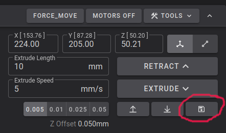

# Load Cells for Z-Offset

This page covers using load cells for auto z-offset alongside another supported probe

!!! klipper-error "Experimental High risk of bed or toolhead damage"

    Load cells for z-offset is **EXTREMELY EXPERIMENTAL**. The nozzle is pushed onto the bed with a force measured by the load cells, if the load cells are not calibrated properly or something else goes wrong you can damage your printer. Be ready to hit the e-stop button in your UI or Grumpyscreen, or the power button, and never leave your printer unattended while starting a print.

!!! warning "Kalico only"

    Load cells for z-offset **REQUIRES [Kalico](kalico.md)**

## Supported Printers

| Printer       | Status                     |
|---------------|----------------------------|
| Ender 3 V3    | Tested                     |
| Ender 3 V3 KE | Tested                     |
| Ender 3 V3 SE | Tested                     |
| K1            | Tested                     |
| K1C           | Configured, **not tested** |
| K1 SE         | Configured, **not tested** |
| K1 Max        | Configured, **not tested** |


!!! note

    For K1, K1C, K1 Max, K1 SE, Ender 3 V3 CoreXZ and Ender 5 Max the load cell probe reads all four bed load cells together as a single probe, this needs new MCU firmware which the installer takes care of.

## Overview

1. Enable loadcells zoffset support
2. [Calibrate the load cells](#calibration) with a known weight
3. [Test the probe](#test-the-probe) and check its [accuracy](#probe-accuracy)
4. Configure [Nozzle Wipe](nozzle_wipe.md) - currently this must be done manually, we are exploring integrating a default nozzle wipe for load cells soon.

## Setup

!!! warning

    There is an assumption you have already setup a supported probe with kalico

To enable loadcells for z-offset its a few simple steps for an existing Simple AF installation

--steps--

1. Add `[include loadcells-zoffset.cfg]` to `printer.cfg`

    Please note, if you want to use load cells with btteddy, you must remove the `[include btteddy_zoffset.cfg]` from the `printer.cfg`.

2. Add the following block to `printer.cfg`:
   ```
   [load_cell_probe]
   z_offset: 0.0
   ```

3. The `[bed_mesh]` `zero_reference_position` must be added to your probe cfg file where it's not already defined, which currently means:
   `bltouch.cfg`, `microprobe.cfg`, `btteddy.cfg`, `eddyng.cfg` and `klicky.cfg`

The value should be the approximate centre of your build plate, it does not have to be perfect, close enough is fine.

!!! note "Ender 3 V3 SE/KE"

    For an Ender 3 V3 SE or Ender 3 V3 KE the `zero_reference_position` **must** be `20,25`!

!!! info "What is Zero Reference Position?"

    You may be asking yourself what is this `zero_reference_position`, this is an optional parameter to the bed_mesh config, quoting
    the kalico docs its An optional X,Y coordinate that specifies the location on the bed where Z = 0.  When this option is specified 
    the mesh will be offset so that zero Z adjustment occurs at this location.

    And we then probe the load cell at this same exact point too so that the bed mesh is based on true z=0

4. Save and Restart

5. You need to [Calibrate the load cells](#calibration) before trying to do a print

--!steps--

## Calibration

!!! warning

    The load cell(s) **must** be calibrated before you can use them for z-offset, until you do the printer will stop with `Load Cell Probe Error: Load Cell not calibrated`. Never guess the calibration value, the safety limits are all in grams and an inaccurate calibration lets the nozzle push far harder than you intend.

### Check the Load Cells

Make sure the bed is empty and run `LOAD_CELL_DIAGNOSTIC`, it collects samples for 10 seconds, press on the bed while it runs.

- `Saturated samples` should be 0
- `Unique values` should be a large part of the samples collected, if it is 1 there is a wiring or configuration problem
- `Sample range` should increase when you press on the bed

**Source:** <https://github.com/KalicoCrew/kalico/blob/main/docs/Load_Cell.md#diagnostics>

### Calibrate the Load Cells

You need an object of known weight, weigh it on a kitchen scale.

!!! tip

    On the Ender 3 V3 a known weight of ~3 kg (around `3000` grams) was needed during testing, 

    On the K1 a known weight of ~6 kg (around `6000` grams) was needed during testing,

    a lighter weight fails with the `Tare and Calibration readings are less than 1% different!` error, see [Calibration Errors](#calibration-errors).

    New spools of filament work well, a brand new spool is typically 1000 g of filament plus the spool itself, which is about 250 g for a bamboo plastic spool or about 175 g for a cardboard spool.  Weight whatever you use on a kitchen scale and enter the real weight.

--steps--

1. Remove everything from the bed
2. Run `LOAD_CELL_CALIBRATE`
3. Run `TARE`
4. Place your object of known weight in the centre of the bed (or over the load cell at the front left for an Ender 3 V3 SE / KE)
5. Run `CALIBRATE GRAMS=<weight in grams>` for example `CALIBRATE GRAMS=3000`
6. Run `ACCEPT`
   <br />Upon completion *`SAVE_CONFIG`*

--!steps--

You can use `ABORT` to cancel at any time.  Afterwards run `LOAD_CELL_DIAGNOSTIC` again, and `LOAD_CELL_READ` will it will report the force on the bed in grams.

**Source:** <https://github.com/KalicoCrew/kalico/blob/main/docs/Load_Cell.md#calibration>

### Calibration Errors

| Error | Cause | Fix |
| --- | --- | --- |
| `Tare and Calibration readings are less than 1% different!` | The weight is too light, the reading has to change by at least 1% of the sensor range | Use more weight, on the Ender 3 V3 about 3 kg (`3000` grams) is needed and 2598 grams was not enough.  The message suggests a higher gain, but `gain` is already at its highest setting (`A-128`), so more weight is the only fix |
| `Sensor is saturated with too much load!` | The weight is too heavy | Use less weight |
| `Tare and Calibration readings are the same!` | The reading did not change | Check the weight is actually on the bed and run `LOAD_CELL_DIAGNOSTIC` to check the sensor |

The calibration is still active after one of these errors, so you can change the weight and run `CALIBRATE GRAMS=<weight in grams>` again.

### Test the Probe

Run `LOAD_CELL_TEST_TAP`, then gently tap the nozzle or press on the bed 3 times, it will report each tap as it is detected.  If no tap is detected within 30 seconds it fails.

!!! note

    Load cell probes always report not triggered for `QUERY_ENDSTOPS` and `QUERY_PROBE`, use `LOAD_CELL_TEST_TAP` instead.

### Probe Accuracy

Make sure the nozzle is clean and there is no filament oozing from it, and if you are heating the nozzle keep it around 140°C, ooze on the nozzle is the biggest source of bad taps.

--steps--

1. Home All (`G28`)
2. Run `LOAD_CELL_PROBE_ACCURACY`

--!steps--

## Tuning

The load cell probe settings are in the `[load_cell_probe]` section of `loadcells_zoffset.cfg`, which you can edit from the config editor in Fluidd or Mainsail.

### Tap Failures

If you see tap validation errors in the console like `TAP_PULLBACK_TOO_SHORT` or `TAP_BREAK_CONTACT_TOO_LATE` the pullback move is too short, increase `pullback_distance` in the `[load_cell_probe]` section.  The default is `0.2`, on the Ender 3 V3 setting it to `0.5` fixed frequent `TAP_PULLBACK_TOO_SHORT` failures.

```
[load_cell_probe]
pullback_distance: 0.5
```

If the errors are `TAP_BREAK_CONTACT_TOO_EARLY` it is too long.

### Trigger Force

`trigger_force` is the force in grams that triggers the probe, it is set by the mount, `75` for the Ender 3 V3 and `160` for the K1 and K1 Max.  Probing always overshoots this, so raise it in small steps only if you need to.

### Safety Limits

- `force_safety_limit` (default `2000` grams) is the most force allowed on the bed before a probe move starts.  If it is exceeded you get `force of 3000g exceeds force_safety_limit (2000g) before probing!`, this can be caused by the nozzle already resting on the bed or something pushing on the bed.
- `drift_safety_limit` (default `1000` grams) is the most force allowed while probing before it triggers.  If it is exceeded you get `force exceeded drift_safety_limit before triggering!`.


### First Print

You might need to optimise your load cell z offset using baby stepping.

In fluidd the save button after you finish or cancel your print can be a bit hard to find, look for


