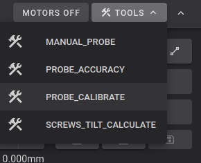
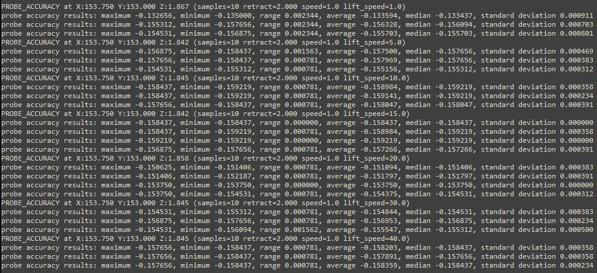

# Microprobe

This page covers installing SimpleAF using a BTT Microprobe. New here? See [Getting Started](getting-started.md).

RPi / SBC users: install SimpleAF via [SimpleAF for RPi](rpi.md). The rest of this page &mdash; mount options and calibration &mdash; applies to your setup too.

## Firmware requirements

--8<-- "snippets/probe/limits_on_x_and_y_microsteps_64.md"

### K1 Series

This guide assumes you have a K1, K1C, K1SE or K1 Max and you are running stock creality firmware 1.3.3.5 or **higher** (The firmware 1.3.3.5 is much older than 1.3.3.46 for example), **or alternately** you can use [my prerooted firmware](prerooted_firmware.md).

### Ender 5 Max

This probe is currently not supported on Ender 5 Max

### Ender 3 V3 KE

This guide assumes you have a stock Ender 3 V3 KE with Nebula Pad with Root enabled, when you get to installation below, you should specify the `--mount Default` to install
Simple AF on the KE for Cartographer.

Please note that you will need to change the screen orientation to horizontal, here is a model for that <https://www.printables.com/model/727362-ender-3-v3-ke-screen-holder-landscape-for-guppyscr>,
but please do **not** follow the installation instructions on that page, just print the model and remount your screen only!

### Nebula Pad

This probe is currently not supported on Nebula Pad

### CR10SE

This probe is currently not supported on CR10SE

### Simple AF for RPi

See [Simple AF for RPi](rpi.md)

## Probe Installation

!!! danger

    If you are not using a side mount you **must** verify config changes for microprobe.cfg before **homing your printer**, using **Screws Tilt Calculate** or doing a **bed mesh**!  

    Ignoring these instructions can lead to significant damage to your build plate and/or probe.

### Mount Options

| Mount           | Printer            | URL                                                                                                                       | Notes                            |
|-----------------|--------------------|---------------------------------------------------------------------------------------------------------------------------|----------------------------------|
| **Default**     | K1, K1C, K1M, K1SE | <https://www.printables.com/model/867527-k1-biqu-microprobe-mount-remix>                                                  |                                  |
| **BootyGantry** | K1, K1C, K1M, K1SE | <https://github.com/tlace17/K1-Linear-Rail-Gantry/blob/main/STLs/Probe%20Mounts/Rail%20Carriage%20Microprobe%20Mount.stl> |                                  |
| **Default**     | Ender 3 K3 KE      | <https://www.printables.com/model/1024825-biqu-btt-microprobe-to-crtouch-adapter>                                         | Experimental and untested as yet |

**Important:** All mount options assume a V2 microprobe is being used, after the installation you may need to modify `microprobe.cfg` to 
switch the pin config:

```
#pin: ^nozzle_mcu: PA9  # MicroProbe V1 users should use this line to trigger on high
pin: ^!nozzle_mcu: PA9  # MicroProbe V2 users should use this line to trigger on low
```

## Installation

!!! warning

     The installation section does not apply to Simple AF for RPi, See [Simple AF for RPi](rpi.md)

The installation can only be performed on a printer which has been rooted and ssh granted

You need root access, if you are not already root, then follow the [Enable Root Access](enable-root-access.md) instructions.

--8<-- "snippets/probe/factory_reset.md"

--8<-- "snippets/probe/clone_the_repo.md"

### Run the installer

!!! note

    If you have pellcorp-overrides in github but not stored locally, [you need to recreate the ~/pellcorp-overrides directory](config_overrides.md#create-local-repo) before running the installer.sh!

To run the script, you must specify the probe you want to use.

```
/usr/data/pellcorp/installer.sh --install microprobe --mount Mount
```

!!! tip "Install Kalico"

    If you want to use [Kalico](kalico.md) instead of Klipper, add the `--kalico` installation argument! 

!!! warning

    Replace `Mount` with the specific mount you have used, if you do not do this the printer will be incorrectly configured for your mount, and bed meshes, x and y limits and related config will be wrong.   Please refer to [Mount Options](#mount-options) for supported mounts.   

    If you are using a non-supported mount you should specify a mount option as close to your mount as possible and properly adjust your configuration after installation before trying to perform a bed mesh or Screws Tilt Calculate!

## Post Installation

### V1 Probe Changes

The default microprobe.cfg assumes a V2 microprobe a post install change to `[probe]` section of `printer.cfg` will be required for a V1.  Have a look at the printer.cfg after the install has finished and have a look at the commented V1 pin config.

--8<-- "snippets/probe/mcu_firmware_updates_are_pending.md"

--8<-- "snippets/probe/slicer_settings.md"

## Calibration

!!! warning

    The following calibration steps are required to setup a new printer:

    - [Probe Calibrate](#probe-calibrate)
    - [PID Tuning and Input Shaping](#pid-tuning-and-input-shaping)

### Probe Calibrate

For the microprobe it is **extremely** important to do the PROBE_CALIBRATE step to configure your z-offset, regardless of what model you have used to mount the probe!



--steps--

1. Home All (`G28`)
2. Run `PROBE_CALIBRATE`
3. Follow the [Paper Test Method](https://www.klipper3d.org/Bed_Level.html#the-paper-test)
   <br />Upon completion *`SAVE_CONFIG`*

--!steps--

!!! note

    The default z-offset for Microprobe is 0, so your prints won't stick without doing this step.

### Pid Tuning and Input Shaping

At least PID tuning (bed and extruder) and input shaping is required for acceptable printing.  If you try and print after running the installer.sh and a power cycle but before any calibration you will most likely have horrendous quality, the worst you have ever seen on the k1.   After PID tuning and input shaping you should see the same kind of quality as you get with stock k1 + input shaper fix.

!!! note

    You can use the QUICK_START Macro to complete Bed and Nozzle PID Tuning and Input Shaping Automatically.

--8<-- "snippets/probe/pid_tuning.md"

--8<-- "snippets/probe/input_shaping.md"

### Probing speed

On a K1/Max a faster lift_speed may counter the backlash on the Z-axis belts. Going too fast is likely making the bed bounce back in the opposite direction. Find the best speeds for probing by varying the probe_speed and lift_speed parameters. BIQU Microprobe is an optical probe and as a rule slow probe_speed will give better results. Start with probe_speed=1 and vary the lift_speed values to find the optimal lift_speed first.

```
PROBE_ACCURACY probe_speed=1 lift_speed=15
```

In this case, lift_speed of 15mm/s seems optimal.



After determining the optimal lift_speed, different probe_speed values can be tested until the sweet spot is found. Here 1.0mm/s works most reliably, however, the slow speed will make the meshing process take longer.


Credit to Ales Omahen (@Havoc on discord) for this section

--8<-- "snippets/probe/axis_twist_compensation.md"

--8<-- "snippets/probe/first_print.md"

--8<-- "snippets/probe/other_calibrations.md"

--8<-- "snippets/probe/where_can_i_get_help.md"
