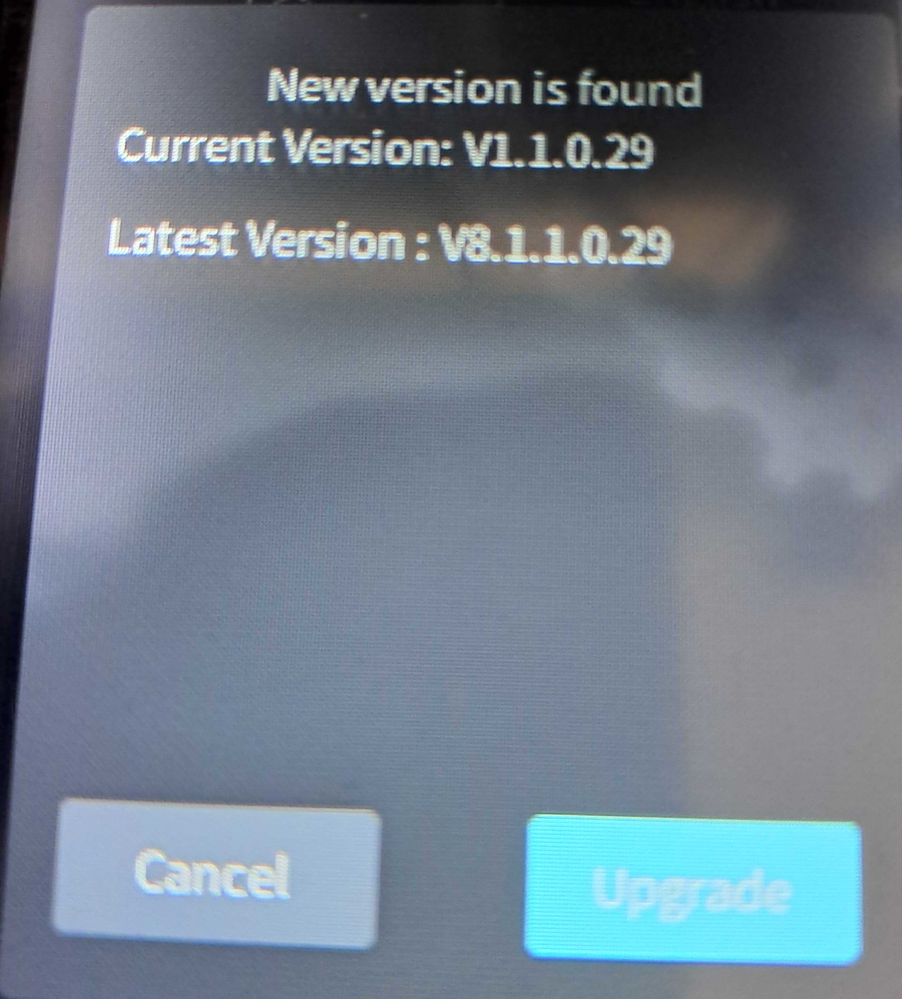
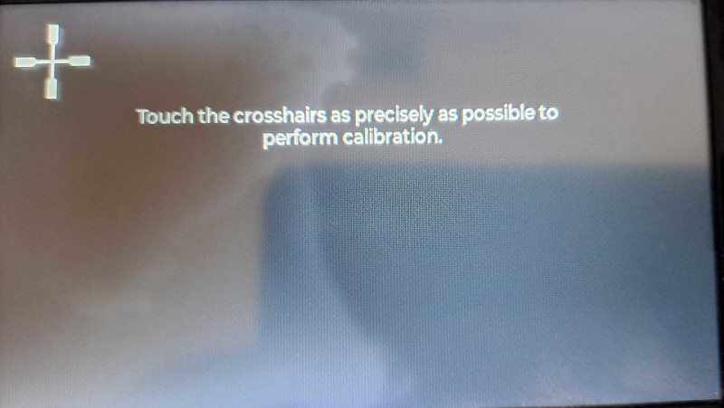
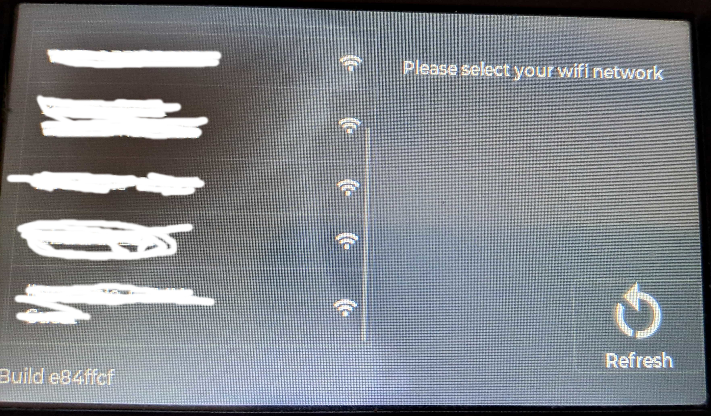
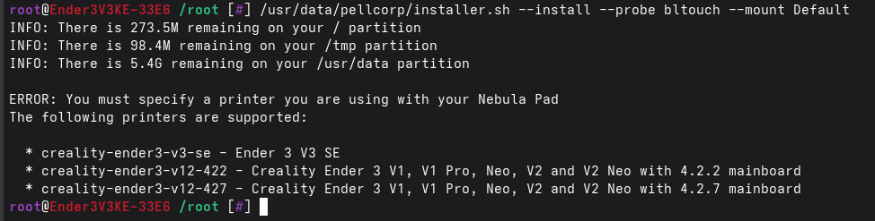

!!! klipper-error "Coming Soon"

    Installing Simple AF on a Nebula Pad is not available yet

# Simple AF on a Nebula Pad

We are introducing support for running Simple AF with a retail Nebula Pad for some older Ender printers.

## Nebula Pad mount

The Nebula Pad **must** be mounted onto the printer in landscape mode

## Supported Printers

- Ender 3 V1 and V1 Pro with 4.2.2 mainboard (`--printer creality-ender3-422`)
- Ender 3 V1 and V1 Pro with 4.2.7 mainboard (`--printer creality-ender3-427`)
- Ender 3 Neo with 4.2.7 mainboard (`--printer creality-ender3-neo-427`)
- Ender 3 V2 with 4.2.2 mainboard (`--printer creality-ender3-v2-422`)
- Ender 3 V2 with 4.2.7 mainboard (`--printer creality-ender3-v2-427`)
- Ender 3 V2 Neo with 4.2.7 mainboard (`--printer creality-ender3-v2-neo-427`)
- Ender 3 V3 SE (`--printer creality-ender3-v3-se`)

The following additional printers are planned for the near future:

- Ender 3 S1
- Ender 3 S1 Pro
- Ender 3 Max Neo

!!! note

    Additional printers that can be connected via the IDC display port will be added if requested

## Printer Firmware

You will need to flash your printer with klipper firmware in the way that each printer needs to be flashed, usually
this will entail copying the bin file to a SD or Micro SD card and placing into the printer and restarting the printer, you should not
have the printer connected to the Nebula Pad at this stage.

| Mainboards               | URL                                                                                     | Notes                                                                                                                                  |
|--------------------------|-----------------------------------------------------------------------------------------|----------------------------------------------------------------------------------------------------------------------------------------|
| Creality 4.2.2 and 4.2.7 | <https://github.com/pellcorp/klipper/raw/refs/heads/jun2025/fw/NEBULA/creality-42x.bin> | This firmware works for STM32 and GD32 variants of the boards                                                                          |
| Ender 3 V3 C13           | <https://github.com/pellcorp/klipper/raw/refs/heads/jun2025/fw/NEBULA/e3v3se.bin>       | C13 board only                                                                                                                         | 
| Ender 3 V3 C14           | <https://github.com/pellcorp/klipper/raw/refs/heads/jun2025/fw/NEBULA/e3v3se_c14.bin>   | **UNTESTED** C14 board only - Create a folder `STM32F4_UPDATE` copy `e3v3se_c14.bin`<br /> to this folder and rename to `firmware.bin` |

## SimpleAF Base Firmware

You must install the Simple AF base nebula firmware.

Download the [NEBULA_ota_img_V8.1.1.0.29.img](https://github.com/pellcorp/downloads/raw/refs/heads/main/creality/simpleaf/NEBULA_ota_img_V8.1.1.0.29.img) and save it to a Fat32 formatted USB Key and insert it into your Nebula Pad.

After you finish flashing the SimpleAF base firmware, you must [factory reset your Nebula Pad](factory_reset.md) before proceeding to install
Simple AF, the installer will abort if it detects you have not factory reset!

!!! note

    WIFI settings should be retained if you use the Simple AF factory reset method

You have a few options for flashing the firmware to your Nebula Pad

### Flash the firmware from the stock UI

The stock UI should prompt you to install the updated firmware when the USB is inserted!



### Via the command line on the printer

You will need root access to the printer, and then run this command:

```
/etc/ota_bin/local_ota_update.sh /tmp/udisk/sda1/NEBULA_ota_img_V8.1.1.0.29.img
```

### Ingenic Cloner

Coming soon

## First start

### Touch Calibration

When you start the Nebula Pad after installing the SimpleAF Base Firmware you will be a asked to complete touch calibration, follow the
steps to get that done



### Setup WIFI

If you already had wifi setup before flashing the new firmware, your wifi details might have been retained, if not you will need to
set them up again via the wifi panel or [Configure WIFI via USB](configure_wifi.md)



### Logging in

Once WIFI is connected you can login as root via ssh:

```
ssh root@THE_IP_ADDRESS
```

The password is `Creality2023`

## Installing SimpleAF



The instructions for installing SimpleAF for a bltouch just need to have a --printer argument added, so for example to install for a Ender 3 V1 with a 4.2.2 mainboard, 
you would clone the repo and then run the installer:

```
git config --global http.sslVerify false
git clone https://github.com/pellcorp/creality.git /usr/data/pellcorp
/usr/data/pellcorp/installer.sh --install bltouch --mount Default --printer creality-ender3-422
```

!!! note

    The `--mount Default` will configure bltouch for the Creality supplied bltouch mount with the stock hotend, you could also specify `--mount SpritePro` to
    setup a printer with the Sprite Pro and the provided bltouch mount.
