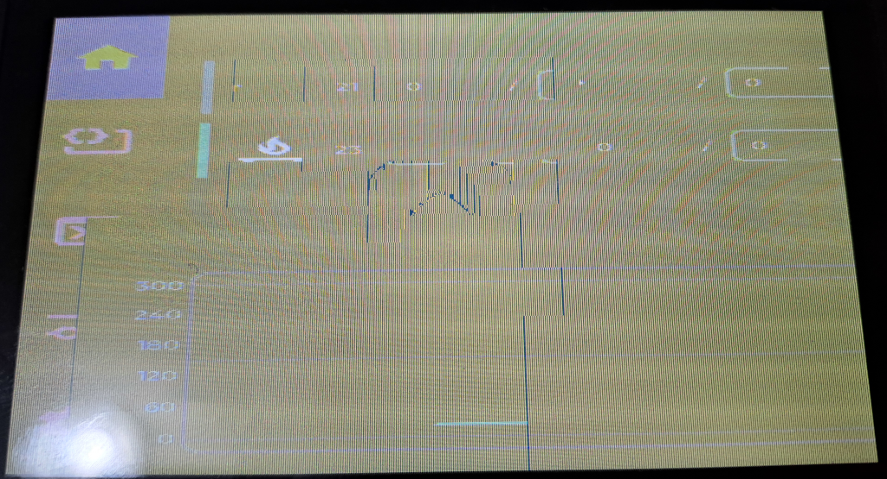

# Simple AF for RPi

Work is being done to bring Simple AF to the RPi (and other rpi like sbc)

!!! warning

    The installer assumes rasbian 11 (bulleye) or 12 (bookworm) only

## Cloning repo

You will need to install git first:

```
sudo apt-get update
sudo apt-get install --yes git
```

There is an assumption that there is a pi user and the home directory is `/home/pi`, this is most likely something we can adjust
in the future, but for the initial version you are required to have a pi user and their home directory to be /home/pi

```
git clone https://github.com/pellcorp/creality.git /home/pi/pellcorp
cd /home/pi/pellcorp 
git switch jp_simpleaf_rpi
cd -
```

## Rpi Camera

I've not found a way to get the V1 cam working with rasbian 12, only with 11 and enable classic legacy cam support
and then it just works.

## Grumpyscreen

### BTT Screens

Support for grumpyscreen will be provided for BTT screens but you need to setup the screen to be correctly configured.

<https://github.com/bigtreetech/TFT43-DIP>

By default when grumpyscreen starts its probably going to look like:



The following changes are required to fix that:

Need to download the dtbo file:

```
sudo wget https://raw.githubusercontent.com/bigtreetech/TFT43-DIP/master/gt911_btt_tft43_dip.dtbo -O /boot/overlays/gt911_btt_tft43_dip.dtbo
```

Needs this in `/boot/firmware/config.txt` (for bookworm) or `/boot/config.txt` (for bulleye)

```
[all]
gpu_mem=160

dtoverlay=vc4-kms-dpi-generic
dtparam=rgb666-padhi,clock-frequency=32000000
dtparam=hactive=800,hfp=16,hsync=1,hbp=46
dtparam=vactive=480,vfp=7,vsync=3,vbp=23
dtparam=backlight-gpio=19
dtparam=rotate=0

dtoverlay=gt911_btt_tft43_dip
dtparam=rotate_0
```

And please make sure you disable this line:

```
# dtoverlay=vc4-kms-v3d
```

!!! note
    
    The gpu_mem=160 is really important otherwise Grumpyscreen won't display correctly.
