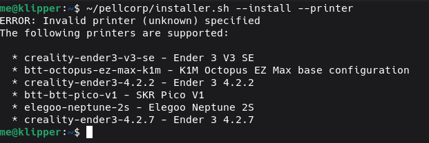
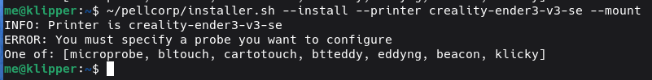

# SimpleAF for RPi

Do you want Simple AF on your non Creality OS printers?   Well Simple AF for RPi is for you, you can install it on pretty much
any debian based (rasbian, dietpi, opi debian server, etc) Rpi like SBC, which also includes CM like the CM4, CM5 and CB range from BTT as well as your standard Raspberry Pis,
Orange Pis, etc.

## Installation

Refer to [Supported OS](rpi_supported_os.md)

### Cloning repo

The following commands should be executed to get the repo locally:

```
sudo apt-get update
sudo apt-get install -y git
git clone https://github.com/pellcorp/creality.git ~/pellcorp
```

### Installing

The installation command is very similar to K1 series:

```
~/pellcorp/installer.sh --install --printer <ThePrinter> --probe <TheProbe> [--mount <TheMount>]
```

- Where `--printer <ThePrinter>` is a predefined, downloaded or downloadable printer definition
- Where `--mount <TheMount>` is only required for some predefined printer definitions
- Where `<TheProbe>` is one of:

  - [cartographer](cartographer.md)
  - [cartotouch](cartotouch.md)
  - [beacon](beacon.md)
  - [bltouch](bltouch.md)
  - [microprobe](microprobe.md)
  - [klicky](klicky.md)
  - [btteddy](btteddy.md)
  - [eddyng](eddyng.md)

#### Predefined Printer

You need to figure out what kind of mainboard you have because that will dictate whether you can  use a predefined printer cfg file 
or you need to provide your own.  The easiest way to find out what predefined printers are available is to run the command:

```
~/pellcorp/installer.sh --install --printer
```



!!! note

    For the `--printer` argument specify the ID of the printer so for instance `--printer creality-ender3-v3-se`

### Downloaded or Downloadable Printer Definition

Refer to [Printer Definitions](rpi_printer_definitions.md) for how to craft a base printer cfg file, note at the moment the 
installer does not support a printer cfg broken up into separate files, it should be a **single** .cfg file only.

You can specify a http:// or https:// url for the --printer parameter or you can download the file locally yourself!

!!! note

    For the `--printer` argument specify the url of the file, so for example `--printer https://github.com/pellcorp/klipper-rpi/blob/master/config/printer-creality-ender3-s1plus-2022.cfg`
    or reference a local file if you did download it locally, so for example `--printer ~/printer-creality-ender3-s1plus-2022.cfg`

#### Choose a Probe

You need to choose a probe one of:

- [Cartographer](cartographer.md)
- [Cartotouch (Legacy)](cartotouch.md)
- [Beacon](beacon.md)
- [BlTouch](bltouch.md)
- [Microprobe](microprobe.md)
- [Klicky](klicky.md)
- [BttEddy](btteddy.md)
- [Eddyng](eddyng.md)

#### Choose a mount

If you have chosen a predefined printer, it **might** require you to choose a mount, you can run the installer
with the --mount option without an argument to get a list of possible mounts:



## Post Installation issues

### Input Shaper and Klippain

Klippain is only pre-installed on corexy printers

If you do not define `[adxl345]` and `[resonance_tester]` sections in your base printer cfg, the installer will install
klippain but not add the `[include klippain.cfg]`, so if you setup adxl and resonance tester config after installation
you should also manually add the `[include klippain.cfg]` to your printer.cfg as well!

If you do not have a `[resonance_tester]` section, the `TEST_RESONANCES`, `SHAPER_CALIBRATE`, `INPUT_SHAPER` and `INPUT_SHAPER_GRAPHS`
macros will not work!

### MCU Firmware

Its easier to install Simple AF and then build the firmware with `make menuconfig` afterwards, just be aware that 
on first boot its likely your MCU will either not connect or klipper will complain about Protocol version issues,
this is to be expected.
