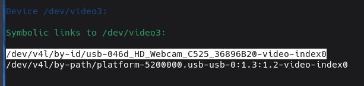

# Simple AF for RPi

Do you want Simple AF on your non Creality OS printers?   Well Simple AF for RPi is for you, you can install it on pretty much
any debian based (rasbian, dietpi, opi debian server, etc) Rpi like SBC, which also includes CM like the CM4, CM5 and CB range from BTT as well as your standard Raspberry Pis,
Orange Pis, etc.

!!! warning

    This feature is classed as **experimental**, every effort will be made to avoid breaking existing installations, but this
    cannot be guaranteed.

## Supported OS

Simple AF is best supported by RPi or OrangePi running a version of debian 11 or 12 (which includes Orange Pi Debian, Rasbian, Arbian, whatever BTT is doing, etc).

### Raspberry Pi OS

So far been tested to work on a pi 3, 4 and 5, it does not matter whether you use 32 or 64 bit OS.  
It is recommended to use the [Rpi Imager](https://www.raspberrypi.com/software/) and choose `Raspberry PI OS Lite (64-bit)` or `Raspberry PI OS (Legacy, 64 bit) Lite`

You must login as the **pi** (Default password is `raspberry`) user to perform the installation, you are not allowed to run the installer as root!

### Orange Pi OS

Please note that OrangePi OS (based on Arch) **is not supported** and will fail to install because the installer assumes a debian based OS, this is unlikely
to change anytime soon.

### Orange Pi Debian OS

Testing has been done on an Orange Pi Zero 3 W running a server image available from:
<https://drive.google.com/drive/folders/10zlO-0mMz-fqRQOKAOWX-mQA_UbN_C1n>

!!! note

    Please make sure to set `bootlogo=true` in the `orangepiEnv.txt` before booting for the first time so that
    the boot display works correctly.

    When running the `sudo apt-get update` you might get an error complaining about `Err:36 https://repo.huaweicloud.com/docker-ce/linux/debian bullseye/stable arm64 Contents`,
    this is a long standing bug (from 2023) that was never fixed and the work around is to run:
    ```
    sudo rm /etc/apt/sources.list.d/docker.list
    sudo apt-get --allow-releaseinfo-change update
    ```

You must login as the **orangepi** (Default password is `orangepi`) user to perform the installation, you are not allowed to run the installer as root!

!!! warning

    By default the `orangepi` user cannot sudo without providing a password, the installer will create a ` /etc/sudoers.d/nopasswd` file
    to enable no password sudo for the orangepi user.

### DietPi OS

Basic testing has been done with DietPi (Bookworm) running on an Orange Pi 3 Zero W

I had some trouble getting DietPi setup in my home network which uses a PiHole connected to cleanbrowsing.org DNS family filter
which prevented the default DNS settings from working.

I updated the dietpi.txt as follows:

```
AUTO_SETUP_AUTOMATED=1
SURVEY_OPTED_IN=0
CONFIG_CHECK_CONNECTION_IP=8.8.8.8
CONFIG_CHECK_CONNECTION_IPV6=2001:4860:4860::8888
CONFIG_CHECK_DNS_DOMAIN=google.com
CONFIG_CHECK_DIETPI_UPDATES=0
CONFIG_CHECK_APT_UPDATES=0
CONFIG_SERIAL_CONSOLE_ENABLE=0
```

You do not want the OS doing updates while prints are going so updating should be controlled by Moonraker only.   I reconfigured the
DNS check configuration to use google as the quad9 DNS was not resolved by cleanbrowsing.org, of course your situation may be completely
different and the above options might be overkill.

I discovered that there is a few hoops to jump through before getting the OrangePi setup, no idea if this is due to some weird
combination of settings above, but I discovered you have to physically power off the device after the first run finishes and the
pi hole is supposedly rebooted, otherwise ethernet does not come back.   

What I did was login as root after powering up the device for the first time and it will tell me that first run setup is going on in a 
different screen and will eventually let me know a restart will be required, I wait until I am kicked from the SSH session and then I give it
a minute and power cycle the pi.

Then login as the **dietpi** (Default password is `dietpi`) user to start the installation, after logging in, you may be told that first run setup is still going,
give it a few minutes and you should be greeted with a login prompt.

### Armbian

Should work fine but no formal testing has been performed as yet!

### BTT OS

Should work fine but no formal testing has been performed as yet!

## Installation

!!! danger

    Do not try and install Simple AF for RPi on Mainsail OS or onto an existing klipper environment which has been setup using kiuah

### Cloning repo

The following commands should be executed to get the repo locally:

```
sudo apt-get update
sudo apt-get install -y git
git clone https://github.com/pellcorp/creality.git ~/pellcorp
```

### Installing

The installation command is very similar to K1 series:

```
~/pellcorp/installer.sh --install --printer <ThePrinter> <TheProbe> [--mount <TheMount>]
```

- Where `--printer <ThePrinter>` is a predefined, downloaded or downloadable printer definition
- Where `--mount <TheMount>` is only required for some predefined printer definitions
- Where `<TheProbe>` is one of bltouch, microprobe, cartotouch, beacon, klicky, btteddy or eddyng. 

#### Predefined Printer

You need to figure out what kind of mainboard you have because that will dictate whether you can  use a predefined printer cfg file 
or you need to provide your own.  The easiest way to find out what predefined printers are available is to run the command:

```
~/pellcorp/installer.sh --install --printer
```


!!! note

    For the `--printer` argument specify the ID of the printer so for instance `--printer creality-ender3-v3-se`

#### Downloaded or Downloadable Printer Definition

Otherwise you will need to download a basic printer config, this definition should **not** include any kind of probe
configuration, this should just have the basics (the installer will automatically remove some problematic definitions):

- extruder
- heater_bed
- heater_fan
- stepper_x
- stepper_y
- stepper_z (or multiple stepper_z for multi-z)
- the `[printer]` section
- fan
- fan_generic
- filament_switch_sensor

!!! note

    Klippain is only pre-installed on corexy printers

    If you do not define `[adxl345]` and `[resonance_tester]` sections in your base printer, the installer will install
    klippain but not add the `[include klippain.cfg]`, so if you setup adxl and resonance tester config after installation
    you should also manually add the `[include klippain.cfg]` to your printer.cfg as well!

    If you do not have a `[resonance_tester]` section, the `TEST_RESONANCES`, `SHAPER_CALIBRATE`, `INPUT_SHAPER` and `INPUT_SHAPER_GRAPHS`
    macros will not work!

You can specify a http:// or https:// url for the --printer parameter or you can download the file locally yourself!

!!! note

    For the `--printer` argument specify the url of the file, so for example `--printer https://github.com/pellcorp/klipper-rpi/blob/master/config/printer-creality-ender3-s1plus-2022.cfg`
    or reference a local file if you did download it locally, so for example `--printer ~/printer-creality-ender3-s1plus-2022.cfg`

#### Choose a Probe

You need to choose a probe one of:

- [Cartotouch](cartographer.md)
- [Beacon](beacon.md)
- [BlTouch](bltouch.md)
- [Microprobe](microprobe.md)
- [Klicky](klicky.md)
- [BttEddy](btteddy.md)
- [Eddyng](eddyng.md)

#### Choose a mount

If you have chosen a predefined printer its possible it will require you to choose a mount, you can run the installer
with the --mount option without an argument to get a list of possible mounts:


## Post Installation issues

### MCU Firmware

Its easier to install Simple AF and then build the firmware with `make menuconfig` afterwards, just be aware that 
on first boot its likely your MCU will either not connect or klipper will complain about Protocol version issues,
this is to be expected.

### Boot Display

The boot display step is currently optional and requires some manual steps, so you install the boot display via:

```
~/pellcorp/rpi/install-boot-display.sh
```

#### Raspberry Pi OS

To get the splash screen working on raspberry pi OS you have to jump through a few additional hoops including installing:

```
sudo apt-get install -y plymouth rpd-plym-splash plymouth-themes
```

And then enable the splashscreen in raspi-config!

!!! note

    Installing rpd-plym-splash actually displays the raspberry pi desktop theme so if you enable the splashscreen after running the installer
    for the boot-display, you will most likely need to rerun:

```
sudo plymouth-set-default-theme -R simpleaf
```

### KlipperScreen

The installer will automatically install KlipperScreen on Pi4 or above, there are concerns of overloading a pi3
or less with klipperscreen so the installer will install grumpyscreen for lower specced devices, you can actually
force the installation of KlipperScreen afterwards by running:

```
sudo systemctl stop grumpyscreen
sudo systemctl disable grumpyscreen
~/pellcorp/rpi/install-klipperscreen.sh
```

### Grumpyscreen

#### BTT HDMI Screen

For whatever reason Grumpyscreen does not work nicely with a HDMI screen its on my list of TODOs to fix this, if possible
setup Simple AF on a Pi4 or above to get KlipperScreen.

#### BTT DSI Screen

Support for grumpyscreen will be provided for BTT DSI screens but you need to setup the screen to be correctly configured.

<https://github.com/bigtreetech/TFT43-DIP>

By default when grumpyscreen starts its probably going to look like:


The following changes are required to fix that:

Need to download the dtbo file:

```
sudo wget https://raw.githubusercontent.com/bigtreetech/TFT43-DIP/master/gt911_btt_tft43_dip.dtbo -O /boot/overlays/gt911_btt_tft43_dip.dtbo
```

Needs this in `/boot/firmware/config.txt` (for bookworm) or `/boot/config.txt` (for bulleye)

```
[all]
gpu_mem=160

dtoverlay=vc4-kms-dpi-generic
dtparam=rgb666-padhi,clock-frequency=32000000
dtparam=hactive=800,hfp=16,hsync=1,hbp=46
dtparam=vactive=480,vfp=7,vsync=3,vbp=23
dtparam=backlight-gpio=19
dtparam=rotate=0

dtoverlay=gt911_btt_tft43_dip
dtparam=rotate_0
```

And please make sure you disable this line:

```
# dtoverlay=vc4-kms-v3d
```

!!! note
    
    The gpu_mem=160 is really important otherwise Grumpyscreen won't display correctly.

### Crowsnest (Camera Support)

Crowsnest is automatically installed for you but a single webcam is configured and points at `/dev/video0`, this
won't always end up being a valid webcam.

To find out what devices are available you can use the crowsnest tool like so:

```
~/crowsnest/tools/dev-helper.sh -c
```



!!! warning

    According to the crowsnest project, its always preferable to use full paths, especially in Mutlicam setups using /dev/video* 
    will lead to errors or unexpected behaviours.
    
    Source: <https://crowsnest.mainsail.xyz/configuration/cam-section#device>

#### Rpi Camera

I've not found a way to get the V1 cam working with rasbian 12, only with 11 and enable classic legacy cam support
and then it just works.
