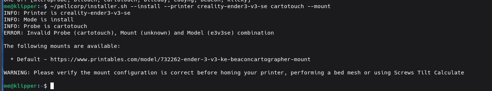

# Simple AF for RPi

Work is being done to bring Simple AF to the RPi (and other rpi like sbc)

!!! warning

    This feature is being actively worked on and has not been officially released so its bound to be broken from time to time as I add
    required features and sometimes existing stuff breaks, over the next few weeks I hope to polish it sufficiently that it can be 
    officially released, but we are not there yet.

    Outstanding and solved issues for RPi variant here:
    <https://github.com/pellcorp/creality/issues/702>

## Supported OS

Simple AF is best supported by RPi or OrangePi running a version of debian 11 or 12.

### Raspberry Pi OS

So far been tested to work on a pi 3, 4 and 5, it does not matter whether you use 32 or 64 bit OS.  
It is recommended to use the [Rpi Imager](https://www.raspberrypi.com/software/) and choose `Raspberry PI OS Lite (64-bit)` or `Raspberry PI OS (Legacy, 64 bit) Lite`

You must login as the **pi** (Default password is `raspberry`) user to perform the installation, you are not allowed to run the installer as root!

### Orange Pi OS

OrangePi OS (based on Arch) **is not supported** and will fail to install because the installer assumes a debian based OS, this is unlikely
to change anytime soon.

Testing has been done on an Orange Pi Zero 3 W running a server image available from:
<https://drive.google.com/drive/folders/10zlO-0mMz-fqRQOKAOWX-mQA_UbN_C1n>

!!! note

    When running the `sudo apt-get update` you might get an error complaining about `Err:36 https://repo.huaweicloud.com/docker-ce/linux/debian bullseye/stable arm64 Contents`,
    this is a long standing bug (from 2023) that was never fixed and the work around is to run:
    ```
    sudo rm /etc/apt/sources.list.d/docker.list
    ```

You must login as the **orangepi** (Default password is `orangepi`) user to perform the installation, you are not allowed to run the installer as root!

!!! warning

    By default the `orangepi` user cannot sudo without providing a password, the installer will create a ` /etc/sudoers.d/nopasswd` file
    to enable no password sudo for the orangepi user.

### DietPi OS

Basic testing has been done with DietPi (Bookworm) running on an Orange Pi 3 Zero W

I had some trouble getting DietPi setup in my home network which uses a PiHole connected to cleanbrowsing.org DNS family filter
which prevented the default DNS settings from working.

I updated the dietpi.txt as follows:

```
AUTO_SETUP_AUTOMATED=1
SURVEY_OPTED_IN=0
CONFIG_CHECK_CONNECTION_IP=8.8.8.8
CONFIG_CHECK_CONNECTION_IPV6=2001:4860:4860::8888
CONFIG_CHECK_DNS_DOMAIN=google.com
CONFIG_CHECK_DIETPI_UPDATES=0
CONFIG_CHECK_APT_UPDATES=0
CONFIG_SERIAL_CONSOLE_ENABLE=0
```

You do not want the OS doing updates while prints are going so updating should be controlled by Moonraker only.   I reconfigured the
DNS check configuration to use google as the quad9 DNS was not resolved by cleanbrowsing.org, of course your situation may be completely
different and the above options might be overkill.

I discovered that there is a few hoops to jump through before getting the OrangePi setup, no idea if this is due to some weird
combination of settings above, but I discovered you have to physically power off the device after the first run finishes and the
pi hole is supposedly rebooted, otherwise ethernet does not come back.   

What I did was login as root after powering up the device for the first time and it will tell me that first run setup is going on in a 
different screen and will eventually let me know a restart will be required, I wait until I am kicked from the SSH session and then I give it
a minute and power cycle the pi.

Then login as the **dietpi** (Default password is `dietpi`) user to start the installation, after logging in, you may be told that first run setup is still going,
give it a few minutes and you should be greeted with a login prompt.

!!! danger

    Do not try and install Simple AF for RPi on Mainsail OS or onto an existing klipper environment which has been setup using kiuah

## Installation

### Cloning repo

The following commands should be executed to get the repo locally:

```
sudo apt-get update
sudo apt-get install --yes git wget
git clone https://github.com/pellcorp/creality.git ~/pellcorp
~/pellcorp/rpi/installer.sh --branch jp_simpleaf_rpi
```

### Installing

The installation command is very similar to K1 series:

```
~/pellcorp/rpi/installer.sh --install --printer <ThePrinter> <TheProbe> --mount <TheMount>
```

- Where `--printer <ThePrinter>` is a predefined or downloaded printer definition
- Where `--mount <TheMount>` is only required for some predefined printer definitions
- Where `<TheProbe>` is one of bltouch, microprobe, cartotouch, beacon, klicky, btteddy or eddyng. 

#### Predefined Printer

You need to figure out what kind of mainboard you have because that will dictate whether you can  use a predefined printer cfg file 
or you need to provide your own.  The easiest way to find out what predefined printers are available is to run the command:

```
~/pellcorp/rpi/installer.sh --install --printer
```


!!! note

    For the `--printer` argument specify the ID of the printer so for instance `--printer creality-ender3-v3-se`

#### Downloaded Printer Definition

Otherwise you will need to download a basic printer config, this definition should **not** include any kind of probe
configuration, this should just have the basics:

- extruder
- heaters
- steppers
- the `[printer]` section
- fans
- filament runout

You can download a definition from <https://github.com/pellcorp/klipper-rpi/blob/master/config/> with wget, something like:

```
wget https://raw.githubusercontent.com/pellcorp/klipper-rpi/refs/heads/master/config/generic-bigtreetech-skr-pico-v1.0.cfg -O ~/bigtreetech-skr-pico-v1.0.cfg
```

!!! note

    For the `--printer` argument specify the path to the file, so `--printer ~/bigtreetech-skr-pico-v1.0.cfg`

#### Choose a Probe

You need to choose a probe one of:

- Cartotouch
- Beacon
- BlTouch
- Microprobe
- Klicky
- BttEddy
- Eddyng

!!! warning

    Refer to the other guides for probe specific config, but keep in mind that any references to `/usr/data/` in those guides should be replaced
    with your PI users home directory (so /home/pi, home/orangepi, /home/whatever)

#### Choose a mount

If you have chosen a predefined printer its possible it will require you to choose a mount, just like for K1 series, you can run the installer
with the --mount option without an argument to get a list of possible mounts:



## Post Installation issues

### Rpi Camera

I've not found a way to get the V1 cam working with rasbian 12, only with 11 and enable classic legacy cam support
and then it just works.

### KlipperScreen

The installer will automatically install KlipperScreen on Pi4 or above, there are concerns of overloading a pi3
or less with klipperscreen so the installer will install grumpyscreen for lower specced devices, you can actually
force the installation of KlipperScreen afterwards by running:

```
sudo systemctl stop grumpyscreen
sudo systemctl disable grumpyscreen
~/pellcorp/rpi/install-klipperscreen.sh
```

### Grumpyscreen

#### BTT HDMI Screen

For whatever reason Grumpyscreen does not work nicely with a HDMI screen its on my list of TODOs to fix this, if possible
setup Simple AF on a Pi4 or above to get KlipperScreen.

#### BTT DSI Screen

Support for grumpyscreen will be provided for BTT DSI screens but you need to setup the screen to be correctly configured.

<https://github.com/bigtreetech/TFT43-DIP>

By default when grumpyscreen starts its probably going to look like:


The following changes are required to fix that:

Need to download the dtbo file:

```
sudo wget https://raw.githubusercontent.com/bigtreetech/TFT43-DIP/master/gt911_btt_tft43_dip.dtbo -O /boot/overlays/gt911_btt_tft43_dip.dtbo
```

Needs this in `/boot/firmware/config.txt` (for bookworm) or `/boot/config.txt` (for bulleye)

```
[all]
gpu_mem=160

dtoverlay=vc4-kms-dpi-generic
dtparam=rgb666-padhi,clock-frequency=32000000
dtparam=hactive=800,hfp=16,hsync=1,hbp=46
dtparam=vactive=480,vfp=7,vsync=3,vbp=23
dtparam=backlight-gpio=19
dtparam=rotate=0

dtoverlay=gt911_btt_tft43_dip
dtparam=rotate_0
```

And please make sure you disable this line:

```
# dtoverlay=vc4-kms-v3d
```

!!! note
    
    The gpu_mem=160 is really important otherwise Grumpyscreen won't display correctly.
