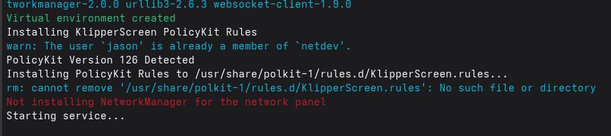

# KlipperScreen

To install KlipperScreen on Simple AF for RPi, there is currently an assumption that you are using a BTT DSI or BTT HDMI screen,
other screens might work, but ymmv.

From the printer via ssh, run:

```
~/pellcorp/rpi/install-klipperscreen.sh 
```

Please note that these errors from the installer are normal and can be ignored:



## Troubleshooting

### RPI5 and Trixie

A user has reported that klipperscreen keeps crashing on trixie with a rpi5, and the fix appears to be modifying the config.txt
to disable:

```
dtoverlay=vc4-kms-v3d
```

Its counterintuitive and in the future it might be a solved issue, but for now it might be required!
