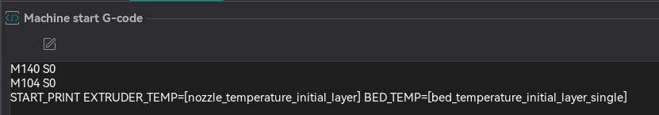
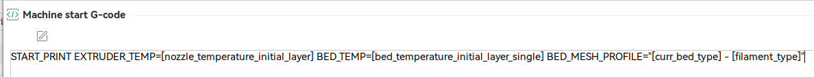

# Slicer Settings

OrcaSlicer is the only slicer we support!  You must verify that your start and end slicer gcode are correct before trying
to print.

!!! note

    We use `START_PRINT` and `END_PRINT`, **not** `PRINT_START` and `PRINT_END`, please verify you are using the correct
    macros in your slicer!

## Creality Print

Creality Print won't be able to see your printer after you have installed Simple AF.  If you want to use Creality Print you will need to print via usb!

## Cura Slicer

Cura Slicer won't work out of the box for configuring START_PRINT variables as below, you need to change the start print EXTRUDER_TEMP and BED_TEMP to pass
in the correct values, but since I don't use Cura Slicer I can't advise on that!

There is an assumption that you are using a slicer like OrcaSlicer and Machine G-code like:

## Start Print



**Machine start G-code**

```
M140 S0
M104 S0
START_PRINT EXTRUDER_TEMP=[nozzle_temperature_initial_layer] BED_TEMP=[bed_temperature_initial_layer_single]
```

## End Print

**Machine end G-code**

```
END_PRINT
```

## Custom Bed Mesh Profile

If you want to select a specific predefined bed mesh profile (which disables adaptive mesh generation), you can pass in an additional `START_PRINT` parameter:

You can either hard code it to a particular model, like `BED_MESH_PROFILE=myprofile` or you can specify a profile based on orca slicer variables, such as `BED_MESH_PROFILE="[curr_bed_type] - [filament_type]"`, but you have to make sure you have all the possible profiles
defined for each of the bed type and filament type combinations.


