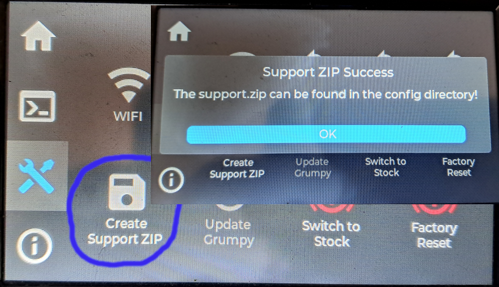
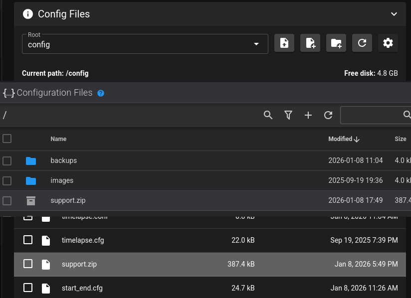

# Support ZIP

You will be asked to provide a `support.zip` file in the SimpleAF discord, there are a few ways to do this:

## Via Fluidd or Mainsail

Run the `SUPPORT_ZIP` macro from Fluidd or Mailsail

## Via GrumpyScreen

Run the `Create Support ZIP` button from the Tools menu of GrumpyScreen, be sure to wait for the success message
as it can take a while to generate the zip file.

## Via SSH

Run `~/pellcorp/tools/support.sh` from ssh on the printer.

### Where can I find the support.zip?

In all cases the support.zip can be found in the `~/printer_data/config` or the config section of fluidd or mailsail.

You need to somehow download this zip file to your local desktop / laptop so you can then upload it to discord.

