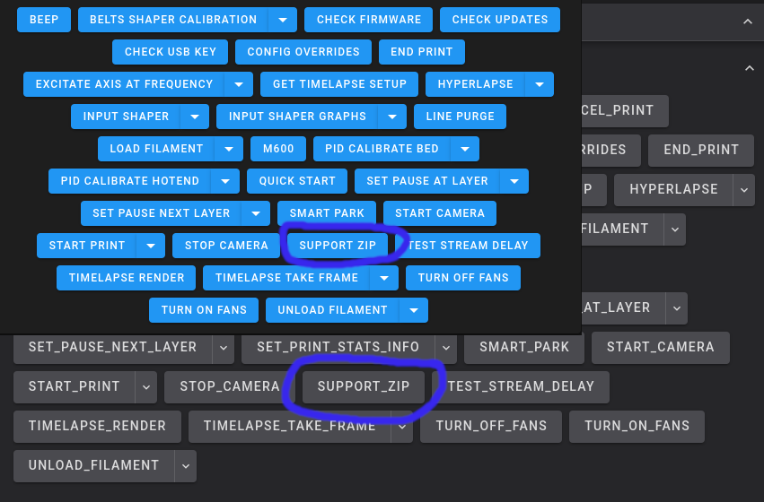
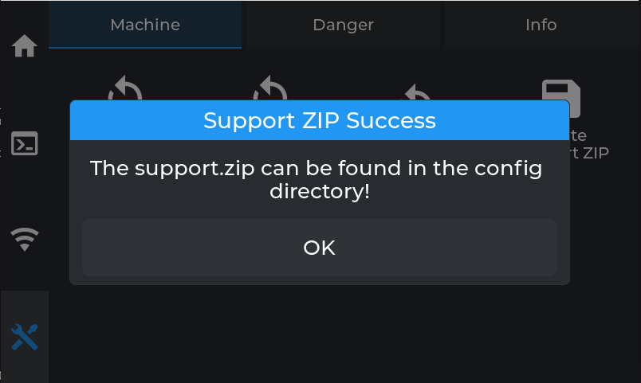
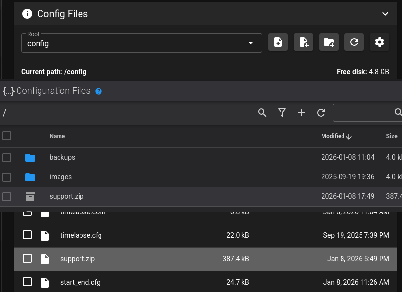

# Support

## Before Asking

Most problems have already been solved by someone else, so check these first:

- The [FAQ](faq.md)
- The troubleshooting page for your probe: [Cartographer](cartographer_troubleshooting.md), [Beacon](beacon_troubleshooting.md),
  [BTT Eddy](btteddy_troubleshooting.md) or [Eddy NG](eddyng_troubleshooting.md)
- That you are on the latest Simple AF, see [Updating](updating.md)
- If the printer will not boot or you cannot get in, see [Factory Reset](factory_reset.md) and [Emergency Factory Reset](emergency_factory_reset.md)

## Where to Ask

- The [Simple AF Discord](https://discord.gg/M5rmBQqRSG) is the best place for help
- If you have found a bug, raise an issue on [GitHub](https://github.com/pellcorp/creality/issues)

## What to Include

The more you include the faster someone can help you:

- Your printer model, for example K1 Max or Ender 3 V3 KE
- Your probe and mount
- Whether you are on Simple AF or Simple AF for RPi, and Klipper or Kalico
- What you were doing and the exact error message, a screenshot is fine
- A `support.zip`, see below

## Support ZIP

If you have been asked to provide a `support.zip` file in the Simple AF discord, there are a few ways to do this.

### Via Fluidd or Mainsail

Run the `SUPPORT_ZIP` macro from Fluidd or Mainsail

### Via GrumpyScreen

Click the `Create Support ZIP` button from the Tools menu of GrumpyScreen, be sure to wait for the success message
as it can take a while to generate the zip file.

### Via SSH

Run `~/pellcorp/tools/support.sh` from ssh on the printer.

### Where can I find the support.zip?

In all cases the support.zip can be found in the `~/printer_data/config` or the config section of Fluidd or Mainsail.

You need to somehow download this zip file to your local desktop / laptop so you can then upload it to discord.

