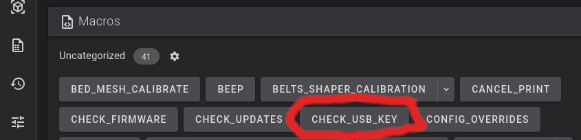
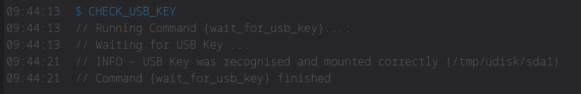

# Verify USB for Factory Reset

It is important to make sure you have a way to [emergency factory reset](misc.md#emergency-factory-reset) the printer, if the worst happens.   There is a macro in Simple AF called `CHECK_USB_KEY` that will wait for you to plug a USB thumb drive (aka USB key) in and tell you if it was able to be successfully mounted.

You can find the CHECK_USB_KEY macro in Fluidd or Mainsail, because Fluidd and Mainsail are already installed, you can access Fluidd by opening your browser and connecting
using http://X.X.X.X, where X.X.X.X is your ip address that you used to login via ssh to your printer, you can also access Fluidd via http://X.X.X.X:4408 and Mainsail via http://X.X.X.X:4409!

After running the macro you should see output like the following:

- If you get the message: `INFO - USB Key was recognised and mounted correctly (/tmp/udisk/sda1)`, your USB thumb drive (aka USB key) is perfect to use for a factory reset.
- If you get no message at all before the script ends (after 60 seconds), your USB thumb drive (aka USB key) is defective.   You can check the `messages` file in the logs section of your UI to get more details about why the usb key could not be mounted!

!!! tip

    You should verify your USB thumb drive (aka USB key) often just to make sure you have something if you need to unbrick your printer, simply type `CHECK_USB_KEY` or hit the button in Fluidd / Mainsail
    The USB key should be FAT32 formatted and be no larger than 32GB!

!!! note

    If you have plugged your probe (Eddy/Carto/Beacon) into the front usb port, you are going to have to temporarily remove the probe from the front usb slot and replace it with your USB thumb drive, after you have finished verifying the USB thumb drive can be used in an emergency, you can re-insert the probe usb into the front usb slot and restart klipper or power cycle your printer.

- If you get the message: `INFO - USB Key was recognised and mounted correctly (/tmp/udisk/sda1)`, your USB thumb drive (aka USB key) is perfect to use for a factory reset.
- If you get no message at all before the script ends (after 60 seconds), your USB thumb drive (aka USB key) is defective.   You can check the `messages` file in the logs section of your UI to get more details about why the usb key could not be mounted!
